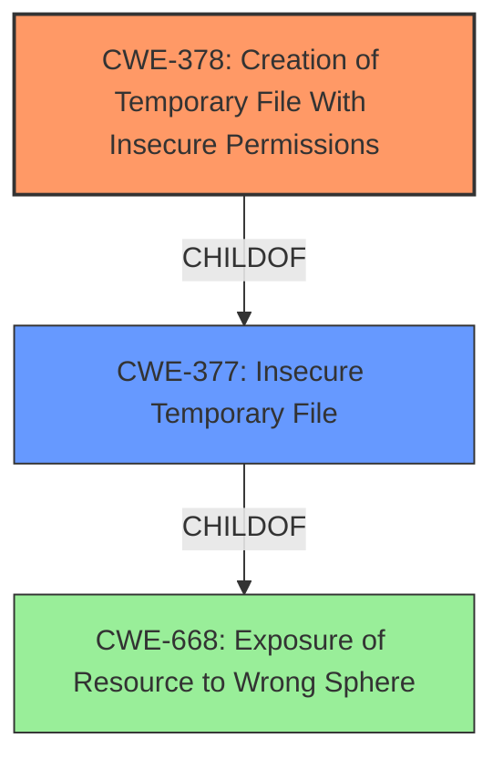

# Analysis Report for CVE-2022-24823

# Vulnerability Analysis Report: CVE-2022-24823

## Description


## Analysis (with Relationship Data)

# Summary
| CWE ID | CWE Name | Confidence | CWE Abstraction Level | CWE Vulnerability Mapping Label | CWE-Vulnerability Mapping Notes |
|---|---|---|---|---|---|
| CWE-378 | Creation of Temporary File With Insecure Permissions | 1.0 | Base | Allowed | Primary CWE. The **root cause** is the creation of temporary files with insecure permissions. |
| CWE-377 | Insecure Temporary File | 0.7 | Class | Allowed-with-Review | Secondary CWE. Broad class encompassing the issue of insecure temporary files. |
| CWE-668 | Exposure of Resource to Wrong Sphere | 0.5 | Class | Discouraged | Secondary CWE. The temporary file is a resource exposed to the wrong sphere. |

## Evidence and Confidence

*   **Confidence Score:** 0.9
*   **Evidence Strength:** HIGH

## Relationship Analysis
The primary weakness is CWE-378 (Creation of Temporary File With Insecure Permissions), which is a base-level CWE and a child of CWE-377 (Insecure Temporary File). CWE-377 is a class-level CWE. The vulnerability involves creating temporary files with permissions that allow unintended actors to access them, leading to information disclosure. CWE-668 (Exposure of Resource to Wrong Sphere) is also considered because the temporary file is a resource exposed to the wrong sphere. However, it is a higher-level class and less specific than CWE-378.



## Vulnerability Chain
The vulnerability chain is as follows:
1.  **Root Cause:** **Insufficient fix** that uses `File.createTempFile()` with default permissions, creating temporary files with insecure permissions.
2.  **Weakness:** Creation of temporary files with overly permissive default permissions.
3.  **Impact:** Local information disclosure.

## Summary of Analysis
The initial analysis identified the **root cause** as the creation of temporary files with insecure permissions using `File.createTempFile()` with a `null` base directory, leading to the creation of files with default permissions readable by other local users. The "**insufficient fix**" allowed the vulnerability to persist.

The evidence from the "CVE Reference Links Content Summary" confirms that the vulnerability arises from the use of `File.createTempFile()` in Netty's `PlatformDependent` class when running on Java 6 or lower. When a `null` base directory is provided, it creates temporary files in the system temporary directory with default permissions (typically `-rw-r--r--` on Unix-like systems). This allows other local users to read the content of the files. The vulnerability is specific to Unix-like systems (and very old MacOS and Windows versions) where the system's temporary directory is shared between all users, and to applications running Java 6 and lower.

Based on this evidence, CWE-378 (Creation of Temporary File With Insecure Permissions) is the most appropriate CWE because it directly addresses the **root cause** of the vulnerability.

CWE-377 (Insecure Temporary File) is a broader class that encompasses the issue of insecure temporary files, but CWE-378 is more specific.

CWE-668 (Exposure of Resource to Wrong Sphere) is considered because the temporary file can be considered a resource exposed to the wrong sphere. However, CWE-668 is a higher-level class and less specific than CWE-378. Also, the "Mapping Guidance" for CWE-668 states that it is Discouraged and often misused as a catch-all when lower-level CWE IDs might be applicable.

Therefore, CWE-378 is the optimal level of specificity.

Relevant CWE Information:

*   **CWE-378: Creation of Temporary File With Insecure Permissions**

    *   **Description**: Opening temporary files without appropriate measures or controls can leave the file, its contents and any function that it impacts vulnerable to attack.
    *   **Mapping Guidance**: Usage: Allowed, Rationale: This CWE entry is at the Base level of abstraction, which is a preferred level of abstraction for mapping to the root causes of vulnerabilities.
    *   **Observed Examples**: **CVE-2022-24823**: A network application framework uses the Java function createTempFile(), which will create a file that is readable by other local users of the system.


## CWE Relationship Analysis

Current CWEs represent these abstraction levels: .


### Vulnerability Chain Analysis

**Chain starting from CWE-377:**
- 377 (Insecure Temporary File) - ROOT


**Chain starting from CWE-668:**
- 668 (Exposure of Resource to Wrong Sphere) - ROOT


### CWE Relationship Diagram

```mermaid
graph TD
    classDef primary fill:#f96,stroke:#333,stroke-width:2px
    classDef secondary fill:#69f,stroke:#333
    classDef tertiary fill:#9e9,stroke:#333
```


*Report generated on 2025-03-30 14:39:58*
