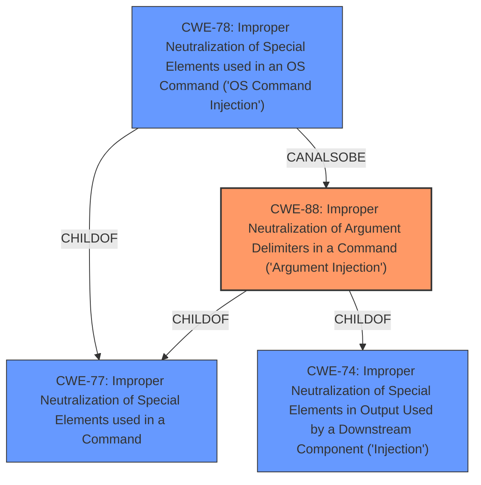

# Analysis Report for CVE-2022-24828

# Vulnerability Analysis Report: CVE-2022-24828

## Description


## Analysis (with Relationship Data)

# Summary
| CWE ID  | CWE Name                                                                                               | Confidence | CWE Abstraction Level | CWE Vulnerability Mapping Label | CWE-Vulnerability Mapping Notes |
|---------|--------------------------------------------------------------------------------------------------------|------------|-----------------------|---------------------------------|---------------------------------|
| CWE-88  | Improper Neutralization of Argument Delimiters in a Command ('Argument Injection')                      | 0.95       | Base                  | Primary CWE                    | Allowed                         |
| CWE-78  | Improper Neutralization of Special Elements used in an OS Command ('OS Command Injection')           | 0.75       | Base                  | Secondary Candidate               | Allowed                         |
| CWE-74  | Improper Neutralization of Special Elements in Output Used by a Downstream Component ('Injection') | 0.60       | Class                  | Secondary Candidate               | Discouraged                   |

## Evidence and Confidence

*   **Confidence Score:** 0.85
*   **Evidence Strength:** HIGH

## Relationship Analysis
The primary weakness is CWE-88, which is a base-level CWE describing the improper handling of argument delimiters in a command. This is supported by the vulnerability description and the CVE reference links content summary, which mention the injection of parameters into hg/Mercurial or git via the `$file` or `$identifier` arguments. CWE-88 is a child of CWE-77 (Improper Neutralization of Special Elements used in a Command) and CWE-74 (Improper Neutralization of Special Elements in Output Used by a Downstream Component ('Injection')). CWE-78 (Improper Neutralization of Special Elements used in an OS Command) is also considered as a closely related weakness and a peer of CWE-88.



## Vulnerability Chain
The vulnerability chain starts with the **lack of proper input validation** of the `$file` and `$identifier` arguments. This leads to **improper neutralization of argument delimiters**, allowing for **argument injection**. The final impact is the ability to **inject parameters into hg/Mercurial or git**, potentially leading to arbitrary command execution.
  - Root Cause: Insufficient input validation
  - Weakness: Improper Neutralization of Argument Delimiters (CWE-88)
  - Impact: Arbitrary command execution via injected parameters

## Summary of Analysis
Initially, the presence of a **code injection** vulnerability in Composer, specifically within the `VcsDriver::getFileContent()` method due to **insufficient validation** of the `$file` and `$identifier` arguments, pointed towards several potential CWEs. The "CVE Reference Links Content Summary" confirmed that the root cause was indeed the **lack of proper input validation** and the ability to inject arbitrary commands.

The Retriever results highlighted CWE-88 (Improper Neutralization of Argument Delimiters in a Command ('Argument Injection')) as the top candidate, aligning well with the vulnerability's description of injecting parameters into hg/Mercurial or git. While CWE-78 (Improper Neutralization of Special Elements used in an OS Command ('OS Command Injection')) was also considered, the specific nature of the vulnerability, involving the injection of arguments rather than full commands, made CWE-88 a more precise fit.

CWE-74 (Improper Neutralization of Special Elements in Output Used by a Downstream Component ('Injection')) is a high-level class that can be a parent of more specific injection issues, but since CWE-88 and CWE-78 are more descriptive, CWE-74 is less appropriate.

The final decision to prioritize CWE-88 was based on the evidence from the vulnerability description and the CVE reference, along with its higher relevance score and base-level abstraction, as well as the evidence:
> Integrators using Composer code to call `VcsDrivergetFileContent` can have a **code injection** vulnerability if the user can control the `$file` or `$identifier` argument. This leads to a vulnerability on packagist.org for example where the composer.jsons `readme` field can be used as a vector for injecting parameters into hg/Mercurial via the `$file` argument, or git via the `$identifier` argument if you allow arbitrary data there

Relevant CWE Information:

# Enhanced Context (25 CWEs)
The following CWEs were identified as potentially relevant to this vulnerability:

## CWE-88: Improper Neutralization of Argument Delimiters in a Command ('Argument Injection')
**Abstraction:** Base
**Similarity Score**: 0.933 (sparse)
**Source**: sparse

**Description**:
The product constructs a string for a command to be executed by a separate component
in another control sphere, but it does not properly delimit the
intended arguments, options, or switches within that command string.

**Mapping Guidance**:
- Usage: Allowed
- Rationale: This CWE entry is at the Base level of abstraction, which is a preferred level of abstraction for mapping to the root causes of vulnerabilities.

## CWE-78: Improper Neutralization of Special Elements used in an OS Command ('OS Command Injection')
**Abstraction:** base
**Similarity Score**: 5.03
**Source**: graph

**Description**:
CWE-78: Improper Neutralization of Special Elements used in an OS Command ('OS Command Injection')

**Mapping Guidance**:
- Usage: Allowed
- Rationale: This CWE entry is at the Base level of abstraction, which is a preferred level of abstraction for mapping to the root causes of vulnerabilities.

## CWE-74: Improper Neutralization of Special Elements in Output Used by a Downstream Component ('Injection')
**Abstraction Level**: Class
**Similarity Score**: 0.79
**Source**: dense

**Description**:
The product constructs all or part of a command, data structure, or record using externally-influenced input from an upstream component, but it does not neutralize or incorrectly neutralizes special elements that could modify how it is parsed or interpreted when it is sent to a downstream component.

**Mapping Guidance**:
- Usage: Discouraged
- Rationale: CWE-74 is high-level and often misused when lower-level weaknesses are more appropriate.


## CWE Relationship Analysis

Current CWEs represent these abstraction levels: .


### Vulnerability Chain Analysis

**Chain starting from CWE-78:**
- 78 (Improper Neutralization of Special Elements used in an OS Command ('OS Command Injection')) - ROOT


**Chain starting from CWE-77:**
- 77 (Improper Neutralization of Special Elements used in a Command ('Command Injection')) - ROOT


### CWE Relationship Diagram

```mermaid
graph TD
    classDef primary fill:#f96,stroke:#333,stroke-width:2px
    classDef secondary fill:#69f,stroke:#333
    classDef tertiary fill:#9e9,stroke:#333
```


*Report generated on 2025-03-30 13:24:52*
