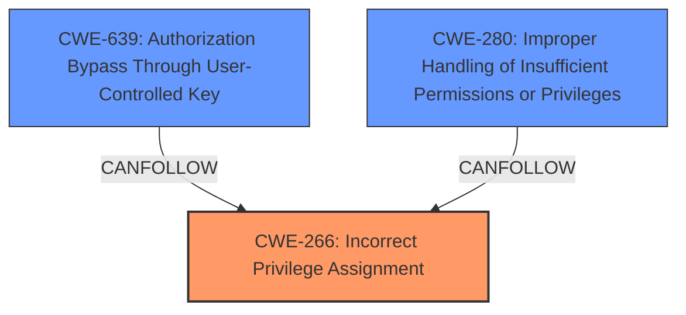

# Enhanced Analysis for CVE-2022-24842

# Summary
| CWE ID | CWE Name | Confidence | CWE Abstraction Level | CWE Vulnerability Mapping Label | CWE-Vulnerability Mapping Notes |
|---|---|---|---|---|---|
| CWE-266 | Incorrect Privilege Assignment | 0.9 | Base | Allowed | Primary CWE. The vulnerability stems from the **incorrect assignment** of the privilege to create service accounts to non-admin users, leading to privilege escalation. |
| CWE-639 | Authorization Bypass Through User-Controlled Key | 0.7 | Base | Allowed | Secondary CWE. A non-admin user is able to create service accounts for root or other admin users and then is able to assume their access policies via the generated credentials. |
| CWE-280 | Improper Handling of Insufficient Permissions or Privileges | 0.6 | Base | Allowed | Secondary CWE. The product does not properly handle the case where the non-admin user should not have the permission to create service accounts for admin users. |

## Evidence and Confidence

*   **Confidence Score:** 0.8
*   **Evidence Strength:** HIGH

## Relationship Analysis
The analysis focuses on the root cause of the vulnerability, which is the ability of a non-admin user to create service accounts for admin users, leading to privilege escalation.
  - CWE-266 represents the root cause: the incorrect privilege assignment that allows non-admin users to create service accounts for admin users.
  - CWE-639 occurs when the non-admin user is able to create service accounts for root or other admin users and then is able to assume their access policies via the generated credentials.
  - CWE-280 occurs because the application does not properly handle the case where a non-admin user attempts to create service accounts for admin users.



## Vulnerability Chain
The vulnerability chain starts with the **incorrect privilege assignment** (CWE-266), which allows a non-admin user to create service accounts for admin users. This leads to the ability to assume the access policies of the admin user (**Authorization Bypass Through User-Controlled Key** - CWE-639) and **Improper Handling of Insufficient Permissions or Privileges** (CWE-280) and results in privilege escalation.

## Summary of Analysis
The primary weakness is the **incorrect assignment** of privileges, which allows a non-admin user to create service accounts for admin users. This is best represented by CWE-266. The vulnerability description clearly states that a non-admin user is able to create service accounts for root or other admin users and then is able to assume their access policies via the generated credentials. This leads to privilege escalation.

The retriever results also suggested CWE-285: Improper Authorization and CWE-863: Incorrect Authorization. However, these are class level CWEs and not as specific as CWE-266.

Based on the evidence and the CWE specifications, the most appropriate CWE for this vulnerability is CWE-266.

Relevant CWE Information:

# Enhanced Context (25 CWEs)
The following CWEs were identified as potentially relevant to this vulnerability:

## CWE-266: Incorrect Privilege Assignment
**Abstraction Level**: Base
**Similarity Score**: 0.75
**Source**: dense

**Description**:
A product incorrectly assigns a privilege to a particular actor, creating an unintended sphere of control for that actor.

**Mapping Guidance**:
- Usage: Allowed
- Rationale: This CWE entry is at the Base level of abstraction, which is a preferred level of abstraction for mapping to the root causes of vulnerabilities.

## CWE-639: Authorization Bypass Through User-Controlled Key
**Abstraction Level**: Base
**Similarity Score**: 5431.30
**Source**: sparse

**Description**:
The system's authorization functionality does not prevent one user from gaining access to another user's data or record by modifying the key value identifying the data.

**Mapping Guidance**:
- Usage: Allowed
- Rationale: This CWE entry is at the Base level of abstraction, which is a preferred level of abstraction for mapping to the root causes of vulnerabilities.

## CWE-280: Improper Handling of Insufficient Permissions or Privileges 
**Abstraction Level**: Base
**Similarity Score**: 2.49
**Source**: graph

**Description**:
The product does not handle or incorrectly handles when it has insufficient privileges to access resources or functionality as specified by their permissions. This may cause it to follow unexpected code paths that may leave the product in an invalid state.

**Mapping Guidance**:
- Usage: Allowed
- Rationale: This CWE entry is at the Base level of abstraction, which is a preferred level of abstraction for mapping to the root causes of vulnerabilities.


## CWE Relationship Analysis

Current CWEs represent these abstraction levels: .


### Vulnerability Chain Analysis

**Chain starting from CWE-266:**
- 266 (Incorrect Privilege Assignment) - ROOT


**Chain starting from CWE-280:**
- 280 (Improper Handling of Insufficient Permissions or Privileges ) - ROOT


### CWE Relationship Diagram

```mermaid
graph TD
    classDef primary fill:#f96,stroke:#333,stroke-width:2px
    classDef secondary fill:#69f,stroke:#333
    classDef tertiary fill:#9e9,stroke:#333
```