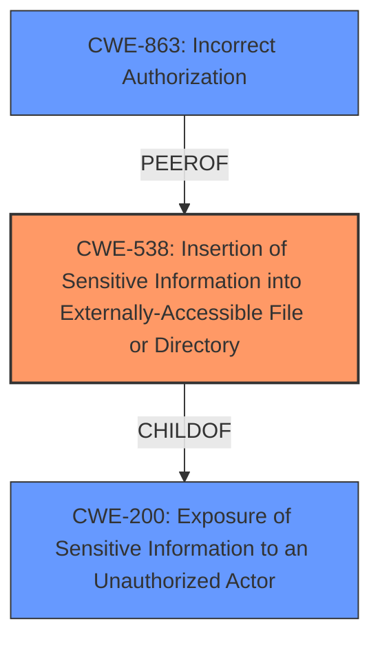

# Enhanced Analysis for CVE-2022-24850

# Summary
| CWE ID | CWE Name | Confidence | CWE Abstraction Level | CWE Vulnerability Mapping Label | CWE-Vulnerability Mapping Notes |
|---|---|---|---|---|---|
| CWE-538 | Insertion of Sensitive Information into Externally-Accessible File or Directory | 0.8 | Base | Allowed | Primary CWE: The vulnerability allows unauthorized access to category group permissions settings, fitting the description of sensitive information being placed in an externally accessible location. |
| CWE-200 | Exposure of Sensitive Information to an Unauthorized Actor | 0.6 | Class | Discouraged | Secondary Candidate: While CWE-200 is a broader category, it is applicable as the root cause leads to the exposure of sensitive information. However, CWE-538 is more specific. |
| CWE-863 | Incorrect Authorization | 0.5 | Class | Allowed-with-Review | Secondary Candidate: This CWE could be applicable because the system is performing an authorization check, but is doing so incorrectly, leading to information exposure. |

## Evidence and Confidence

*   **Confidence Score:** 0.7
*   **Evidence Strength:** MEDIUM

## Relationship Analysis
The primary CWE, CWE-538, is a child of CWE-200, indicating a more specific instance of information exposure. The relationship suggests that the vulnerability involves placing sensitive information in a location that is accessible to unauthorized actors, which is a form of information exposure. CWE-863 represents an incorrect authorization check, which could lead to the sensitive information being exposed. Choosing CWE-538 provides a more precise classification of the vulnerability's root cause compared to the higher-level CWE-200 or the potentially related CWE-863.



## Vulnerability Chain
The chain of events starts with an **improper access control**, leading to the exposure of category group permissions to unauthorized users.

`Improper Access Control` -> `Information Disclosure`

CWE-538 represents the point where sensitive information is placed in an accessible location.

## Summary of Analysis
The initial analysis considered several CWEs, including CWE-200, CWE-863, and CWE-538. The final conclusion is that CWE-538 is the most appropriate because it specifically addresses the placement of sensitive information in an externally accessible file or directory.

The vulnerability description states: "A categorys group permissions settings can be viewed by anyone that has access to the category. As a result, a normal user is able to see whether a group has read/write permissions in the category even though the information should only be available to the users that can manage a category." This aligns well with CWE-538's description: "The product places sensitive information into files or directories that are accessible to actors who are allowed to have access to the files, but not to the sensitive information."

The relationship graph shows that CWE-538 is a child of CWE-200, which means it is a more specific type of information exposure. This specificity makes it a better fit than CWE-200, which is a more general category.

CWE-863 was also considered, as the **root cause** involves **improper access control**, which could be related to incorrect authorization. However, the primary issue is the exposure of sensitive information, making CWE-538 a more direct representation of the vulnerability.

The selected CWE is at the Base level of abstraction, which is the preferred level for mapping root causes. This ensures that the mapping is as specific as possible while still accurately representing the vulnerability.

Relevant CWE Information:

# Enhanced Context (25 CWEs)

## CWE-538: Insertion of Sensitive Information into Externally-Accessible File or Directory
**Abstraction:** Base
**Similarity Score**: 0.78
**Source**: dense

**Description**:
The product places sensitive information into files or directories that are accessible to actors who are allowed to have access to the files, but not to the sensitive information.

**Mapping Guidance**:
- Usage: Allowed
- Rationale: This CWE entry is at the Base level of abstraction, which is a preferred level of abstraction for mapping to the root causes of vulnerabilities.

## CWE-200: Exposure of Sensitive Information to an Unauthorized Actor
**Abstraction:** Class
**Similarity Score**: 5821.13
**Source**: sparse

**Description**:
The product exposes sensitive information to an actor that is not explicitly authorized to have access to that information.

**Mapping Guidance**:
- Usage: Discouraged
- Rationale: CWE-200 is commonly misused to represent the loss of confidentiality in a vulnerability, but confidentiality loss is a technical impact - not a root cause error. As of CWE 4.9, over 400 CWE entries can lead to a loss of confidentiality. Other options are often available. [REF-1287].

## CWE-863: Incorrect Authorization
**Abstraction:** Class
**Similarity Score**: 5839.81
**Source**: sparse

**Description**:
The product performs an authorization check when an actor attempts to access a resource or perform an action, but it does not correctly perform the check.

**Mapping Guidance**:
- Usage: Allowed-with-Review
- Rationale: This CWE entry is a Class and might have Base-level children that would be more appropriate


## CWE Relationship Analysis

Current CWEs represent these abstraction levels: .


### Vulnerability Chain Analysis

**Chain starting from CWE-538:**
- 538 (Insertion of Sensitive Information into Externally-Accessible File or Directory) - ROOT


**Chain starting from CWE-200:**
- 200 (Exposure of Sensitive Information to an Unauthorized Actor) - ROOT


### CWE Relationship Diagram

```mermaid
graph TD
    classDef primary fill:#f96,stroke:#333,stroke-width:2px
    classDef secondary fill:#69f,stroke:#333
    classDef tertiary fill:#9e9,stroke:#333
```