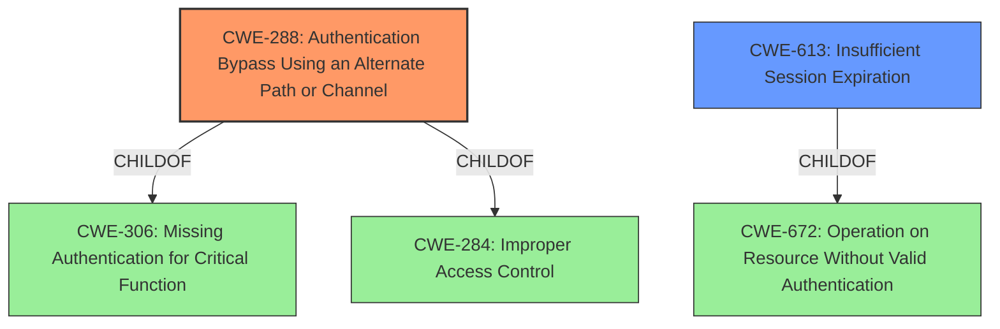

# Analysis Report for CVE-2022-24857

# Vulnerability Analysis Report: CVE-2022-24857

## Description


## Analysis (with Relationship Data)

# Summary
| CWE ID | CWE Name | Confidence | CWE Abstraction Level | CWE Vulnerability Mapping Label | CWE-Vulnerability Mapping Notes |
|---|---|---|---|---|---|
| CWE-288 | Authentication Bypass Using an Alternate Path or Channel | 1.0 | Base | Primary | Allowed |
| CWE-613 | Insufficient Session Expiration | 0.5 | Base | Secondary | Allowed |

## Evidence and Confidence

*   **Confidence Score:** 0.9
*   **Evidence Strength:** HIGH

## Relationship Analysis
The primary CWE selected is CWE-288, which is a Base-level CWE and a child of CWE-306 (Missing Authentication for Critical Function) and CWE-284 (Improper Access Control).
The relationship indicates that the vulnerability involves bypassing authentication through an alternate path. The secondary CWE considered was CWE-613, which is a Base-level CWE and a child of CWE-672 (Operation on Resource Without Valid Authentication) indicating potential session management issues.



## Vulnerability Chain
The vulnerability chain starts with the **weakness** that the `django-mfa3` library only modified the regular login view, neglecting the admin login view. This led to an **authentication bypass** (CWE-288) because the admin login route provided an alternate, unprotected channel. If sessions are not properly expired or managed, this could lead to further exploitation.

## Summary of Analysis
The analysis identified CWE-288 (Authentication Bypass Using an Alternate Path or Channel) as the primary **weakness**. This is based on the fact that the `django-mfa3` library did not apply multi-factor authentication to the Django admin login view, providing an alternate, unprotected path for authentication.

The selection of CWE-288 is supported by the vulnerability description, which states that the "multi factor authentication can be bypassed" because the "second login view was not modified." The "CVE Reference Links Content Summary" confirms this by highlighting the "Incomplete MFA Enforcement" and the "Lack of Centralized Login Handling."

CWE-288 is a Base-level CWE, which is the preferred level of abstraction. The retriever results also ranked CWE-288 as the top match with a score of 1.042.

CWE-287 (Improper Authentication) and CWE-1390 (Weak Authentication) were considered but not chosen because they are Class-level CWEs, and CWE-288 provides a more specific description of the vulnerability. CWE-306 (Missing Authentication for Critical Function) was also considered, but the vulnerability involves bypassing existing authentication rather than a complete lack of authentication.

CWE-613 (Insufficient Session Expiration) was considered as a secondary CWE, due to the risk of sessions not being properly expired which would compound the risk of the bypass.

Overall, the assessment is based on the provided evidence and the relationships between CWEs. The selection of CWE-288 is justified by its specific match to the vulnerability description, its Base-level abstraction, and its ranking in the retriever results.


## CWE Relationship Analysis

Current CWEs represent these abstraction levels: .


### Vulnerability Chain Analysis

**Chain starting from CWE-672:**
- 672 (Operation on a Resource after Expiration or Release) - ROOT


**Chain starting from CWE-1390:**
- 1390 (Weak Authentication) - ROOT


### CWE Relationship Diagram

```mermaid
graph TD
    classDef primary fill:#f96,stroke:#333,stroke-width:2px
    classDef secondary fill:#69f,stroke:#333
    classDef tertiary fill:#9e9,stroke:#333
```


*Report generated on 2025-03-31 13:04:26*
