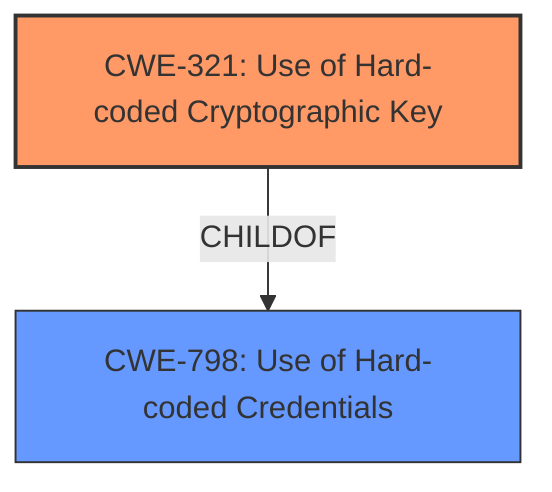

# Analysis Report for CVE-2022-24860

# Vulnerability Analysis Report: CVE-2022-24860

## Description


## Analysis (with Relationship Data)

# Summary
| CWE ID | CWE Name | Confidence | CWE Abstraction Level | CWE Vulnerability Mapping Label | CWE-Vulnerability Mapping Notes |
|---|---|---|---|---|---|
| CWE-321 | Use of Hard-coded Cryptographic Key | 1.0 | Variant | Allowed | Primary CWE |
| CWE-798 | Use of Hard-coded Credentials | 0.8 | Base | Allowed | Secondary Candidate |

## Evidence and Confidence

*   **Confidence Score:** 1.0
*   **Evidence Strength:** HIGH

## Relationship Analysis
The primary relationship that influenced the decision was the parent-child relationship between CWE-798 (Use of Hard-coded Credentials) and CWE-321 (Use of Hard-coded Cryptographic Key). CWE-321 is a specific type of CWE-798, dealing specifically with cryptographic keys, which directly aligns with the vulnerability description. The Retriever results also indicated the relevance of both CWEs.



## Vulnerability Chain
The vulnerability chain begins with the **root cause**, the **use of a hard-coded cryptographic key**. This leads directly to the impact of allowing an attacker to generate login credentials for any user, thus enabling unauthorized access and privilege escalation.

## Summary of Analysis
The initial analysis focused on identifying the **root cause** of the vulnerability. The vulnerability description and the CVE Reference Links Content Summary clearly indicated the "**use of a hard-coded cryptographic key**" as the primary weakness.

The selection of CWE-321 is strongly supported by the evidence. The "Vulnerability Description Key Phrases" section identifies "**use of hard-coded cryptographic key**" as the **rootcause**. The "CVE Reference Links Content Summary" confirms this, stating: "The vulnerability stems from the use of a hardcoded secret key (`private static final String SECRET = "Databasir2022";`) within the `JwtTokens.java` file." This aligns perfectly with the description of CWE-321, "The use of a hard-coded cryptographic key significantly increases the possibility that encrypted data may be recovered."

The relationship between CWE-321 and CWE-798 was a key factor. While CWE-798 (Use of Hard-coded Credentials) is a valid consideration, CWE-321 is a more specific variant that accurately captures the nature of the weakness. The MITRE mapping guidance for CWE-321 states that it is at the Variant level of abstraction, which is a preferred level for mapping. The retriever results also listed CWE-321 as the top candidate.

Based on the vulnerability description and supporting evidence, CWE-321 is the most appropriate and specific classification.

Relevant CWE Information:

# Enhanced Context (25 CWEs)
The following CWEs were identified as potentially relevant to this vulnerability:

## CWE-656: Reliance on Security Through Obscurity
**Abstraction Level**: Class
**Similarity Score**: 0.79
**Source**: dense

**Description**:
The product uses a protection mechanism whose strength depends heavily on its obscurity, such that knowledge of its algorithms or key data is sufficient to defeat the mechanism.

**Mapping Guidance**:
- Usage: Allowed-with-Review
- Rationale: This CWE entry is a Class and might have Base-level children that would be more appropriate

*Not Used:* While there might be an element of obscurity involved since the key is not immediately visible, the primary issue is the hardcoding itself, not the reliance on obscurity. Therefore, this CWE is not selected.

## CWE-1391: Use of Weak Credentials
**Abstraction Level**: Class
**Similarity Score**: 0.78
**Source**: dense

**Description**:
The product uses weak credentials (such as a default key or hard-coded password) that can be calculated, derived, reused, or guessed by an attacker.

**Mapping Guidance**:
- Usage: Allowed-with-Review
- Rationale: This CWE entry is a Class and might have Base-level children that would be more appropriate

*Not Used:* Although the hard-coded key leads to weak credentials, CWE-1391 is a Class-level CWE and less specific than CWE-321 or CWE-798.

## CWE-1240: Use of a Cryptographic Primitive with a Risky Implementation
**Abstraction Level**: Base
**Similarity Score**: 0.77
**Source**: dense

**Description**:
To fulfill the need for a cryptographic primitive, the product implements a cryptographic algorithm using a non-standard, unproven, or disallowed/non-compliant cryptographic implementation.

**Mapping Guidance**:
- Usage: Allowed
- Rationale: This CWE entry is at the Base level of abstraction, which is a preferred level of abstraction for mapping to the root causes of vulnerabilities.

*Not Used:* This CWE is not applicable because the vulnerability is not related to the implementation of a cryptographic algorithm itself, but rather the **use of a hard-coded key**.

## CWE-657: Violation of Secure Design Principles
**Abstraction Level**: Class
**Similarity Score**: 0.76
**Source**: dense

**Description**:
The product violates well-established principles for secure design.

**Mapping Guidance**:
- Usage: Discouraged
- Rationale: This CWE entry is a level-1 Class (i.e., a child of a Pillar). It might have lower-level children that would be more appropriate

*Not Used:* This CWE is too general. The vulnerability is more specifically related to the **use of hard-coded credentials**, rather than a general design flaw.

## CWE-798: Use of Hard-coded Credentials
**Abstraction Level**: Base
**Similarity Score**: 0.76
**Source**: dense

**Description**:
The product contains hard-coded credentials, such as a password or cryptographic key.

**Mapping Guidance**:
- Usage: Allowed
- Rationale: This CWE entry is at the Base level of abstraction, which is a preferred level of abstraction for mapping to the root causes of vulnerabilities.

*Secondary Candidate:* This CWE is a valid consideration as it encompasses both hard-coded passwords and cryptographic keys. However, CWE-321 provides a more specific classification for this vulnerability.

## CWE-1394: Use of Default Cryptographic Key
**Abstraction Level**: Base
**Similarity Score**: 0.75
**Source**: dense

**Description**:
The product uses a default cryptographic key for potentially critical functionality.

**Mapping Guidance**:
- Usage: Allowed
- Rationale: This CWE entry is at the Base level of abstraction, which is a preferred level of abstraction for mapping to the root causes of vulnerabilities.

*Not Used:* The key is not described as a "default" key but as hardcoded.

## CWE-1392: Use of Default Credentials
**Abstraction Level**: Base
**Similarity Score**: 0.75
**Source**: dense

**Description**:
The product uses default credentials (such as passwords or cryptographic keys) for potentially critical functionality.

**Mapping Guidance**:
- Usage: Allowed
- Rationale: This CWE entry is at the Base level of abstraction, which is a preferred level of abstraction for mapping to the root causes of vulnerabilities.

*Not Used:* The key is not described as a "default" key but as hardcoded.

## CWE-807: Reliance on Untrusted Inputs in a Security Decision
**Abstraction Level**: Base
**Similarity Score**: 0.75
**Source**: dense

**Description**:
The product uses a protection mechanism that relies on the existence or values of an input, but the input can be modified by an untrusted actor in a way that bypasses the protection mechanism.

**Mapping Guidance**:
- Usage: Allowed
- Rationale: This CWE entry is at the Base level of abstraction, which is a preferred level of abstraction for mapping to the root causes of vulnerabilities.

*Not Used:* This CWE is not applicable because the vulnerability is not related to relying on untrusted inputs.

## CWE-1188: Initialization of a Resource with an Insecure Default
**Abstraction Level**: Base
**Similarity Score**: 0.74
**Source**: dense

**Description**:
The product initializes or sets a resource with a default that is intended to be changed by the administrator, but the default is not secure.

**Mapping Guidance**:
- Usage: Allowed
- Rationale: This CWE entry is at the Base level of abstraction, which is a preferred level of abstraction for mapping to the root causes of vulnerabilities.

*Not Used:* The key is not described as a "default" key but as hardcoded.

## CWE-321: Use of Hard-coded Cryptographic Key
**Abstraction Level**: Variant
**Similarity Score**: 0.74
**Source**: dense

**Description**:
The use of a hard-coded cryptographic key significantly increases the possibility that encrypted data may be recovered.

**Mapping Guidance**:
- Usage: Allowed
- R


## CWE Relationship Analysis

Current CWEs represent these abstraction levels: .


### Vulnerability Chain Analysis

**Chain starting from CWE-321:**
- 321 (Use of Hard-coded Cryptographic Key) - ROOT


**Chain starting from CWE-1392:**
- 1392 (Use of Default Credentials) - ROOT


### CWE Relationship Diagram

```mermaid
graph TD
    classDef primary fill:#f96,stroke:#333,stroke-width:2px
    classDef secondary fill:#69f,stroke:#333
    classDef tertiary fill:#9e9,stroke:#333
```


*Report generated on 2025-03-31 02:22:09*
