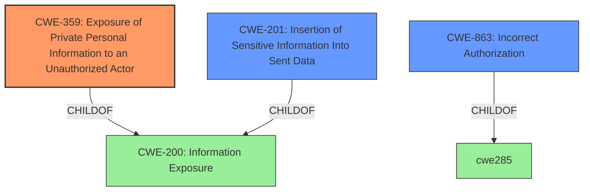

# Analysis Report for CVE-2022-24866

# Vulnerability Analysis Report: CVE-2022-24866

## Description


## Analysis (with Relationship Data)

# Summary
| CWE ID | CWE Name | Confidence | CWE Abstraction Level | CWE Vulnerability Mapping Label | CWE-Vulnerability Mapping Notes |
|---|---|---|---|---|---|
| CWE-359 | Exposure of Private Personal Information to an Unauthorized Actor | 1.0 | Base | Allowed | Primary CWE |
| CWE-201 | Insertion of Sensitive Information Into Sent Data | 0.7 | Base | Allowed | Secondary Candidate |
| CWE-863 | Incorrect Authorization | 0.5 | Class | Allowed-with-Review | Secondary Candidate |

## Evidence and Confidence

*   **Confidence Score:** 0.8
*   **Evidence Strength:** HIGH

## Relationship Analysis
The primary CWE, CWE-359, is a base-level CWE and a child of CWE-200 (Information Exposure). CWE-201 (Insertion of Sensitive Information Into Sent Data) is also a base-level CWE and a child of CWE-200. CWE-863 (Incorrect Authorization) is a class-level CWE. The relationships indicate that the vulnerability involves exposing information, and CWE-359 is the most specific base-level CWE that accurately reflects the nature of the vulnerability.



## Vulnerability Chain
The vulnerability chain involves the **improper serialization** of user and group objects, leading to the **exposure of private information** to unauthorized actors.

## Summary of Analysis
The analysis is based on the provided vulnerability description and CVE reference summary. The **root cause** is that the `UserBookmarkSerializer` serialized the whole User / Group object. This resulted in the **leakage of private information**. The primary CWE is CWE-359 (Exposure of Private Personal Information to an Unauthorized Actor), which accurately captures the nature of the vulnerability. The relationships between CWEs, particularly the parent-child relationship between CWE-359 and CWE-200, support this classification. CWE-359 is at the optimal level of specificity because it is a base-level CWE that directly addresses the exposure of private personal information.

Evidence:

*   "**UserBookmarkSerializer serialized the whole User / Group object**, which leaked some private information."
*   "The vulnerability stemmed from the improper serialization of user and group objects, which leaked private information that should not have been exposed."
*   "**Private Information Leakage:** Sensitive data from user and group objects was exposed via bookmarks, which could potentially lead to unauthorized access to user details or group configurations."

Relevant CWE Information:

*   **CWE-359: Exposure of Private Personal Information to an Unauthorized Actor**
    *   The vulnerability's details match the CWE's characteristics as it involves exposing private user and group information to unauthorized actors.
    *   The security implication is the leakage of sensitive data, potentially leading to unauthorized access or compromise of user accounts.
    *   This CWE is a child of CWE-200 (Information Exposure), indicating a more specific type of information exposure.
    *   The MITRE mapping guidance allows this CWE.
*   **CWE-201: Insertion of Sensitive Information Into Sent Data**
    *   This CWE was considered because the vulnerability involves sending user/group objects which contain sensitive data to actors who should not have access to it.
    *   The vulnerability details match the CWE's characteristics.
    *   It is not as specific as CWE-359, which focuses on private personal information, making CWE-359 a better fit.
*   **CWE-863: Incorrect Authorization**
    *   This CWE was considered because the vulnerability could be viewed as a failure to properly authorize access to user and group data.
    *   However, the root cause is more directly related to the exposure of sensitive information rather than a flawed authorization mechanism.
    *   Therefore, CWE-863 is not the most appropriate CWE for this vulnerability.

The final selection is based on matching the root cause and impact to the most relevant CWE.


## CWE Relationship Analysis

Current CWEs represent these abstraction levels: .


### Vulnerability Chain Analysis

**Chain starting from CWE-201:**
- 201 (Insertion of Sensitive Information Into Sent Data) - ROOT


**Chain starting from CWE-200:**
- 200 (Exposure of Sensitive Information to an Unauthorized Actor) - ROOT


### CWE Relationship Diagram

```mermaid
graph TD
    classDef primary fill:#f96,stroke:#333,stroke-width:2px
    classDef secondary fill:#69f,stroke:#333
    classDef tertiary fill:#9e9,stroke:#333
```


*Report generated on 2025-03-31 10:02:08*
