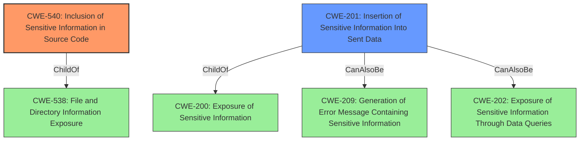

# Raw Analyzer Response for CVE-2022-24867

# Summary
| CWE ID | CWE Name | Confidence | CWE Abstraction Level | CWE Vulnerability Mapping Label | CWE-Vulnerability Mapping Notes |
|---|---|---|---|---|---|
| CWE-540 | Inclusion of Sensitive Information in Source Code | 0.9 | Base | Allowed | Primary CWE |
| CWE-201 | Insertion of Sensitive Information Into Sent Data | 0.7 | Base | Allowed | Secondary Candidate |

## Evidence and Confidence

*   **Confidence Score:** 0.8
*   **Evidence Strength:** HIGH

## Relationship Analysis
The primary CWE, CWE-540, is a base-level weakness that describes the inclusion of sensitive information in source code. A related weakness, CWE-201, involves the insertion of sensitive information into sent data, which could be seen as a broader category encompassing CWE-540. However, the vulnerability specifically exposes sensitive information within the source code itself, making CWE-540 a more precise fit.

## Vulnerability Chain
The chain of events can be described as follows:

1.  **Root Cause:** **Improper input filtering** (`ldap_pass` variable not filtered).
2.  **Weakness:** Inclusion of sensitive information in source code (CWE-540).
3.  **Impact:** Information disclosure (LDAP password exposed).

## Summary of Analysis
The analysis indicates that the primary weakness is the inclusion of sensitive information (`ldap_pass`) within the source code due to **improper input filtering**. The vulnerability description and CVE reference links content summary clearly support this, highlighting the root cause as the unfiltered `ldap_pass` variable being passed to JavaScript, leading to its exposure in the HTML source code.

The selection of CWE-540 is based on the explicit evidence from the vulnerability description: "The variable ldap_pass is not filtered and when you look at the source code of the rendered page, we can see the password for the root dn." This directly aligns with the CWE-540 description: "Source code on a web server or repository often contains sensitive information and should generally not be accessible to users."

CWE-201 was considered due to its broader nature of inserting sensitive information into sent data, but CWE-540 is more specific as the sensitive information is directly included in the source code, making it a more accurate representation of the vulnerability.

The retriever results also support CWE-540 as the top combined result.

Relevant CWE Information:

# Enhanced Context (25 CWEs)

## CWE-540: Inclusion of Sensitive Information in Source Code
**Abstraction:** Base
**Status:** Incomplete

### Description
Source code on a web server or repository often contains sensitive information and should generally not be accessible to users.

### Extended Description
There are situations where it is critical to remove source code from an area or server. For example, obtaining Perl source code on a system allows an attacker to understand the logic of the script and extract extremely useful information such as code bugs or logins and passwords.

### Alternative Terms
None

### Relationships
ChildOf -> CWE-538

### Mapping Guidance
**Usage:** Allowed
**Rationale:** This CWE entry is at the Base level of abstraction, which is a preferred level of abstraction for mapping to the root causes of vulnerabilities.
**Comments:** Carefully read both the name and description to ensure that this mapping is an appropriate fit. Do not try to 'force' a mapping to a lower-level Base/Variant simply to comply with this preferred level of abstraction.
**Reasons:**
- Acceptable-Use

### Observed Examples
- **CVE-2022-25512:** Server for Team Awareness Kit (TAK) application includes sensitive tokens in the JavaScript source code.
- **CVE-2022-24867:** The LDAP password might be visible in the html code of a rendered page in an IT Asset Management tool.
- **CVE-2007-6197:** Version numbers and internal hostnames leaked in HTML comments.