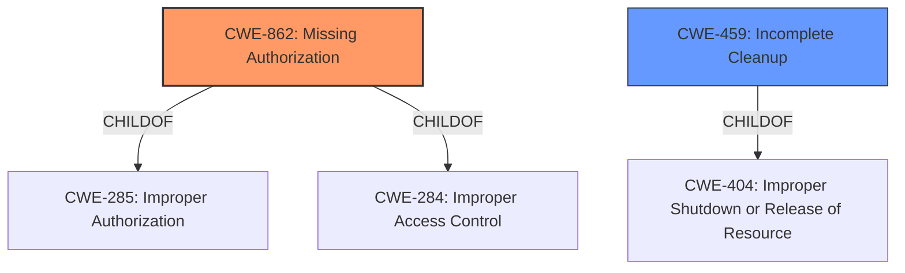

# Analysis Report for CVE-2022-24885

# Vulnerability Analysis Report: CVE-2022-24885

## Description


## Analysis (with Relationship Data)

# Summary
| CWE ID    | CWE Name                                                                      | Confidence | CWE Abstraction Level | CWE Vulnerability Mapping Label | CWE-Vulnerability Mapping Notes |
| :---------- | :---------------------------------------------------------------------------- | :--------- | :---------------------- | :------------------------------ | :------------------------------ |
| CWE-862     | Missing Authorization                                                         | 0.9        | Class                   | Primary                         | Allowed-with-Review           |
| CWE-459     | Incomplete Cleanup                                                          | 0.7        | Base                   | Secondary                        | Allowed                      |

## Evidence and Confidence

*   **Confidence Score:** 0.8
*   **Evidence Strength:** HIGH

## Relationship Analysis
The primary CWE is CWE-862 which is a Class-level CWE. The retriever results show that it is a good candidate. The relationships to its children like CWE-285 and CWE-284 are important to consider, but this class level is appropriate because the description indicates a general missing authorization check rather than a specific type of authorization failure.

CWE-459 is a Base-level CWE. It is related to CWE-404.



## Vulnerability Chain
The vulnerability chain starts with a **missing authorization** check (CWE-862), which leads to a lock bypass. Repeatedly reopening the app triggers the **incomplete cleanup** (CWE-459) of resources related to the lock mechanism, resulting in unauthorized access to the Nextcloud app.

## Summary of Analysis
Initially, the vulnerability description pointed towards a problem in the app's lock mechanism, suggesting a potential **missing authorization** check (CWE-862). The retriever results also listed CWE-862 as a candidate. Upon reviewing the CVE Reference Links Content Summary, the root cause was confirmed to be a **missing authorization** check in the handling of activity lifecycle events. Specifically, the app **does not properly** ensure the lock is enforced when the app is reopened repeatedly. This allowed users to bypass the intended lock screen, granting unauthorized access to the app's data. The fix implemented in pull request #9816 aimed to address this **missing authorization** by ensuring the lock timestamp is updated and the activity counter is correctly handled. This confirms the presence of a **missing authorization** issue (CWE-862).

Additionally, the repeated reopening of the app, which triggers the bypass, can be linked to an **incomplete cleanup** of the lock mechanism. The app **fails to properly** reset or re-initialize the lock state, allowing subsequent attempts to bypass it. This leads to the secondary classification of CWE-459.

The selection of CWE-862 is at the Class level, which is appropriate because the description indicates a general **missing authorization** check rather than a specific type of authorization failure. The base CWE would be a more specific type of authorization such as CWE-285: Improper Authorization.

Relevant CWE Information:

# Enhanced Context (25 CWEs)
The following CWEs were identified as potentially relevant to this vulnerability:

## CWE-113: Improper Neutralization of CRLF Sequences in HTTP Headers ('HTTP Request/Response Splitting')
**Abstraction Level**: Variant
**Similarity Score**: 0.78
**Source**: dense

**Description**:
The product receives data from an HTTP agent/component (e.g., web server, proxy, browser, etc.), but it does not neutralize or incorrectly neutralizes CR and LF characters before the data is included in outgoing HTTP headers.
**Rationale for Exclusion**: Not relevant because the vulnerability is not related to HTTP headers.

## CWE-93: Improper Neutralization of CRLF Sequences ('CRLF Injection')
**Abstraction Level**: Base
**Similarity Score**: 0.77
**Source**: dense

**Description**:
The product uses CRLF (carriage return line feeds) as a special element, e.g. to separate lines or records, but it does not neutralize or incorrectly neutralizes CRLF sequences from inputs.
**Rationale for Exclusion**: Not relevant because the vulnerability is not related to CRLF injection.

## CWE-74: Improper Neutralization of Special Elements in Output Used by a Downstream Component ('Injection')
**Abstraction Level**: Class
**Similarity Score**: 0.77
**Source**: dense

**Description**:
The product constructs all or part of a command, data structure, or record using externally-influenced input from an upstream component, but it does not neutralize or incorrectly neutralizes special elements that could modify how it is parsed or interpreted when it is sent to a downstream component.
**Rationale for Exclusion**: Not relevant because the vulnerability is not an injection issue.

## CWE-212: Improper Removal of Sensitive Information Before Storage or Transfer
**Abstraction Level**: Base
**Similarity Score**: 0.76
**Source**: dense

**Description**:
The product stores, transfers, or shares a resource that contains sensitive information, but it does not properly remove that information before the product makes the resource available to unauthorized actors.
**Rationale for Exclusion**: Not relevant because the vulnerability is not related to sensitive information handling during storage or transfer.

## CWE-209: Generation of Error Message Containing Sensitive Information
**Abstraction Level**: Base
**Similarity Score**: 0.76
**Source**: dense

**Description**:
The product generates an error message that includes sensitive information about its environment, users, or associated data.
**Rationale for Exclusion**: Not relevant because the vulnerability is not related to the generation of error messages containing sensitive information.

## CWE-451: User Interface (UI) Misrepresentation of Critical Information
**Abstraction Level**: Class
**Similarity Score**: 0.76
**Source**: dense

**Description**:
The user interface (UI) does not properly represent critical information to the user, allowing the information - or its source - to be obscured or spoofed. This is often a component in phishing attacks.
**Rationale for Exclusion**: Not relevant because the vulnerability is not related to UI misrepresentation.

## CWE-41: Improper Resolution of Path Equivalence
**Abstraction Level**: Base
**Similarity Score**: 0.75
**Source**: dense

**Description**:
The product is vulnerable to file system contents disclosure through path equivalence. Path equivalence involves the use of special characters in file and directory names. The associated manipulations are intended to generate multiple names for the same object.
**Rationale for Exclusion**: Not relevant because the vulnerability is not related to path equivalence.

## CWE-138: Improper Neutralization of Special Elements
**Abstraction Level**: Class
**Similarity Score**: 0.75
**Source**: dense

**Description**:
The product receives input from an upstream component, but it does not neutralize or incorrectly neutralizes special elements that could be interpreted as control elements or syntactic markers when they are sent to a downstream component.
**Rationale for Exclusion**: Not relevant because the vulnerability is not related to improper neutralization of special elements.

## CWE-203: Observable Discrepancy
**Abstraction Level**: Base
**Similarity Score**: 0.75
**Source**: dense

**Description**:
The product behaves differently or sends different responses under different circumstances in a way that is observable to an unauthorized actor, which exposes security-relevant information about the state of the product, such as whether a particular operation was successful or not.
**Rationale for Exclusion**: Not relevant because the vulnerability is not related to observable discrepancies.

## CWE-116: Improper Encoding or Escaping of Output
**Abstraction Level**: Class
**Similarity Score**: 0.75
**Source**: dense

**Description**:
The product prepares a structured message for communication with another component, but encoding or escaping of the data is either missing or done incorrectly. As a result, the intended structure of the message is not preserved.
**Rationale for Exclusion**: Not relevant because the vulnerability is not related to encoding or escaping of output.

## CWE-295: Improper Certificate Validation
**Abstraction Level**: Base
**Similarity Score**: 4058.45
**Source**: sparse

**Description**:
The product does not validate, or incorrectly validates, a certificate.
**Rationale for Exclusion**: Not relevant because the vulnerability is not related to certificate validation.

## CWE-209: Generation of Error Message Containing Sensitive Information
**Abstraction Level**: Base
**Similarity Score**: 4034.26
**Source**: sparse

**Description**:
The product generates an error message that includes sensitive information about its environment, users, or associated data.
**Rationale for Exclusion**: Not relevant because the vulnerability is not


## CWE Relationship Analysis

Current CWEs represent these abstraction levels: .


### Vulnerability Chain Analysis

**Chain starting from CWE-862:**
- 862 (Missing Authorization) - ROOT


**Chain starting from CWE-203:**
- 203 (Observable Discrepancy) - ROOT


### CWE Relationship Diagram

```mermaid
graph TD
    classDef primary fill:#f96,stroke:#333,stroke-width:2px
    classDef secondary fill:#69f,stroke:#333
    classDef tertiary fill:#9e9,stroke:#333
```


*Report generated on 2025-03-31 09:43:56*
