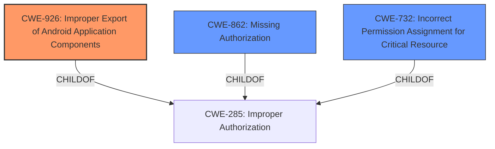

# Raw Analyzer Response for CVE-2022-24886

# Summary
| CWE ID | CWE Name | Confidence | CWE Abstraction Level | CWE Vulnerability Mapping Label | CWE-Vulnerability Mapping Notes |
|---|---|---|---|---|---|
| CWE-926 | Improper Export of Android Application Components | 0.9 | Variant | Allowed | Primary CWE |
| CWE-862 | Missing Authorization | 0.7 | Class | Allowed-with-Review | Secondary Candidate |
| CWE-732 | Incorrect Permission Assignment for Critical Resource | 0.6 | Class | Allowed-with-Review | Secondary Candidate |

## Evidence and Confidence

*   **Confidence Score:** 0.9
*   **Evidence Strength:** HIGH

## Relationship Analysis
The primary CWE is CWE-926, which is a Variant of CWE-285 (Improper Authorization). CWE-862 (Missing Authorization) and CWE-732 (Incorrect Permission Assignment for Critical Resource) are also children of CWE-285, representing closely related authorization issues. Choosing CWE-926 reflects the specific Android context and the vulnerability's manifestation through exported application components, but other authorization related CWEs are still relevant and could be present.

## Vulnerability Chain
The vulnerability chain starts with the **improper export of an Android application component** (CWE-926). Specifically, the Nextcloud app's component doesn't properly restrict which applications can access it. This leads to **missing authorization** (CWE-862) because any application with notification permission can then access contacts without needing the contact permission itself. The final impact is **information disclosure** as contact data becomes accessible to unauthorized applications.

## Summary of Analysis
My analysis indicates that the primary weakness is the **Improper Export of Android Application Components** (CWE-926). This is because the vulnerability stems from the Nextcloud Android app exporting a component without properly restricting access. The vulnerability description and CVE summary explicitly state that an application with notification permission can access contacts, which directly aligns with CWE-926's description.

The evidence supporting this conclusion comes directly from the "CVE Reference Links Content Summary," which states: "The Nextcloud Android application uses a notification implicit PendingIntent which can be exploited by other applications with notification permissions," and "An application with notification permission can access contacts if Nextcloud has access to Contacts without applying for the Contacts permission itself."

While other CWEs like **Missing Authorization** (CWE-862) and **Incorrect Permission Assignment for Critical Resource** (CWE-732) are related, they are less specific. CWE-926 captures the Android-specific nature of the vulnerability, making it the most appropriate primary classification.

The retriever results also support this selection. CWE-926 is listed with a high score, indicating its relevance to the vulnerability description.

Based on the evidence, relationship analysis, and retriever results, I am confident in classifying this vulnerability as CWE-926.
Relevant CWE Information:

# Enhanced Context (25 CWEs)
The following CWEs were identified as potentially relevant to this vulnerability:

## CWE-1390: Weak Authentication
**Abstraction Level**: Class
**Similarity Score**: 0.77
**Source**: dense

**Description**:
The product uses an authentication mechanism to restrict access to specific users or identities, but the mechanism does not sufficiently prove that the claimed identity is correct.

**Mapping Guidance**:
- Usage: Allowed-with-Review
- Rationale: This CWE entry is a Class and might have Base-level children that would be more appropriate
*Not Used:* Authentication is not involved in the vulnerability. The issue is about authorization of access to resources given an application has notification permission.

## CWE-639: Authorization Bypass Through User-Controlled Key
**Abstraction Level**: Base
**Similarity Score**: 0.77
**Source**: dense

**Description**:
The system's authorization functionality does not prevent one user from gaining access to another user's data or record by modifying the key value identifying the data.

**Mapping Guidance**:
- Usage: Allowed
- Rationale: This CWE entry is at the Base level of abstraction, which is a preferred level of abstraction for mapping to the root causes of vulnerabilities.
*Not Used:* This CWE is not relevant because it involves modification of a key value, which is not happening in the vulnerability description.

## CWE-303: Incorrect Implementation of Authentication Algorithm
**Abstraction Level**: Base
**Similarity Score**: 0.77
**Source**: dense

**Description**:
The requirements for the product dictate the use of an established authentication algorithm, but the implementation of the algorithm is incorrect.

**Mapping Guidance**:
- Usage: Allowed
- Rationale: This CWE entry is at the Base level of abstraction, which is a preferred level of abstraction for mapping to the root causes of vulnerabilities.
*Not Used:* Authentication algorithms are not relevant in this case. The issue is about authorization based on notification permissions.

## CWE-754: Improper Check for Unusual or Exceptional Conditions
**Abstraction Level**: Class
**Similarity Score**: 0.77
**Source**: dense

**Description**:
The product does not check or incorrectly checks for unusual or exceptional conditions that are not expected to occur frequently during day to day operation of the product.

**Mapping Guidance**:
- Usage: Allowed-with-Review
- Rationale: This CWE entry is a Class and might have Base-level children that would be more appropriate
*Not Used:* This is too generic and does not relate to the authorization weakness described.

## CWE-203: Observable Discrepancy
**Abstraction Level**: Base
**Similarity Score**: 0.76
**Source**: dense

**Description**:
The product behaves differently or sends different responses under different circumstances in a way that is observable to an unauthorized actor, which exposes security-relevant information about the state of the product, such as whether a particular operation was successful or not.

**Mapping Guidance**:
- Usage: Allowed
- Rationale: This CWE entry is at the Base level of abstraction, which is a preferred level of abstraction for mapping to the root causes of vulnerabilities.
*Not Used:* This is not the primary issue. The issue is about an application being able to access data without proper authorization.

## CWE-345: Insufficient Verification of Data Authenticity
**Abstraction Level**: Class
**Similarity Score**: 0.76
**Source**: dense

**Description**:
The product does not sufficiently verify the origin or authenticity of data, in a way that causes it to accept invalid data.

**Mapping Guidance**:
- Usage: Discouraged
- Rationale: This CWE entry is a level-1 Class (i.e., a child of a Pillar). It might have lower-level children that would be more appropriate
*Not Used:* Data authenticity is not the core issue here. The main issue is related to authorization and access control.

## CWE-941: Incorrectly Specified Destination in a Communication Channel
**Abstraction Level**: Base
**Similarity Score**: 0.76
**Source**: dense

**Description**:
The product creates a communication channel to initiate an outgoing request to an actor, but it does not correctly specify the intended destination for that actor.

**Mapping Guidance**:
- Usage: Allowed
- Rationale: This CWE entry is at the Base level of abstraction, which is a preferred level of abstraction for mapping to the root causes of vulnerabilities.
*Not Used:* This CWE is not applicable because the vulnerability does not involve incorrect specification of a communication channel destination.

## CWE-267: Privilege Defined With Unsafe Actions
**Abstraction Level**: Base
**Similarity Score**: 0.76
**Source**: dense

**Description**:
A particular privilege, role, capability, or right can be used to perform unsafe actions that were not intended, even when it is assigned to the correct entity.

**Mapping Guidance**:
- Usage: Allowed
- Rationale: This CWE entry is at the Base level of abstraction, which is a preferred level of abstraction for mapping to the root causes of vulnerabilities.
*Not Used:* While related to privileges, it's not as precise as CWE-926, which describes the Android-specific component export issue.

## CWE-668: Exposure of Resource to Wrong Sphere
**Abstraction Level**: Class
**Similarity Score**: 0.76
**Source**: dense

**Description**:
The product exposes a resource to the wrong control sphere, providing unintended actors with inappropriate access to the resource.

**Mapping Guidance**: