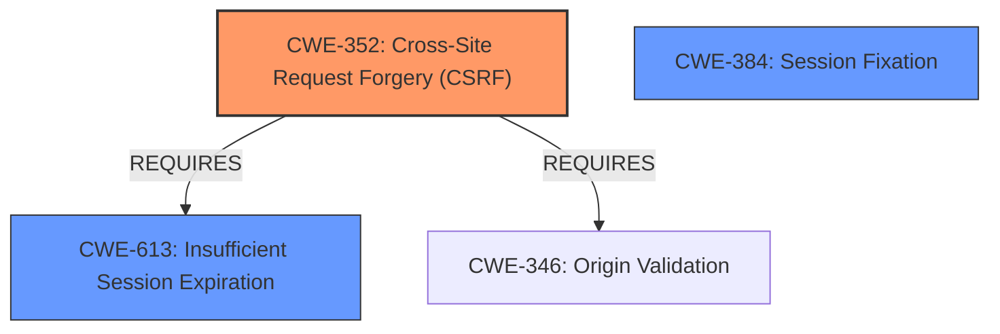

# Analysis Report for CVE-2022-24895

# Vulnerability Analysis Report: CVE-2022-24895

## Description


## Analysis (with Relationship Data)

# Summary
| CWE ID | CWE Name | Confidence | CWE Abstraction Level | CWE Vulnerability Mapping Label | CWE-Vulnerability Mapping Notes |
|---|---|---|---|---|---|
| CWE-352 | Cross-Site Request Forgery (CSRF) | 0.9 | Compound | Allowed | Primary CWE |
| CWE-613 | Insufficient Session Expiration | 0.7 | Base | Allowed | Secondary Candidate |
| CWE-384 | Session Fixation | 0.6 | Compound | Allowed | Secondary Candidate |

## Evidence and Confidence

*   **Confidence Score:** 0.8
*   **Evidence Strength:** HIGH

## Relationship Analysis
The primary CWE selected is CWE-352, Cross-Site Request Forgery (CSRF), which is a compound weakness. CWE-613, Insufficient Session Expiration, and CWE-384, Session Fixation, are considered as secondary candidates. CWE-352 requires CWE-613, suggesting a potential relationship where insufficient session expiration could contribute to the success of a CSRF attack. CWE-384, Session Fixation, is also relevant as the vulnerability description mentions a similarity to session fixation attacks.



## Vulnerability Chain
The vulnerability chain starts with the **rootcause**: the Symfony framework regenerating session IDs but preserving the rest of the session attributes. This leads to the **weakness**: CSRF tokens not being cleared upon login, which results in the **impact**: bypassing the CSRF protection mechanism, similar to a session-fixation attack.

## Summary of Analysis
The initial analysis focused on identifying the most relevant CWE based on the vulnerability description and the provided context. The description clearly indicates that the vulnerability allows bypassing CSRF protection due to the improper handling of session attributes upon login.

The evidence from the "Vulnerability Description Key Phrases" includes:
- **rootcause:** **Symfony regenerates session ID but preserves rest of session attributes**
- **weakness:** **cross-site request forgery**
- **impact:** bypass CSRF protection

The evidence from the "CVE Reference Links Content Summary" includes:
- **root_cause**: "CSRF tokens were not cleared upon successful login, allowing same-site attackers to potentially bypass CSRF protection."
- **weaknesses**: ["CSRF token fixation vulnerability"]
- **impact**: "Bypass of CSRF protection, potentially leading to unauthorized actions by an attacker."

The retriever results also support the selection of CWE-352, as it is listed as a top candidate.

CWE-352 is selected as the primary CWE because the vulnerability's main impact is the bypass of CSRF protection. The fact that CSRF tokens are not cleared upon login directly relates to the core issue described by CWE-352. While the vulnerability shares similarities with session fixation (CWE-384) and involves insufficient session expiration (CWE-613), the primary effect is the circumvention of CSRF protection mechanisms, making CWE-352 the most accurate classification.

CWE-613 was considered because the **rootcause** involves the framework not properly invalidating the session which leads to the bypass. However, the vulnerability description focuses on the bypass of CSRF, making CWE-352 the more direct match.

CWE-384 was considered because the vulnerability is similar to a session fixation attack. However, session fixation involves an attacker forcing a known session ID on a user, while this vulnerability involves the application not clearing existing CSRF tokens. Therefore, CWE-352 is a better fit.

The chosen CWE is at the compound level, which is appropriate given that CSRF is a complex issue involving multiple contributing factors.

Relevant CWE Information:

# Enhanced Context (25 CWEs)
The following CWEs were identified as potentially relevant to this vulnerability:

## CWE-352: Cross-Site Request Forgery (CSRF)
**Abstraction:** Compound
**Status:** Stable

### Description
The web application does not, or can not, sufficiently verify whether a well-formed, valid, consistent request was intentionally provided by the user who submitted the request.

### Extended Description
When a web server is designed to receive a request from a client without any mechanism for verifying that it was intentionally sent, then it might be possible for an attacker to trick a client into making an unintentional request to the web server which will be treated as an authentic request. This can be done via a URL, image load, XMLHttpRequest, etc. and can result in exposure of data or unintended code execution.

### Alternative Terms
Session Riding
Cross Site Reference Forgery
XSRF

### Relationships
ChildOf -> CWE-345
ChildOf -> CWE-345
Requires -> CWE-346
Requires -> CWE-441
Requires -> CWE-642
Requires -> CWE-613

### Mapping Guidance
**Usage:** Allowed
**Rationale:** This is a well-known Composite of multiple weaknesses that must all occur simultaneously, although it is attack-oriented in nature.

## CWE-613: Insufficient Session Expiration
**Abstraction:** Base
**Status:** Incomplete

### Description
According to WASC, "Insufficient Session Expiration is when a web site permits an attacker to reuse old session credentials or session IDs for authorization."

### Relationships
ChildOf -> CWE-672
ChildOf -> CWE-672
CanPrecede -> CWE-287

### Mapping Guidance
**Usage:** Allowed
**Rationale:** This CWE entry is at the Base level of abstraction, which is a preferred level of abstraction for mapping to the root causes of vulnerabilities.

## CWE-384: Session Fixation
**Abstraction:** Compound
**Status:** Incomplete

### Description
Authenticating a user, or otherwise establishing a new user session, without invalidating any existing session identifier gives an attacker the opportunity to steal authenticated sessions.

### Relationships
ChildOf -> CWE-610
ChildOf -> CWE-610
Requires -> CWE-346
Requires -> CWE-472
Requires -> CWE-441

### Mapping Guidance
**Usage:** Allowed
**Rationale:** This is a well-known Composite of multiple weaknesses that must all occur simultaneously, although it is attack-oriented in nature.


## CWE Relationship Analysis

Current CWEs represent these abstraction levels: .


### Vulnerability Chain Analysis

**Chain starting from CWE-472:**
- 472 (External Control of Assumed-Immutable Web Parameter) - ROOT


**Chain starting from CWE-672:**
- 672 (Operation on a Resource after Expiration or Release) - ROOT


### CWE Relationship Diagram

```mermaid
graph TD
    classDef primary fill:#f96,stroke:#333,stroke-width:2px
    classDef secondary fill:#69f,stroke:#333
    classDef tertiary fill:#9e9,stroke:#333
```


*Report generated on 2025-03-30 15:41:01*
