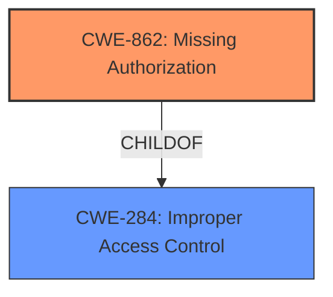

# Raw Analyzer Response for CVE-2022-24896

# Summary
| CWE ID | CWE Name | Confidence | CWE Abstraction Level | CWE Vulnerability Mapping Label | CWE-Vulnerability Mapping Notes |
|---|---|---|---|---|---|
| CWE-862 | Missing Authorization | 0.9 | Class | Allowed-with-Review | Primary CWE. The product **does not properly verify authorizations when displaying the content of tracker report renderer and chart widgets**. |
| CWE-284 | Improper Access Control | 0.6 | Pillar | Discouraged | Secondary CWE. The vulnerability is related to access control issues, but CWE-862 is more specific. |

## Evidence and Confidence

*   **Confidence Score:** 0.9
*   **Evidence Strength:** HIGH

## Relationship Analysis
The primary relationship is that CWE-862 (Missing Authorization) is a child of CWE-284 (Improper Access Control). This indicates that CWE-862 is a more specific type of access control issue. Since the vulnerability description and CVE details clearly point to a **missing authorization** check, CWE-862 is chosen as the primary CWE.

## Vulnerability Chain
The vulnerability chain consists of a **missing authorization** check, leading to information disclosure.

## Summary of Analysis
The initial assessment identified the **root cause** as the application's failure to **properly verify authorizations** when displaying tracker report data, allowing unauthorized users to access information they should not have access to. The **evidence** supporting this assessment includes the vulnerability description stating the application "**does not properly verify authorizations when displaying the content of tracker report renderer and chart widgets**" and the CVE Reference Links Content Summary highlighting the **"Insufficient Authorization Checks"** as the primary vulnerability.

Based on the provided information, CWE-862 (Missing Authorization) is the most appropriate classification because the application **does not perform an authorization check** when an actor attempts to access a resource or perform an action, directly aligning with the vulnerability's core issue. While CWE-284 (Improper Access Control) could be considered, it's a high-level category, and CWE-862 provides a more specific and accurate representation of the **missing authorization** problem.

The selection of CWE-862 is at the optimal level of specificity because it directly addresses the **root cause** of the vulnerability, which is the **lack of authorization checks**. This is consistent with the principle of choosing the most detailed (child) CWE over a generic (parent) CWE when the evidence supports it.

Relevant CWE Information:

# Enhanced Context (25 CWEs)
The following CWEs were identified as potentially relevant to this vulnerability:

## CWE-1289: Improper Validation of Unsafe Equivalence in Input
**Abstraction Level**: Base
**Similarity Score**: 0.77

## CWE-41: Improper Resolution of Path Equivalence
**Abstraction Level**: Base
**Similarity Score**: 0.77

## CWE-345: Insufficient Verification of Data Authenticity
**Abstraction Level**: Class
**Similarity Score**: 0.77

## CWE-668: Exposure of Resource to Wrong Sphere
**Abstraction Level**: Class
**Similarity Score**: 0.77

## CWE-295: Improper Certificate Validation
**Abstraction Level**: Base
**Similarity Score**: 0.77

## CWE-639: Authorization Bypass Through User-Controlled Key
**Abstraction Level**: Base
**Similarity Score**: 0.77

## CWE-923: Improper Restriction of Communication Channel to Intended Endpoints
**Abstraction Level**: Class
**Similarity Score**: 0.77

## CWE-807: Reliance on Untrusted Inputs in a Security Decision
**Abstraction Level**: Base
**Similarity Score**: 0.76

## CWE-1390: Weak Authentication
**Abstraction Level**: Class
**Similarity Score**: 0.76

## CWE-74: Improper Neutralization of Special Elements in Output Used by a Downstream Component ('Injection')
**Abstraction Level**: Class
**Similarity Score**: 0.76

## CWE-639: Authorization Bypass Through User-Controlled Key
**Abstraction Level**: Base
**Similarity Score**: 6863.94

## CWE-863: Incorrect Authorization
**Abstraction Level**: Class
**Similarity Score**: 6712.97

## CWE-116: Improper Encoding or Escaping of Output
**Abstraction Level**: Class
**Similarity Score**: 6610.53

## CWE-923: Improper Restriction of Communication Channel to Intended Endpoints
**Abstraction Level**: Class
**Similarity Score**: 6590.79

## CWE-285: Improper Authorization
**Abstraction Level**: Class
**Similarity Score**: 6539.54

## CWE-322: Key Exchange without Entity Authentication
**Abstraction Level**: base
**Similarity Score**: 5.03

## CWE-22: Improper Limitation of a Pathname to a Restricted Directory ('Path Traversal')
**Abstraction Level**: base
**Similarity Score**: 4.33

## CWE-178: Improper Handling of Case Sensitivity
**Abstraction Level**: base
**Similarity Score**: 3.76

## CWE-41: Improper Resolution of Path Equivalence
**Abstraction Level**: Base
**Similarity Score**: 3.33

## CWE-20: Improper Input Validation
**Abstraction Level**: class
**Similarity Score**: 2.98

## CWE-79: Improper Neutralization of Input During Web Page Generation ('Cross-site Scripting')
**Abstraction Level**: base
**Similarity Score**: 2.87

## CWE-289: Authentication Bypass by Alternate Name
**Abstraction Level**: base
**Similarity Score**: 2.87

## CWE-942: Permissive Cross-domain Policy with Untrusted Domains
**Abstraction Level**: variant
**Similarity Score**: 2.68

## CWE-116: Improper Encoding or Escaping of Output
**Abstraction Level**: class
**Similarity Score**: 2.55

## CWE-350: Reliance on Reverse DNS Resolution for a Security-Critical Action
**Abstraction Level**: variant
**Similarity Score**: 2.55

**CWE Considerations:**
*   CWE-284 (Improper Access Control): Considered but deemed too general.
*   CWE-863 (Incorrect Authorization): Considered, but the vulnerability is due to a **missing** check, not an **incorrect** one.
*   CWE-639 (Authorization Bypass Through User-Controlled Key): While a user-controlled key might be involved, the core issue is the **missing authorization** check.