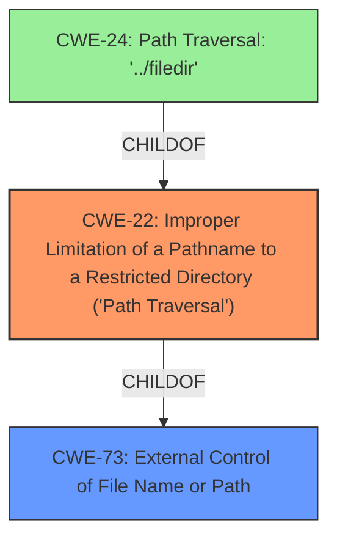

# Analysis for CVE-2022-24900

# Summary
| CWE ID | CWE Name | Confidence | CWE Abstraction Level | CWE Vulnerability Mapping Label | CWE-Vulnerability Mapping Notes |
|---|---|---|---|---|---|
| CWE-22 | Improper Limitation of a Pathname to a Restricted Directory ('Path Traversal') | 0.9 | Base | Allowed | Primary CWE |
| CWE-73 | External Control of File Name or Path | 0.8 | Base | Allowed | Secondary Candidate |

## Evidence and Confidence

*   **Confidence Score:** 0.85
*   **Evidence Strength:** HIGH

## Relationship Analysis
The primary CWE is CWE-22 **Improper Limitation of a Pathname to a Restricted Directory ('Path Traversal')**. This CWE is a base level which is appropriate. CWE-73 **External Control of File Name or Path** is a parent of CWE-22, but CWE-22 is more specific and therefore a better fit. CWE-24 is a variant of CWE-22 but the weakness doesn't specify the "../filedir" case specifically so it is not used.

## Vulnerability Chain
The chain of events starts with external control of a file name or path (CWE-73), leading to improper limitation of a pathname to a restricted directory, which results in a path traversal vulnerability (CWE-22).

## Summary of Analysis
The vulnerability involves a **path traversal attack** due to the unsafe use of `os.path.join` with untrusted input, as stated in the "Root cause" from the CVE Reference Links Content Summary: "The `os.path.join` function is used unsafely with untrusted input, allowing an attacker to control the path passed to `flask.send_file`." This allows an attacker to access arbitrary files and directories, as the "Impact" section confirms: "An attacker can access arbitrary files and directories on the file system, including application source code, configuration files, and critical system files."

The **weakness** is a **path traversal attack**. The vulnerable function `os.path.join` **does not properly** neutralize absolute path sequences.

The `os.path.join` call **encounters an absolute path**, it ignores all the parameters it has encountered till that point and starts working with the new absolute path. Since the malicious parameter represents an absolute path, the result of `os.path.join` ignores the static directory completely. Hence, untrusted input is passed via the `os.path.join` call to `flask.send_file` can lead to a **path traversal attack**.

CWE-22 **Improper Limitation of a Pathname to a Restricted Directory ('Path Traversal')** best fits the root cause. Its description states: "The product uses external input to construct a pathname that is intended to identify a file or directory that is located underneath a restricted parent directory, but the product does not properly neutralize special elements within the pathname that can cause the pathname to resolve to a location that is outside of the restricted directory." This aligns perfectly with the vulnerability description. The vulnerability description explicitly states that a **path traversal attack** is possible.

CWE-73 **External Control of File Name or Path** is also relevant, as the vulnerability involves user-controlled input influencing file paths. The description of CWE-73 states: "The product allows user input to control or influence paths or file names that are used in filesystem operations." However, CWE-22 is more specific and directly addresses the **path traversal** aspect of the vulnerability, making it a more accurate primary classification.

CWE-36 **Absolute Path Traversal** was considered because the vulnerability description mentions the `os.path.join` call encountering an absolute path and ignoring previous parameters. However, CWE-22 is broader and covers both relative and absolute path traversal, making it a more suitable fit.

CWE-23 **Relative Path Traversal** was considered, but the description also mentions absolute path names, so CWE-22 is a better fit.

CWE-24 **Path Traversal: '../filedir'** was considered, but the description does not mention "../filedir" specifically.

CWE-59 **Improper Link Resolution Before File Access ('Link Following')** was considered but the description does not indicate any symlink usage.

CWE-502 **Deserialization of Untrusted Data** was considered but the description does not indicate any deserialization of data.

CWE-88 **Improper Neutralization of Argument Delimiters in a Command ('Argument Injection')** was considered but the description does not indicate any command injection.

The selection of CWE-22 as the primary CWE is based on its direct relevance to the **path traversal vulnerability**, as evidenced by the vulnerability description and the CVE Reference Links Content Summary. The provided information explicitly points to the improper handling of pathnames, allowing attackers to access files outside the intended restricted directory. This aligns perfectly with the definition and characteristics of CWE-22.