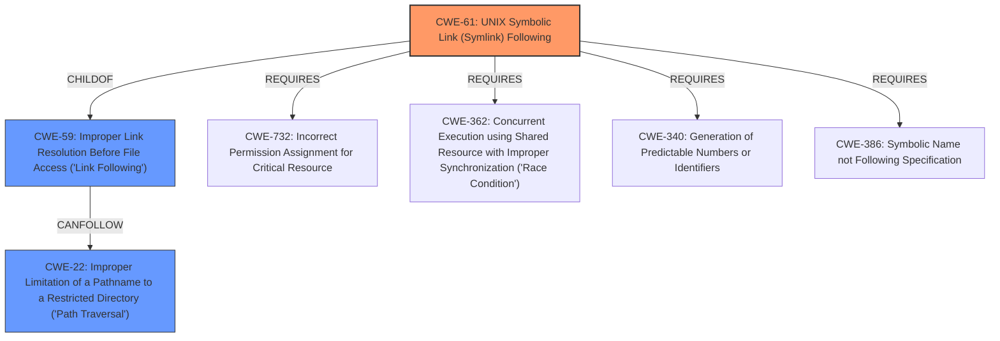

# Enhanced Analysis for CVE-2022-24904

# Summary
| CWE ID | CWE Name | Confidence | CWE Abstraction Level | CWE Vulnerability Mapping Label | CWE-Vulnerability Mapping Notes |
|---|---|---|---|---|---|
| CWE-61 | UNIX Symbolic Link (Symlink) Following | 1.0 | Compound | Allowed | Primary CWE |
| CWE-59 | Improper Link Resolution Before File Access ('Link Following') | 0.8 | Base | Allowed | Secondary Candidate |
| CWE-22 | Improper Limitation of a Pathname to a Restricted Directory ('Path Traversal') | 0.6 | Base | Allowed | Secondary Candidate |

## Evidence and Confidence

*   **Confidence Score:** 0.9
*   **Evidence Strength:** HIGH

## Relationship Analysis
The primary CWE is CWE-61, "UNIX Symbolic Link (Symlink) Following," which is a compound CWE representing a combination of multiple weaknesses that must occur together. This is appropriate given the vulnerability description explicitly mentions a **symlink following bug**. CWE-61 is a ChildOf CWE-59, "Improper Link Resolution Before File Access ('Link Following')," indicating a more general case of improper handling of links. CWE-22, "Improper Limitation of a Pathname to a Restricted Directory ('Path Traversal')," is also related, as symlink following can lead to accessing files outside the intended restricted directory.



## Vulnerability Chain
The vulnerability chain starts with a **symlink following bug** (CWE-61). An attacker with write access to a repository can create a malicious symlink that points to out-of-bounds files. When Argo CD's repo-server processes this symlink, it accesses the unintended file, leading to the leakage of sensitive information.

## Summary of Analysis
The primary classification is CWE-61, "UNIX Symbolic Link (Symlink) Following," because the vulnerability is directly caused by the improper handling of symlinks, as stated in the vulnerability description: "vulnerable to a **symlink following bug** allowing a malicious user with repository write access to leak sensitive files from Argo CDs repo-server." The evidence from the CVE Reference Links Content Summary also supports this, stating "The vulnerability is due to a symlink following bug within the Argo CD repo-server."

CWE-59, "Improper Link Resolution Before File Access ('Link Following')," is a more general case of the same issue and is a parent of CWE-61, but CWE-61 is more specific.

CWE-22, "Improper Limitation of a Pathname to a Restricted Directory ('Path Traversal')," is also relevant because the symlink allows traversal outside the intended directory.

The selected CWEs are at the optimal level of specificity because CWE-61 directly addresses the **symlink following bug**, while CWE-59 and CWE-22 provide broader context.

Relevant CWE Information:

# Enhanced Context (25 CWEs)

## CWE-61: UNIX Symbolic Link (Symlink) Following
**Abstraction:** Compound
**Similarity Score**: 0.80
**Source**: alternate_terms

**Description**:
The product, when opening a file or directory, does not sufficiently account for when the file is a symbolic link that resolves to a target outside of the intended control sphere. This could allow an attacker to cause the product to operate on unauthorized files.

**Mapping Guidance**:
- Usage: Allowed
- Rationale: This is a well-known Composite of multiple weaknesses that must all occur simultaneously, although it is attack-oriented in nature.

## CWE-59: Improper Link Resolution Before File Access ('Link Following')
**Abstraction:** Base
**Similarity Score**: 8638.48
**Source**: sparse

**Description**:
The product attempts to access a file based on the filename, but it does not properly prevent that filename from identifying a link or shortcut that resolves to an unintended resource.

**Mapping Guidance**:
- Usage: Allowed
- Rationale: This CWE entry is at the Base level of abstraction, which is a preferred level of abstraction for mapping to the root causes of vulnerabilities.

## CWE-22: Improper Limitation of a Pathname to a Restricted Directory ('Path Traversal')
**Abstraction:** Base
**Similarity Score**: 8816.73
**Source**: sparse

**Description**:
The product uses external input to construct a pathname that is intended to identify a file or directory that is located underneath a restricted parent directory, but the product does not properly neutralize special elements within the pathname that can cause the pathname to resolve to a location that is outside of the restricted directory.

**Mapping Guidance**:
- Usage: Allowed
- Rationale: This CWE entry is at the Base level of abstraction, which is a preferred level of abstraction for mapping to the root causes of vulnerabilities.

## CWE-73: External Control of File Name or Path
CWE-73 was considered, but it is a more general weakness where the file name or path is externally controlled. While this is a factor, the core issue is the mishandling of symlinks.

## CWE-79: Improper Neutralization of Input During Web Page Generation ('Cross-site Scripting')
CWE-79 was considered because the leaked information could potentially be used in a web context. However, the primary issue is the leakage of sensitive files, not the rendering of web pages.


## CWE Relationship Analysis

Current CWEs represent these abstraction levels: .


### Vulnerability Chain Analysis

**Chain starting from CWE-732:**
- 732 (Incorrect Permission Assignment for Critical Resource) - ROOT


**Chain starting from CWE-340:**
- 340 (Generation of Predictable Numbers or Identifiers) - ROOT


### CWE Relationship Diagram

```mermaid
graph TD
    classDef primary fill:#f96,stroke:#333,stroke-width:2px
    classDef secondary fill:#69f,stroke:#333
    classDef tertiary fill:#9e9,stroke:#333
```