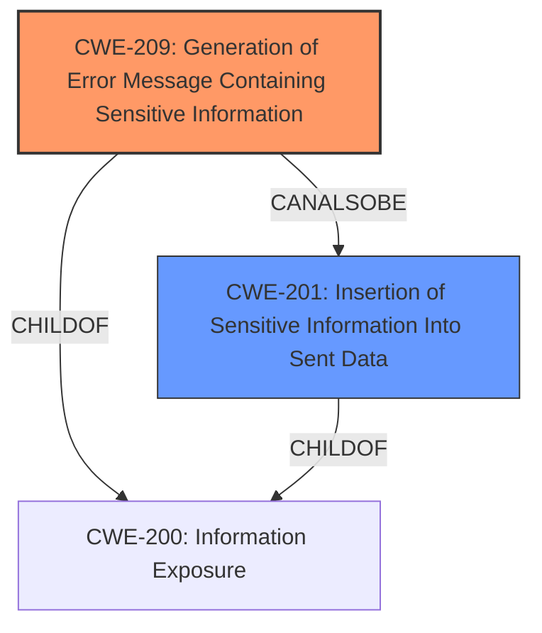

# Raw Analyzer Response for CVE-2022-24906

# Summary
| CWE ID | CWE Name | Confidence | CWE Abstraction Level | CWE Vulnerability Mapping Label | CWE-Vulnerability Mapping Notes |
|---|---|---|---|---|---|
| CWE-209 | Generation of Error Message Containing Sensitive Information | 1.0 | Base | Allowed | Primary CWE |
| CWE-201 | Insertion of Sensitive Information Into Sent Data | 0.7 | Base | Allowed | Secondary Candidate |

## Evidence and Confidence

*   **Confidence Score:** 0.85
*   **Evidence Strength:** HIGH

## Relationship Analysis
The primary relationship impacting the decision is that CWE-209 is a child of CWE-200 (Information Exposure), indicating a more specific type of information exposure. While CWE-201 (Insertion of Sensitive Information Into Sent Data) is also a child of CWE-200 and a peer of CWE-209, the evidence more strongly supports the generation of an error message containing the sensitive path, rather than the general insertion of sensitive information into sent data.

## Vulnerability Chain
The vulnerability chain starts with a **weakness** where the application **fails to properly** handle errors when deleting deck card attachments, leading to the **exposure** of the full application path in the error message.

## Summary of Analysis
The primary CWE is CWE-209 (Generation of Error Message Containing Sensitive Information) because the vulnerability description and CVE reference links clearly indicate that the application **exposes** its full path in an error message due to **improper** error handling during the deletion of deck card attachments.

The evidence includes:

*   **Vulnerability Description Key Phrases:** "**weakness:** **full path exposure**"
*   **CVE Reference Links Content Summary:** "This error inadvertently **exposes** the full application path to unauthorized users."
*   **CVE Reference Links Content Summary:** "Information **Exposure**: The application leaks sensitive information by disclosing its full path in error responses related to deleting attachments."
*   **CVE Reference Links Content Summary:** "Lack of proper error handling: The system returns detailed exception information, including the application path, instead of a generic error message."
*   **CVE Reference Links Content Summary:** "The fix for this vulnerability involves suppressing exception details in the API response and returning a generic error message with a request ID for logging purposes."

CWE-209's description aligns perfectly: "The product generates an error message that includes sensitive information about its environment, users, or associated data."

CWE-201 (Insertion of Sensitive Information Into Sent Data) was considered because the full path is being sent in the error message. However, CWE-209 is more specific as it directly addresses the generation of error messages containing sensitive information, making it a better fit.

I am confident in this assessment due to the clear evidence and direct applicability of CWE-209.