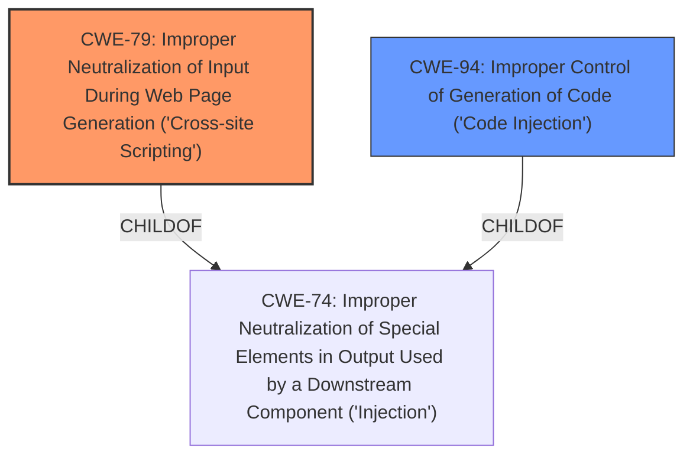

# Analysis Report for CVE-2022-24915

# Vulnerability Analysis Report: CVE-2022-24915

## Description


## Analysis (with Relationship Data)

# Summary
| CWE ID | CWE Name | Confidence | CWE Abstraction Level | CWE Vulnerability Mapping Label | CWE-Vulnerability Mapping Notes |
|---|---|---|---|---|---|
| CWE-79 | Improper Neutralization of Input During Web Page Generation ('Cross-site Scripting') | 1.0 | Base | Allowed | Primary CWE |
| CWE-94 | Improper Control of Generation of Code ('Code Injection') | 0.75 | Base | Allowed-with-Review | Secondary Candidate |

## Evidence and Confidence

*   **Confidence Score:** 0.9
*   **Evidence Strength:** HIGH

## Relationship Analysis
The primary CWE is CWE-79, which is a Base level CWE, making it a good fit. CWE-79 is a child of CWE-74 (Improper Neutralization of Special Elements in Output Used by a Downstream Component ('Injection')), but since CWE-79 is more specific and a base level, it is a better fit. CWE-94 is also a child of CWE-74. CWE-79 can precede CWE-494 (Download of Code Without Integrity Check) and is a peer of CWE-352 (Cross-Site Request Forgery (CSRF)). While this vulnerability could potentially lead to code execution, the more immediate weakness is the improper neutralization of input, making CWE-79 the most appropriate primary mapping.



## Vulnerability Chain
The vulnerability chain starts with the **absence of filters** on user-supplied input. This leads to **improper neutralization** of that input, allowing an attacker to inject malicious code. When a legitimate user accesses the web section where the un-neutralized input is displayed, the injected code is executed in the user's browser. This results in **cross-site scripting**, allowing the attacker to perform actions on behalf of the user.

## Summary of Analysis
The primary weakness identified is **CWE-79 (Improper Neutralization of Input During Web Page Generation ('Cross-site Scripting'))**. This is based on the vulnerability description's mention of the **absence of filters** which allows for the injection of malicious code that is executed when a legitimate user accesses the web section. The CVE Reference Links Content Summary confirms the lack of input sanitization, leading to the possibility of injecting and executing arbitrary code.

While the CVE Reference Links Content Summary section mentions **Code Injection (CWE-94)**, the vulnerability description primarily emphasizes the **absence of filters** and the resulting **cross-site scripting** when a legitimate user views the content. Therefore, CWE-79 is the most appropriate primary CWE.

The Retriever Results also list CWE-79 as a potential match, further supporting this decision. The abstraction level of CWE-79 is Base, which is preferred.

CWE-94 (Improper Control of Generation of Code ('Code Injection')) is considered as a secondary candidate because the injected code is ultimately executed. However, the root cause is the lack of neutralization, making CWE-79 more directly relevant. The retriever also lists it.
Relevant CWE Information:

# Enhanced Context (25 CWEs)

## CWE-1289: Improper Validation of Unsafe Equivalence in Input
**Abstraction Level**: Base
**Similarity Score**: 0.81

This CWE was not selected because the described vulnerability does not explicitly involve validating the equivalence of an input to a potentially unsafe value.

## CWE-184: Incomplete List of Disallowed Inputs
**Abstraction Level**: Base
**Similarity Score**: 0.79

This CWE was not selected because the vulnerability is not about an incomplete list of disallowed inputs, but rather the **absence of filters**.

## CWE-74: Improper Neutralization of Special Elements in Output Used by a Downstream Component ('Injection')
**Abstraction Level**: Class
**Similarity Score**: 0.78

This CWE was not selected because it is a class level CWE, and a more specific Base CWE is available, CWE-79.

## CWE-807: Reliance on Untrusted Inputs in a Security Decision
**Abstraction Level**: Base
**Similarity Score**: 0.78

This CWE was not selected because the vulnerability doesn't explicitly rely on untrusted inputs in a security decision, but on a **lack of input filtering**.

## CWE-138: Improper Neutralization of Special Elements
**Abstraction Level**: Class
**Similarity Score**: 0.77

This CWE was not selected because it is a class level CWE, and a more specific Base CWE is available, CWE-79.

## CWE-80: Improper Neutralization of Script-Related HTML Tags in a Web Page (Basic XSS)
**Abstraction Level**: Variant
**Similarity Score**: 0.77

This CWE was not selected because CWE-79 is more appropriate since it's the base level for Cross-Site Scripting.

## CWE-183: Permissive List of Allowed Inputs
**Abstraction Level**: Base
**Similarity Score**: 0.77

This CWE was not selected because the vulnerability is not about a permissive list of allowed inputs, but rather the **absence of filters**.

## CWE-41: Improper Resolution of Path Equivalence
**Abstraction Level**: Base
**Similarity Score**: 0.77

This CWE was not selected because the vulnerability does not involve path equivalence issues.

## CWE-116: Improper Encoding or Escaping of Output
**Abstraction Level**: Class
**Similarity Score**: 0.76

This CWE was not selected because the vulnerability doesn't specifically describe an encoding or escaping issue. The primary issue is the **absence of filters**.

## CWE-472: External Control of Assumed-Immutable Web Parameter
**Abstraction Level**: Base
**Similarity Score**: 0.76

This CWE was not selected because the vulnerability does not specifically relate to assumed-immutable web parameters.

## CWE-88: Improper Neutralization of Argument Delimiters in a Command ('Argument Injection')
**Abstraction Level**: Base
**Similarity Score**: 9048.46

This CWE was not selected because it involves command argument injection, which is not the primary issue in the provided vulnerability description. The core weakness is the **absence of filters** leading to XSS.

## CWE-22: Improper Limitation of a Pathname to a Restricted Directory ('Path Traversal')
**Abstraction Level**: Base
**Similarity Score**: 8925.57

This CWE was not selected because the vulnerability is not related to path traversal issues.

## CWE-494: Download of Code Without Integrity Check
**Abstraction Level**: base
**Similarity Score**: 4.33

This CWE was not selected because the vulnerability is not about downloading code without an integrity check.

## CWE-770: Allocation of Resources Without Limits or Throttling
**Abstraction Level**: base
**Similarity Score**: 4.33

This CWE was not selected because the vulnerability is not related to resource allocation or throttling.

## CWE-190: Integer Overflow or Wraparound
**Abstraction Level**: base
**Similarity Score**: 4.33

This CWE was not selected because the vulnerability is not about integer overflows or wraparounds.

## CWE-289: Authentication Bypass by Alternate Name
**Abstraction Level**: base
**Similarity Score**: 4.33

This CWE was not selected because the vulnerability is not about authentication bypass.

## CWE-613: Insufficient Session Expiration
**Abstraction Level**: base
**Similarity Score**: 4.21

This CWE was not selected because the vulnerability is not about session expiration issues.


## CWE Relationship Analysis

Current CWEs represent these abstraction levels: .


### Vulnerability Chain Analysis

**Chain starting from CWE-41:**
- 41 (Improper Resolution of Path Equivalence) - ROOT


**Chain starting from CWE-807:**
- 807 (Reliance on Untrusted Inputs in a Security Decision) - ROOT


### CWE Relationship Diagram

```mermaid
graph TD
    classDef primary fill:#f96,stroke:#333,stroke-width:2px
    classDef secondary fill:#69f,stroke:#333
    classDef tertiary fill:#9e9,stroke:#333
```


*Report generated on 2025-03-31 01:37:06*
