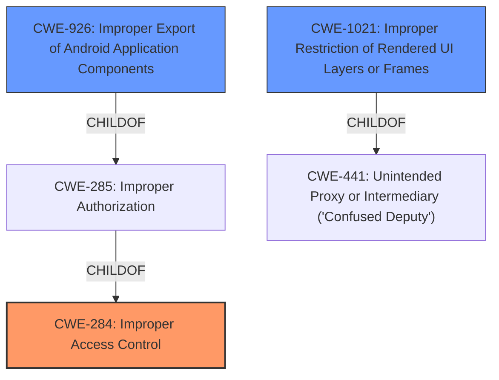

# Raw Analyzer Response for CVE-2022-24923

# Summary

| CWE ID | CWE Name | Confidence | CWE Abstraction Level | CWE Vulnerability Mapping Label | CWE-Vulnerability Mapping Notes |
|---|---|---|---|---|---|
| CWE-284 | Improper Access Control | 0.9 | Pillar | Primary | Discouraged |
| CWE-926 | Improper Export of Android Application Components | 0.6 | Variant | Secondary | Allowed |
| CWE-1021 | Improper Restriction of Rendered UI Layers or Frames | 0.5 | Base | Secondary | Allowed |

## Evidence and Confidence

*   **Confidence Score:** 0.7
*   **Evidence Strength:** HIGH

## Relationship Analysis
The primary CWE selected is CWE-284, which is a high-level Pillar. The Retriever Results suggested more specific CWEs. CWE-926 is a Variant of CWE-285 (Improper Authorization), which is a child of CWE-284. CWE-1021 is a Base CWE, but also a child of CWE-441 (Unintended Proxy or Intermediary ('Confused Deputy')) which is a Class. While CWE-284 is discouraged, the evidence is not strong enough to support a specific child.

## Vulnerability Chain
The vulnerability chain starts with **improper access control**, allowing untrusted applications to load arbitrary URLs and local files in a webview.

## Summary of Analysis
The initial analysis identified **improper access control** as the root cause. The Retriever Results provided a list of candidate CWEs, but the high-level nature of the vulnerability description makes it difficult to pinpoint a specific weakness. The final decision favors CWE-284 due to the direct mention of **improper access control** in the vulnerability description: "**Improper access control** vulnerability in Samsung SearchWidget prior to versions 2.3.00.6 in China models allows untrusted applications to load arbitrary URL and local files in webview."

CWE-926 (Improper Export of Android Application Components) was considered because the vulnerability involves an Android application component (SearchWidget) being accessed by untrusted applications. However, the description doesn't explicitly state that the component is being improperly exported, so this is a secondary consideration.

CWE-1021 (Improper Restriction of Rendered UI Layers or Frames) was considered, given that the vulnerability allows untrusted applications to load arbitrary URLs and local files in a webview, potentially leading to UI redress attacks. However, since the primary issue is **improper access control**, this is also a secondary consideration.

The selected CWEs are at the appropriate level of specificity given the available evidence. While more specific CWEs exist, the vulnerability description doesn't provide enough detail to confidently map to them.

Relevant CWE Information:
*   **CWE-284: Improper Access Control**
    *   **Technical Explanation:** The product does not restrict or incorrectly restricts access to a resource from an unauthorized actor. In this case, the Samsung SearchWidget does not properly restrict which applications can load content within its webview.
    *   **Security Implications:** This allows untrusted applications to load arbitrary URLs and local files, potentially leading to arbitrary code execution, data exfiltration, and phishing attacks.
    *   **Relationship:** This is a high-level Pillar, and more specific CWEs might be applicable if more information were available.
    *   **Mapping Guidance:** Discouraged due to being high-level, but appropriate given the lack of specific details.
*   **CWE-926: Improper Export of Android Application Components**
    *   **Technical Explanation:** The Android application exports a component for use by other applications, but does not properly restrict which applications can launch the component or access the data it contains.
    *   **Security Implications:** This allows a malicious application to gain access to sensitive information, modify the internal state of the application, or trick a user into interacting with the victim application.
    *   **Relationship:** This is a Variant of CWE-285 (Improper Authorization), which is a child of CWE-284.
    *   **Mapping Guidance:** Allowed, as it is a Variant.
*   **CWE-1021: Improper Restriction of Rendered UI Layers or Frames**
    *   **Technical Explanation:** The web application does not restrict or incorrectly restricts frame objects or UI layers that belong to another application or domain, which can lead to user confusion about which interface the user is interacting with.
    *   **Security Implications:** This could enable Clickjacking and UI Redress attacks.
    *   **Relationship:** ChildOf -> CWE-441, ChildOf -> CWE-610, ChildOf -> CWE-451
    *   **Mapping Guidance:** Allowed, as it is a Base.