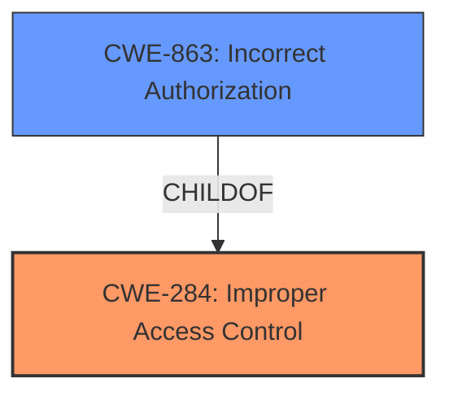

# Analysis for CVE-2022-24924

# Summary
| CWE ID | CWE Name | Confidence | CWE Abstraction Level | CWE Vulnerability Mapping Label | CWE-Vulnerability Mapping Notes |
|---|---|---|---|---|---|
| CWE-284 | Improper Access Control | 0.75 | Pillar | Primary | Discouraged |
| CWE-863 | Incorrect Authorization | 0.6 | Class | Secondary | Allowed-with-Review |

## Evidence and Confidence

*   **Confidence Score:** 0.7
*   **Evidence Strength:** MEDIUM

## Relationship Analysis
The primary relationship influencing this decision is the parent-child relationship between CWE-284 (Improper Access Control) and CWE-863 (Incorrect Authorization). CWE-284 is a high-level Pillar, while CWE-863 is a more specific Class. The vulnerability description indicates an **improper access control** issue, but the details suggest that the authorization check is performed incorrectly. Therefore, while CWE-284 is a general match, CWE-863 provides a more accurate classification as the authorization is incorrectly performed, rather than completely missing.

## Vulnerability Chain
The vulnerability chain consists of an **improper access control**, leading to the ability to create a specific named system directory without proper permission.
  - Root Cause: **Improper Access Control**
  - Impact: Creation of a specific named system directory without proper permissions

## Summary of Analysis
The initial assessment focused on the **improper access control** aspect of the vulnerability, aligning with the primary finding in both the vulnerability description and the CVE summary. The analysis was then refined by considering more specific CWEs related to access control, particularly those involving authorization.

The evidence indicates an **improper access control** in LiveWallpaperService, which allows the creation of a specific named system directory without proper permission. The vulnerability description key phrases also highlight **improper access control** as the root cause. The CVE Reference Links Content Summary corroborates this, stating, "**Root cause of vulnerability:** Improper access control in LiveWallpaperService."

The Retriever Results suggested CWE-284 (Improper Access Control), CWE-863 (Incorrect Authorization), and others. While CWE-284 is a direct match to the description, it is a high-level Pillar and is discouraged to use. CWE-863 is a Class-level CWE and a child of CWE-284, representing a more specific case where authorization is performed incorrectly.

Given the evidence and relationship analysis, the selected CWEs are at the optimal level of specificity. CWE-284 captures the general access control issue, while CWE-863 specifies that the authorization check is incorrectly performed.

Relevant CWE Information:

# Enhanced Context (25 CWEs)

## CWE-280: Improper Handling of Insufficient Permissions or Privileges
**Abstraction Level**: Base
**Similarity Score**: 0.76
**Source**: dense

**Description**:
The product does not handle or incorrectly handles when it has insufficient privileges to access resources or functionality as specified by their permissions. This may cause it to follow unexpected code paths that may leave the product in an invalid state.

**Mapping Guidance**:
- Usage: Allowed
- Rationale: This CWE entry is at the Base level of abstraction, which is a preferred level of abstraction for mapping to the root causes of vulnerabilities.

This was not selected as the issue is not the handling of insufficient privileges but rather the access control is incorrectly configured.

## CWE-274: Improper Handling of Insufficient Privileges
**Abstraction Level**: Base
**Similarity Score**: 0.76
**Source**: dense

**Description**:
The product does not handle or incorrectly handles when it has insufficient privileges to perform an operation, leading to resultant weaknesses.

**Mapping Guidance**:
- Usage: Discouraged
- Rationale: This CWE entry could be deprecated in a future version of CWE.

This was not selected as the issue is not the handling of insufficient privileges but rather the access control is incorrectly configured.

## CWE-266: Incorrect Privilege Assignment
**Abstraction Level**: Base
**Similarity Score**: 0.75
**Source**: dense

**Description**:
A product incorrectly assigns a privilege to a particular actor, creating an unintended sphere of control for that actor.

**Mapping Guidance**:
- Usage: Allowed
- Rationale: This CWE entry is at the Base level of abstraction, which is a preferred level of abstraction for mapping to the root causes of vulnerabilities.

This was not selected as the issue is not about incorrect privilege assignment, but more about the **improper access control** in general.

## CWE-267: Privilege Defined With Unsafe Actions
**Abstraction Level**: Base
**Similarity Score**: 0.75
**Source**: dense

**Description**:
A particular privilege, role, capability, or right can be used to perform unsafe actions that were not intended, even when it is assigned to the correct entity.

**Mapping Guidance**:
- Usage: Allowed
- Rationale: This CWE entry is at the Base level of abstraction, which is a preferred level of abstraction for mapping to the root causes of vulnerabilities.

This was not selected as the issue is not about a privilege being defined with unsafe actions, but more about the **improper access control** in general.

## CWE-639: Authorization Bypass Through User-Controlled Key
**Abstraction Level**: Base
**Similarity Score**: 0.74
**Source**: dense

**Description**:
The system's authorization functionality does not prevent one user from gaining access to another user's data or record by modifying the key value identifying the data.

**Mapping Guidance**:
- Usage: Allowed
- Rationale: This CWE entry is at the Base level of abstraction, which is a preferred level of abstraction for mapping to the root causes of vulnerabilities.

This was not selected as the issue is not specifically about authorization bypass through a user-controlled key, but more about the **improper access control** in general.

## CWE-1220: Insufficient Granularity of Access Control
**Abstraction Level**: Base
**Similarity Score**: 0.74
**Source**: dense

**Description**:
The product implements access controls via a policy or other feature with the intention to disable or restrict accesses (reads and/or writes) to assets in a system from untrusted agents. However, implemented access controls lack required granularity, which renders the control policy too broad because it allows accesses from unauthorized agents to the security-sensitive assets.

**Mapping Guidance**:
- Usage: Allowed
- Rationale: This CWE entry is at the Base level of abstraction, which is a preferred level of abstraction for mapping to the root causes of vulnerabilities.

This was not selected as the issue is not specifically about insufficient granularity of access control, but more about the **improper access control** in general.

## CWE-59: Improper Link Resolution Before File Access ('Link Following')
**Abstraction Level**: Base
**Similarity Score**: 0.74
**Source**: dense

**Description**:
The product attempts to access a file based on the filename, but it does not properly prevent that filename from identifying a link or shortcut that resolves to an unintended resource.

**Mapping Guidance**:
- Usage: Allowed
- Rationale: This CWE entry is at the Base level of abstraction, which is a preferred level of abstraction for mapping to the root causes of vulnerabilities.

This was not selected as the issue is not related to link resolution.

## CWE-269: Improper Privilege Management
**Abstraction Level**: Class
**Similarity Score**: 0.74
**Source**: dense

**Description**:
The product does not properly assign, modify, track, or check privileges for an actor, creating an unintended sphere of control for that actor.

**Mapping Guidance**:
- Usage: Discouraged
- Rationale: CWE-269 is commonly misused. It can be conflated with "privilege escalation," which is a technical impact that is listed in many low-information vulnerability reports [REF-1287]. It is not useful for trend analysis.

This was not selected as the issue is not specific to privilege management but more generally with **improper access control**.

## CWE-23: Relative Path Traversal
**Abstraction Level**: Base
**Similarity Score**: 0.74
**Source**: dense

**Description**:
The product uses external input to construct a pathname that should be within a restricted directory, but it does not properly neutralize sequences such as ".." that can resolve to a location that is outside of that directory.

**Mapping Guidance**:
- Usage: Allowed
- Rationale: This CWE entry is at the Base level of abstraction, which is a preferred level of abstraction for mapping to the root causes of vulnerabilities.

This was not selected as the issue is not related to path traversal.

## CWE-668: Exposure of Resource to Wrong Sphere
**Abstraction Level**: Class
**Similarity Score**: 0.74
**Source**: dense

**Description**:
The product exposes a resource