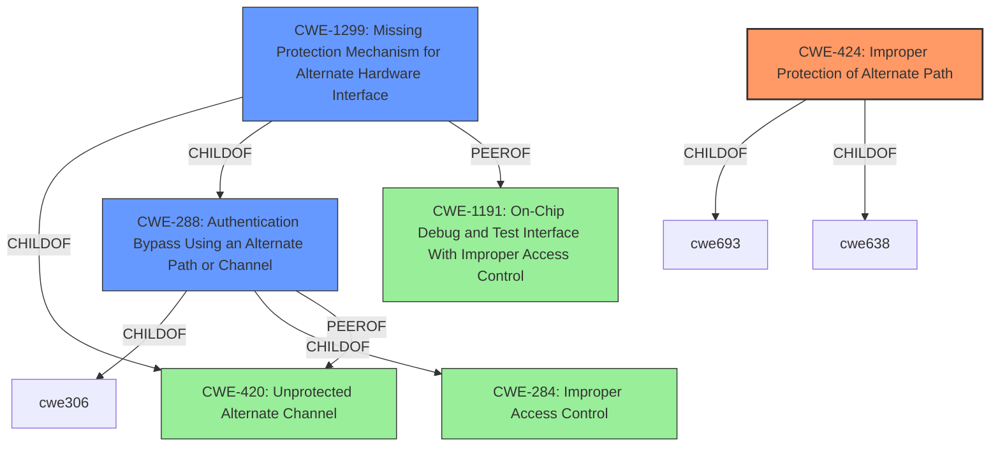

# Analysis for CVE-2022-24932

# Summary
| CWE ID | CWE Name | Confidence | CWE Abstraction Level | CWE Vulnerability Mapping Label | CWE-Vulnerability Mapping Notes |
|---|---|---|---|---|---|
| CWE-424 | Improper Protection of Alternate Path | 1.0 | Class | Allowed-with-Review | Primary CWE |
| CWE-288 | Authentication Bypass Using an Alternate Path or Channel | 0.7 | Base | Allowed | Secondary Candidate |
| CWE-1299 | Missing Protection Mechanism for Alternate Hardware Interface | 0.6 | Base | Allowed | Secondary Candidate |

## Evidence and Confidence

*   **Confidence Score:** 0.9
*   **Evidence Strength:** HIGH

## Relationship Analysis
The primary CWE, CWE-424, is a Class-level weakness that describes the **improper protection of alternate paths**. CWE-288 and CWE-1299 are both Base-level weaknesses that relate to bypassing authentication/access control through alternate paths or missing protection mechanisms. CWE-288 and CWE-1299 are children of CWE-284 (Improper Access Control), which is a Pillar-level weakness. CWE-1299 is also a child of CWE-420 (Unprotected Alternate Channel), and a peer of CWE-1191 (On-Chip Debug and Test Interface With Improper Access Control). These relationships help refine the classification from a general access control issue to a more specific alternate path problem.

## Vulnerability Chain
The vulnerability chain starts with the **improper protection of an alternate path** in the Setup wizard process. This allows a physical attacker to bypass the intended setup flow and install a package prematurely, leading to a potential compromise of the system's security.

## Summary of Analysis
The initial assessment strongly points to CWE-424 (**Improper Protection of Alternate Path**) as the primary weakness. The vulnerability description clearly states "**Improper Protection of Alternate Path vulnerability in Setup wizard process**". The CVE Reference Links Content Summary reinforces this, noting that the **root cause of the vulnerability** is an "**Improper protection of an alternate path** in the Setup wizard process."

The retriever results also list CWE-424 as the top candidate with a score of 0.329. While CWE-424 is a Class-level weakness, the provided evidence does not point to a more specific Base or Variant CWE. The mapping guidance for CWE-424 suggests examining its children for a better fit, but none of them are applicable based on the available information.

CWE-288 (Authentication Bypass Using an Alternate Path or Channel) and CWE-1299 (Missing Protection Mechanism for Alternate Hardware Interface) are also considered as secondary candidates. The fact that the attacker can bypass the intended setup flow suggests a possible authentication/authorization bypass. The chain of weaknesses involves the **improper protection** leading to a potential bypass of security measures. However, the primary issue remains the **improper protection of the alternate path**, making CWE-424 the most accurate classification.

Relevant CWE Information:

# Enhanced Context (25 CWEs)
The following CWEs were identified as potentially relevant to this vulnerability:

## CWE-703: Improper Check or Handling of Exceptional Conditions
**Abstraction Level**: Pillar
**Similarity Score**: 0.79
**Source**: dense
**Reasoning:** This is too high-level and doesn't fit the specific vulnerability.

## CWE-274: Improper Handling of Insufficient Privileges
**Abstraction Level**: Base
**Similarity Score**: 0.76
**Source**: dense
**Reasoning:** Not directly related to privilege handling, but rather to path protection.

## CWE-691: Insufficient Control Flow Management
**Abstraction Level**: Pillar
**Similarity Score**: 0.76
**Source**: dense
**Reasoning:** Too general and doesn't capture the specific issue of alternate path protection.

## CWE-653: Improper Isolation or Compartmentalization
**Abstraction Level**: Class
**Similarity Score**: 0.76
**Source**: dense
**Reasoning:** Not directly related to isolation or compartmentalization failures.

## CWE-754: Improper Check for Unusual or Exceptional Conditions
**Abstraction Level**: Class
**Similarity Score**: 0.76
**Source**: dense
**Reasoning:** While setup wizard may have exceptional conditions, this CWE does not address the **improper protection of alternate path**.

## CWE-664: Improper Control of a Resource Through its Lifetime
**Abstraction Level**: Pillar
**Similarity Score**: 0.76
**Source**: dense
**Reasoning:** Too broad; the vulnerability is specifically about path protection, not general resource control.

## CWE-404: Improper Resource Shutdown or Release
**Abstraction Level**: Class
**Similarity Score**: 0.76
**Source**: dense
**Reasoning:** Not relevant as the issue is not about resource shutdown or release.

## CWE-667: Improper Locking
**Abstraction Level**: Class
**Similarity Score**: 0.75
**Source**: dense
**Reasoning:** The vulnerability is not related to locking mechanisms.

## CWE-424: Improper Protection of Alternate Path
**Abstraction Level**: Class
**Similarity Score**: 0.75
**Source**: dense
**Reasoning:** See primary CWE above

## CWE-280: Improper Handling of Insufficient Permissions or Privileges
**Abstraction Level**: Base
**Similarity Score**: 0.75
**Source**: dense
**Reasoning:** Not directly related to privilege handling, but rather to path protection.

## CWE-1299: Missing Protection Mechanism for Alternate Hardware Interface
**Abstraction Level**: Base
**Similarity Score**: 5229.41
**Source**: sparse
**Reasoning:** See secondary CWE above

## CWE-59: Improper Link Resolution Before File Access ('Link Following')
**Abstraction Level**: Base
**Similarity Score**: 5113.12
**Source**: sparse
**Reasoning:** Not related to link following.

## CWE-863: Incorrect Authorization
**Abstraction Level**: Class
**Similarity Score**: 5024.95
**Source**: sparse
**Reasoning:** The vulnerability may lead to authorization issues, but the root cause is the improper path protection.

## CWE-287: Improper Authentication
**Abstraction Level**: Class
**Similarity Score**: 4980.59
**Source**: sparse
**Reasoning:** May lead to authentication bypass, but root cause is improper path protection

## CWE-639: Authorization Bypass Through User-Controlled Key
**Abstraction Level**: Base
**Similarity Score**: 4963.69
**Source**: sparse
**Reasoning:** Not related to user-controlled keys.

## CWE-613: Insufficient Session Expiration
**Abstraction Level**: base
**Similarity Score**: 4.33
**Source**: graph
**Reasoning:** Not related to session expiration.

## CWE-288: Authentication Bypass Using an Alternate Path or Channel
**Abstraction Level**: base
**Similarity Score**: 3.64
**Source**: graph
**Reasoning:** See secondary CWE above

## CWE-1299: Missing Protection Mechanism for Alternate Hardware Interface
**Abstraction Level**: base
**Similarity Score**: 3.64
**Source**: graph
**Reasoning:** See secondary CWE above

## CWE-420: Unprotected Alternate Channel
**Abstraction Level**: base
**Similarity Score**: 3.64
**Source**: graph
**Reasoning:** Related, but CWE-424 is