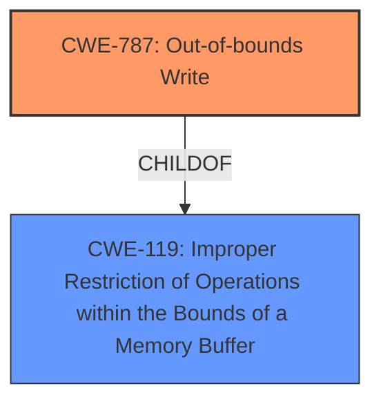

# Analysis for CVE-2022-24936

# Summary
| CWE ID | CWE Name | Confidence | CWE Abstraction Level | CWE Vulnerability Mapping Label | CWE-Vulnerability Mapping Notes |
|---|---|---|---|---|---|
| CWE-787 | Out-of-bounds Write | 1.0 | Base | Primary | Allowed |
| CWE-119 | Improper Restriction of Operations within the Bounds of a Memory Buffer | 0.7 | Class | Secondary | Discouraged |

## Evidence and Confidence

*   **Confidence Score:** 0.9
*   **Evidence Strength:** HIGH

## Relationship Analysis
The primary CWE is CWE-787, which is a base-level weakness describing an out-of-bounds write. This is a child of the class-level CWE-119, which represents improper restrictions of operations within memory buffers. The relationship informed the decision to consider CWE-119 as a secondary, more general classification, but ultimately favor CWE-787 due to its specificity.

## Vulnerability Chain
The vulnerability chain starts with an **out-of-bounds error in the GBL parser**. This leads to the ability to **overwrite flash Sign key and OTA decryption key**, resulting in a malicious bootloader upgrade vector. The **out-of-bounds write** is the root cause, while the overwriting of keys is the impact.

## Summary of Analysis
The initial assessment identified CWE-787 as the primary candidate due to the explicit mention of an "**Out-of-Bounds error**" leading to memory corruption. The **Vulnerability Description** and **CVE Reference Links Content Summary** confirms this: "The product writes data past the end, or before the beginning, of the intended buffer." The retriever results also ranked CWE-787 as the top candidate.

I considered CWE-119, as it is a parent of CWE-787 and represents a broader class of memory safety issues. However, the description specifically indicates an **out-of-bounds write**, making CWE-787 a more precise and appropriate classification.

The final decision is based on the evidence of an **out-of-bounds write** vulnerability, which is accurately represented by CWE-787. This CWE is at the base level of abstraction, providing sufficient specificity for the nature of the vulnerability. The chain of events clearly indicates that the **out-of-bounds write** allows attackers to overwrite sensitive keys, highlighting the severity of the vulnerability.

Relevant CWE Information:

# Enhanced Context (25 CWEs)

## CWE-131: Incorrect Calculation of Buffer Size
**Abstraction Level**: Base
**Similarity Score**: 0.78
**Source**: dense

**Description**:
The product does not correctly calculate the size to be used when allocating a buffer, which could lead to a buffer overflow.

**Mapping Guidance**:
- Usage: Allowed
- Rationale: This CWE entry is at the Base level of abstraction, which is a preferred level of abstraction for mapping to the root causes of vulnerabilities.

*Reason for not selecting*: While incorrect buffer size calculation could lead to an out-of-bounds write, the description doesn't provide specific evidence of this. The root cause explicitly points to an out-of-bounds error in the GBL parser.

## CWE-197: Numeric Truncation Error
**Abstraction Level**: Base
**Similarity Score**: 0.77
**Source**: dense

**Description**:
Truncation errors occur when a primitive is cast to a primitive of a smaller size and data is lost in the conversion.

**Mapping Guidance**:
- Usage: Allowed
- Rationale: This CWE entry is at the Base level of abstraction, which is a preferred level of abstraction for mapping to the root causes of vulnerabilities.

*Reason for not selecting*: There's no indication of numeric truncation in the vulnerability description.

## CWE-125: Out-of-bounds Read
**Abstraction Level**: Base
**Similarity Score**: 0.77
**Source**: dense

**Description**:
The product reads data past the end, or before the beginning, of the intended buffer.

**Mapping Guidance**:
- Usage: Allowed
- Rationale: This CWE entry is at the Base level of abstraction, which is a preferred level of abstraction for mapping to the root causes of vulnerabilities.

*Reason for not selecting*: The vulnerability description states an "out-of-bounds error" that allows overwriting keys. This implies a write operation rather than a read operation.

## CWE-805: Buffer Access with Incorrect Length Value
**Abstraction Level**: Base
**Similarity Score**: 0.77
**Source**: dense

**Description**:
The product uses a sequential operation to read or write a buffer, but it uses an incorrect length value that causes it to access memory that is outside of the bounds of the buffer.

**Mapping Guidance**:
- Usage: Allowed
- Rationale: This CWE entry is at the Base level of abstraction, which is a preferred level of abstraction for mapping to the root causes of vulnerabilities.

*Reason for not selecting*: The description doesn't mention the use of an incorrect length value specifically, only that there is an out-of-bounds write.

## CWE-191: Integer Underflow (Wrap or Wraparound)
**Abstraction Level**: Base
**Similarity Score**: 0.77
**Source**: dense

**Description**:
The product subtracts one value from another, such that the result is less than the minimum allowable integer value, which produces a value that is not equal to the correct result.

**Mapping Guidance**:
- Usage: Allowed
- Rationale: This CWE entry is at the Base level of abstraction, which is a preferred level of abstraction for mapping to the root causes of vulnerabilities.

*Reason for not selecting*: Integer underflow is not suggested in the provided text.

## CWE-823: Use of Out-of-range Pointer Offset
**Abstraction Level**: Base
**Similarity Score**: 0.76
**Source**: dense

**Description**:
The product performs pointer arithmetic on a valid pointer, but it uses an offset that can point outside of the intended range of valid memory locations for the resulting pointer.

**Mapping Guidance**:
- Usage: Allowed
- Rationale: This CWE entry is at the Base level of abstraction, which is a preferred level of abstraction for mapping to the root causes of vulnerabilities.

*Reason for not selecting*: While this could be related, the main description points to an **out-of-bounds write error** in the GBL parser, and not specifically an issue related to pointer arithmetic.

## CWE-126: Buffer Over-read
**Abstraction Level**: Variant
**Similarity Score**: 0.76
**Source**: dense

**Description**:
The product reads from a buffer using buffer access mechanisms such as indexes or pointers that reference memory locations after the targeted buffer.

**Mapping Guidance**:
- Usage: Allowed
- Rationale: This CWE entry is at the Variant level of abstraction, which is a preferred level of abstraction for mapping to the root causes of vulnerabilities.

*Reason for not selecting*: The vulnerability description states an "out-of-bounds error" that allows overwriting keys, suggesting a write operation rather than a read.

## CWE-681: Incorrect Conversion between Numeric Types
**Abstraction Level**: Base
**Similarity Score**: 0.76
**Source**: dense

**Description**:
When converting from one data type to another, such as long to integer, data can be omitted or translated in a way that produces unexpected values. If the resulting values are used in a sensitive context, then dangerous behaviors may occur.

**Mapping Guidance**:
- Usage: Allowed
- Rationale: This CWE entry is at the Base level of abstraction, which is a preferred level of abstraction for mapping to the root causes of vulnerabilities.

*Reason for not selecting*: No evidence of incorrect numeric type conversion is provided in the description.

## CWE-119: Improper Restriction of Operations within the Bounds of a Memory Buffer
**Abstraction Level**: Class
**Similarity Score**: 0.75
**Source**: dense

**Description**:
The product performs operations on a memory buffer, but it reads from or writes to a memory location outside the buffer's intended boundary. This may result in read or write operations on unexpected memory locations that could be linked to other variables, data structures, or internal program data.

**Mapping Guidance**:
- Usage: Discouraged
- Rationale: CWE-119 is commonly misused in low-information vulnerability reports when lower-level CWEs could be used instead, or when more details about the vulnerability are available.

*Reason for selecting as secondary*: This is a general class of weakness that encompasses out-of-bounds read and write errors. Given the specific out-of-bounds write, it is more accurate to map to CWE-787. However, CWE-119 can be considered as a secondary mapping.

## CWE-129: