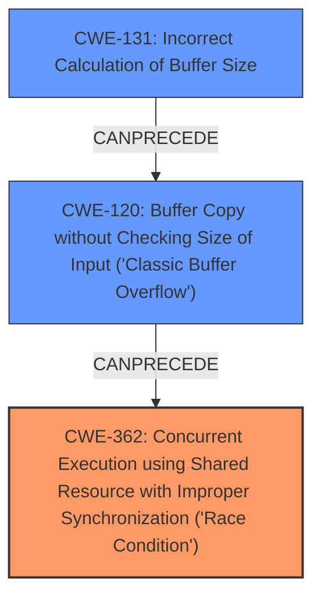

# Analysis for CVE-2022-24949

```markdown
# Summary
| CWE ID    | CWE Name                                                                                                                                         | Confidence | CWE Abstraction Level | CWE Vulnerability Mapping Label | CWE-Vulnerability Mapping Notes |
| --------- | ------------------------------------------------------------------------------------------------------------------------------------------------ | ---------- | ----------------------- | ------------------------------- | ------------------------------- |
| CWE-362     | Concurrent Execution using Shared Resource with Improper Synchronization ('Race Condition')                                                                        | 0.90       | Class                   | Primary                         | Allowed-with-Review           |
| CWE-120     | Buffer Copy without Checking Size of Input ('Classic Buffer Overflow')                                                       | 0.80       | Base                 | Secondary                       | Allowed-with-Review           |
| CWE-131     | Incorrect Calculation of Buffer Size                                                                                               | 0.75       | Base                    | Secondary                       | Allowed                       |

## Evidence and Confidence

*   **Confidence Score:** 0.85
*   **Evidence Strength:** HIGH

## Relationship Analysis
The primary weakness is a race condition (CWE-362), which can lead to a buffer overflow (CWE-120) due to an incorrect calculation of the buffer size (CWE-131). CWE-362 is a class-level CWE, while CWE-120 and CWE-131 are base-level CWEs, providing a more specific description of the underlying issue. CWE-131 CanPrecede CWE-119 (Improper Restriction of Operations within the Bounds of a Memory Buffer) which is a parent of CWE-120.



## Vulnerability Chain
The vulnerability chain starts with a **race condition** (CWE-362) that allows an attacker to influence the calculation of a buffer size (**logic bug**), which is incorrectly calculated (CWE-131), leading to a **buffer overflow** (CWE-120). This buffer overflow then leads to **privilege escalation to root**.

## Summary of Analysis
The vulnerability description indicates a privilege escalation issue caused by a combination of a **race condition**, **buffer overflow**, and **logic bug**. The **race condition** is the primary driver, allowing for exploitation of the other weaknesses. The **buffer overflow** results from a flaw in the buffer size calculation (**logic bug**), making CWE-131 and CWE-120 secondary to the primary **race condition**.

The vulnerability description states: "A privilege escalation to root exists in Eternal Terminal prior to version 6.2.0. This is due to the combination of a **race condition**, **buffer overflow**, and **logic bug** all in PipeSocketHandlerlisten()."

CWE-362 accurately reflects the **race condition**, while CWE-120 captures the **buffer overflow** aspect, and CWE-131 describes the **incorrect calculation of buffer size**. These CWEs are at an appropriate level of specificity, providing a detailed understanding of the vulnerability.

Relevant CWE Information:

# Enhanced Context (25 CWEs)
The following CWEs were identified as potentially relevant to this vulnerability:

## CWE-667: Improper Locking
**Abstraction Level**: Class
**Similarity Score**: 0.74
**Source**: dense

**Description**:
The product does not properly acquire or release a lock on a resource, leading to unexpected resource state changes and behaviors.

**Mapping Guidance**:
- Usage: Allowed-with-Review
- Rationale: This CWE entry is a Class and might have Base-level children that would be more appropriate

## CWE-131: Incorrect Calculation of Buffer Size
**Abstraction Level**: Base
**Similarity Score**: 0.74
**Source**: dense

**Description**:
The product does not correctly calculate the size to be used when allocating a buffer, which could lead to a buffer overflow.

**Mapping Guidance**:
- Usage: Allowed
- Rationale: This CWE entry is at the Base level of abstraction, which is a preferred level of abstraction for mapping to the root causes of vulnerabilities.

## CWE-703: Improper Check or Handling of Exceptional Conditions
**Abstraction Level**: Pillar
**Similarity Score**: 0.73
**Source**: dense

**Description**:
The product does not properly anticipate or handle exceptional conditions that rarely occur during normal operation of the product.

**Mapping Guidance**:
- Usage: Discouraged
- Rationale: This CWE entry is extremely high-level, a Pillar.

## CWE-754: Improper Check for Unusual or Exceptional Conditions
**Abstraction Level**: Class
**Similarity Score**: 0.73
**Source**: dense

**Description**:
The product does not check or incorrectly checks for unusual or exceptional conditions that are not expected to occur frequently during day to day operation of the product.

**Mapping Guidance**:
- Usage: Allowed-with-Review
- Rationale: This CWE entry is a Class and might have Base-level children that would be more appropriate

## CWE-668: Exposure of Resource to Wrong Sphere
**Abstraction Level**: Class
**Similarity Score**: 0.73
**Source**: dense

**Description**:
The product exposes a resource to the wrong control sphere, providing unintended actors with inappropriate access to the resource.

**Mapping Guidance**:
- Usage: Discouraged
- Rationale: CWE-668 is high-level and is often misused as a catch-all when lower-level CWE IDs might be applicable. It is sometimes used for low-information vulnerability reports [REF-1287]. It is a level-1 Class (i.e., a child of a Pillar). It is not useful for trend analysis.

## CWE-696: Incorrect Behavior Order
**Abstraction Level**: Class
**Similarity Score**: 0.72
**Source**: dense

**Description**:
The product performs multiple related behaviors, but the behaviors are performed in the wrong order in ways which may produce resultant weaknesses.

**Mapping Guidance**:
- Usage: Allowed-with-Review
- Rationale: This CWE entry is a Class and might have Base-level children that would be more appropriate

## CWE-367: Time-of-check Time-of-use (TOCTOU) Race Condition
**Abstraction Level**: Base
**Similarity Score**: 0.72
**Source**: dense

**Description**:
The product checks the state of a resource before using that resource, but the resource's state can change between the check and the use in a way that invalidates the results of the check. This can cause the product to perform invalid actions when the resource is in an unexpected state.

**Mapping Guidance**:
- Usage: Allowed
- Rationale: This CWE entry is at the Base level of abstraction, which is a preferred level of abstraction for mapping to the root causes of vulnerabilities.

## CWE-208: Observable Timing Discrepancy
**Abstraction Level**: Base
**Similarity Score**: 0.72
**Source**: dense

**Description**:
Two separate operations in a product require different amounts of time to complete, in a way that is observable to an actor and reveals security-relevant information about the state of the product, such as whether a particular operation was successful or not.

**Mapping Guidance**:
- Usage: Allowed
- Rationale: This CWE entry is at the Base level of abstraction, which is a preferred level of abstraction for mapping to the root causes of vulnerabilities.

## CWE-73: External Control of File Name or Path
**Abstraction Level**: Base
**Similarity Score**: 0.72
**Source**: dense

**Description**:
The product allows user input to control or influence paths or file names that are used in filesystem operations.

**Mapping Guidance**:
- Usage: Allowed
- Rationale: This CWE entry is at the Base level of abstraction, which is a preferred level of abstraction for mapping to the root causes of vulnerabilities.

## CWE-1391: Use of Weak Credentials
**Abstraction Level**: Class
**Similarity Score**: 0.72
**Source**: dense

**Description**:
The product uses weak credentials (such as a default key or hard-coded password) that can be calculated, derived, reused, or guessed by an attacker.

**Mapping Guidance**:
- Usage: Allowed-with-Review
- Rationale: This CWE entry is a Class and might have Base-level children that would be more appropriate

## CWE-362: Concurrent Execution using Shared Resource with Improper Synchronization ('Race Condition')
**Abstraction Level**: Class
**Similarity Score**: 3435.84
**Source**: sparse

**Description**:

# Enhanced Query for CVE-2022-24949

# Vulnerability Description

    A privilege escalation to root exists in Eternal Terminal prior to version 6.2.0. This is due to the combination of a **race condition**, **buffer overflow**, and **logic bug** all in PipeSocketHandlerlisten().

    # Keyphrase-Specific CWE Analysis
    This vulnerability contains multiple keyphrases that may map to different CWEs. 
    Please analyze each keyphrase separately and determine the most appropriate CWE(s) for each.

    ## ROOTCAUSE: 'race condition'

Relevant CWEs for this ROOTCAUSE:

### 1. CWE-362: Concurrent Execution using Shared Resource with Improper Synchronization ('Race Condition') (Score: 293.97)

The product contains a concurrent code sequence that requires temporary, exclusive access to a shared resource, but a timing window exists in which the shared resource can be modified by another code sequence operating concurrently....

### 2. CWE-367: Time-of-check Time-of-use (TOCTOU) Race Condition (Score: 282.42)

The product checks the state of a resource before using that resource, but the resource's state can change between the check and the use in a way that invalidates the results of the check. This can cause the product to perform invalid actions when the resource is in an unexpected state....

### 3. CWE-662: Improper Synchronization (Score: 259.91)

The product utilizes multiple threads or processes to allow temporary access to a shared resource that can only be exclusive to one process at a time, but it does not properly synchronize these actions, which might cause simultaneous accesses of this resource by multiple threads or processes....

### 4. CWE-277: Insecure Inherited Permissions (Score: 240.45)

A product defines a set of insecure permissions that are inherited by objects that are created by the program....

### 5. CWE-667: Improper Locking (Score: 239.95)

The product does not properly acquire or release a lock on a resource, leading to unexpected resource state changes and behaviors....

## WEAKNESS: 'logic bug'

Relevant CWEs for this WEAKNESS:

### 1. CWE-362: Concurrent Execution using Shared Resource with Improper Synchronization ('Race Condition') (Score: 293.97)

The product contains a concurrent code sequence that requires temporary, exclusive access to a shared resource, but a timing window exists in which the shared resource can be modified by another code sequence operating concurrently....

### 2. CWE-190: Integer Overflow or Wraparound (Score: 256.36)

The product performs a calculation that can
         produce an integer overflow or wraparound when the logic
         assumes that the resulting value will always be larger than
         the original value. This occurs when an integer value is
         incremented to a value that is too large to st...

### 3. CWE-131: Incorrect Calculation of Buffer Size (Score: 251.23)

The product does not correctly calculate the size to be used when allocating a buffer, which could lead to a buffer overflow....

### 4. CWE-277: Insecure Inherited Permissions (Score: 240.45)

A product defines a set of insecure permissions that are inherited by objects that are created by the program....

### 5. CWE-267: Privilege Defined With Unsafe Actions (Score: 215.11)

A particular privilege, role, capability, or right can be used to perform unsafe actions that were not intended, even when it is assigned to the correct entity....

## IMPACT: 'privilege escalation to root'

Relevant CWEs for this IMPACT:

### 1. CWE-362: Concurrent Execution using Shared Resource with Improper Synchronization ('Race Condition') (Score: 293.97)

The product contains a concurrent code sequence that requires temporary, exclusive access to a shared resource, but a timing window exists in which the shared resource can be modified by another code sequence operating concurrently....

### 2. CWE-367: Time-of-check Time-of-use (TOCTOU) Race Condition (Score: 282.42)

The product checks the state of a resource before using that resource, but the resource's state can change between the check and the use in a way that invalidates the results of the check. This can cause the product to perform invalid actions when the resource is in an unexpected state....

### 3. CWE-277: Insecure Inherited Permissions (Score: 240.45)

A product defines a set of insecure permissions that are inherited by objects that are created by the program....

### 4. CWE-250: Execution with Unnecessary Privileges (Score: 96.20)

The product performs an operation at a privilege level that is higher than the minimum level required, which creates new weaknesses or amplifies the consequences of other weaknesses....

### 5. CWE-269: Improper Privilege Management (Score: 93.65)

The product does not properly assign, modify, track, or check privileges for an actor, creating an unintended sphere of control for that actor....

## PRODUCT: 'Eternal Terminal'

Relevant CWEs for this PRODUCT:

### 1. CWE-362: Concurrent Execution using Shared Resource with Improper Synchronization ('Race Condition') (Score: 293.97)

The product contains a concurrent code sequence that requires temporary, exclusive access to a shared resource, but a timing window exists in which the shared resource can be modified by another code sequence operating concurrently....

### 2. CWE-367: Time-of-check Time-of-use (TOCTOU) Race Condition (Score: 282.42)

The product checks the state of a resource before using that resource, but the resource's state can change between the check and the use in a way that invalidates the results of the check. This can cause the product to perform invalid actions when the resource is in an unexpected state....

### 3. CWE-119: Improper Restriction of Operations within the Bounds of a Memory Buffer (Score: 256.11)

The product performs operations on a memory buffer, but it reads from or writes to a memory location outside the buffer's intended boundary. This may result in read or write operations on unexpected memory locations that could be linked to other variables, data structures, or internal program data....

### 4. CWE-277: Insecure Inherited Permissions (Score: 240.45)

A product defines a set of insecure permissions that are inherited by objects that are created by the program....

### 5. CWE-345: Insufficient Verification of Data Authenticity (Score: 71.87)

The product does not sufficiently verify the origin or authenticity of data, in a way that causes it to accept invalid data....

## VERSION: 'prior to version 6.2.0'

Relevant CWEs for this VERSION:

### 1. CWE-362: Concurrent Execution using Shared Resource with Improper Synchronization ('Race Condition') (Score: 293.97)

The product contains a concurrent code sequence that requires temporary, exclusive access to a shared resource, but a timing window exists in which the shared resource can be modified by another code sequence operating concurrently....

### 2. CWE-367: Time-of-check Time-of-use (TOCTOU) Race Condition (Score: 282.42)

The product checks the state of a resource before using that resource, but the resource's state can change between the check and the use in a way that invalidates the results of the check. This can cause the product to perform invalid actions when the resource is in an unexpected state....

### 3. CWE-190: Integer Overflow or Wraparound (Score: 256.36)

The product performs a calculation that can
         produce an integer overflow or wraparound when the logic
         assumes that the resulting value will always be larger than
         the original value. This occurs when an integer value is
         incremented to a value that is too large to st...

### 4. CWE-119: Improper Restriction of Operations within the Bounds of a Memory Buffer (Score: 256.11)

The product performs operations on a memory buffer, but it reads from or writes to a memory location outside the buffer's intended boundary. This may result in read or write operations on unexpected memory locations that could be linked to other variables, data structures, or internal program data....

### 5. CWE-277: Insecure Inherited Permissions (Score: 240.45)

A product defines a set of insecure permissions that are inherited by objects that are created by the program....

## COMPONENT: 'PipeSocketHandlerlisten()'

Relevant CWEs for this COMPONENT:

### 1. CWE-362: Concurrent Execution using Shared Resource with Improper Synchronization ('Race Condition') (Score: 293.97)

The product contains a concurrent code sequence that requires temporary, exclusive access to a shared resource, but a timing window exists in which the shared resource can be modified by another code sequence operating concurrently....

### 2. CWE-367: Time-of-check Time-of-use (TOCTOU) Race Condition (Score: 282.42)

The product checks the state of a resource before using that resource, but the resource's state can change between the check and the use in a way that invalidates the results of the check. This can cause the product to perform invalid actions when the resource is in an unexpected state....

### 3. CWE-190: Integer Overflow or Wraparound (Score: 256.36)

The product performs a calculation that can
         produce an integer overflow or wraparound when the logic
         assumes that the resulting value will always be larger than
         the original value. This occurs when an integer value is
         incremented to a value that is too large to st...

### 4. CWE-119: Improper Restriction of Operations within the Bounds of a Memory Buffer (Score: 256.11)

The product performs operations on a memory buffer, but it reads from or writes to a memory location outside the buffer's intended boundary. This may result in read or write operations on unexpected memory locations that could be linked to other variables, data structures, or internal program data....

### 5. CWE-277: Insecure Inherited Permissions (Score: 240.45)

A product defines a set of insecure permissions that are inherited by objects that are created by the program....

## WEAKNESS: 'buffer overflow'

Relevant CWEs for this WEAKNESS:

### 1. CWE-190: Integer Overflow or Wraparound (Score: 256.36)

The product performs a calculation that can
         produce an integer overflow or wraparound when the logic
         assumes that the resulting value will always be larger than
         the original value. This occurs when an integer value is
         incremented to a value that is too large to st...

### 2. CWE-119: Improper Restriction of Operations within the Bounds of a Memory Buffer (Score: 256.11)

The product performs operations on a memory buffer, but it reads from or writes to a memory location outside the buffer's intended boundary. This may result in read or write operations on unexpected memory locations that could be linked to other variables, data structures, or internal program data....

### 3. CWE-122: Heap-based Buffer Overflow (Score: 252.33)

A heap overflow condition is a buffer overflow, where the buffer that can be overwritten is allocated in the heap portion of memory, generally meaning that the buffer was allocated using a routine such as malloc()....

### 4. CWE-131: Incorrect Calculation of Buffer Size (Score: 251.23)

The product does not correctly calculate the size to be used when allocating a buffer, which could lead to a buffer overflow....

### 5. CWE-121: Stack-based Buffer Overflow (Score: 250.68)

A stack-based buffer overflow condition is a condition where the buffer being overwritten is allocated on the stack (i.e., is a local variable or, rarely, a parameter to a function)....


    # Analysis Instructions
    1. For each keyphrase, identify the most appropriate CWE(s) that represent the weakness.
    2. Consider how the different keyphrases might relate to each other in the vulnerability chain.
    3. Provide a final determination of primary CWE(s) and any secondary CWEs.
    4. Format your response using the standard analysis template.

    Please analyze how these different weaknesses interact and provide a comprehensive CWE classification.
    