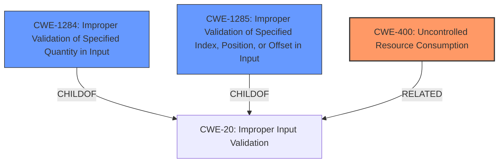

# Raw Analyzer Response for CVE-2022-24952

# Summary
| CWE ID    | CWE Name                                                                             | Confidence | CWE Abstraction Level | CWE Vulnerability Mapping Label | CWE-Vulnerability Mapping Notes |
| :---------- | :----------------------------------------------------------------------------------- | :--------- | :---------------------- | :------------------------------ | :------------------------------ |
| CWE-400     | Uncontrolled Resource Consumption ('Denial of Service')                                            | 0.70       | Class                     | Primary CWE                    | Allowed-with-Review                                     |
| CWE-1284   | Improper Validation of Specified Quantity in Input                                  | 0.60       | Base                      | Secondary CWE                    | Allowed                                     |
| CWE-1285   | Improper Validation of Specified Index, Position, or Offset in Input                                  | 0.50       | Base                      | Secondary CWE                    | Allowed                                     |

## Evidence and Confidence

*   **Confidence Score:** 0.70
*   **Evidence Strength:** MEDIUM

## Relationship Analysis
The primary CWE is CWE-400 [Uncontrolled Resource Consumption], which is a class-level CWE. The secondary CWEs are CWE-1284 [Improper Validation of Specified Quantity in Input] and CWE-1285 [Improper Validation of Specified Index, Position, or Offset in Input] both of which are Base-level CWEs. CWE-1284 and CWE-1285 are both children of CWE-20 [Improper Input Validation]. This relationship shows that the specific type of input validation issue relates to quantities, indexes, positions, or offsets, which can lead to resource consumption issues and ultimately a denial of service.

## Vulnerability Chain
The vulnerability chain starts with **invalid input**, specifically an **invalid sequence number** or other **invalid input**. The **improper or missing validation** of this input (CWE-1284, CWE-1285) leads to **uncontrolled resource consumption** (CWE-400), ultimately resulting in a **denial of service**.

## Summary of Analysis
The primary weakness is the potential for denial of service. The description states, "Several denial of service vulnerabilities exist in Eternal Terminal prior to version 6.2.0, including a DoS triggered remotely by an **invalid sequence number** and a local bug triggered by **invalid input** sent directly to the IPC socket." The root cause is the **improper validation** of the **invalid input**, whether it's an **invalid sequence number** or other malformed data. The lack of validation allows the application to consume excessive resources, leading to the DoS.

CWE-400 [Uncontrolled Resource Consumption] is chosen as the primary CWE because the stated impact is a "denial of service," which directly aligns with uncontrolled resource consumption. This is a Class-level CWE.

CWE-1284 [Improper Validation of Specified Quantity in Input] and CWE-1285 [Improper Validation of Specified Index, Position, or Offset in Input] are chosen as secondary CWEs because the **invalid input** could represent an improperly specified quantity, index, position, or offset. The vulnerability description mentions an **invalid sequence number**, which can be interpreted as an invalid quantity. Additionally, other **invalid input** sent to the IPC socket could represent invalid indices or positions. These are Base-level CWEs.

The retriever results showed other CWEs with high relevance scores, such as CWE-120 [Buffer Copy without Checking Size of Input] and CWE-407 [Inefficient Algorithmic Complexity]. However, these CWEs are not as directly relevant as CWE-400, CWE-1284, and CWE-1285 based on the provided description. The description does not explicitly mention a buffer overflow or algorithmic complexity issues, only **invalid input** leading to denial of service.

Relevant CWE Information: