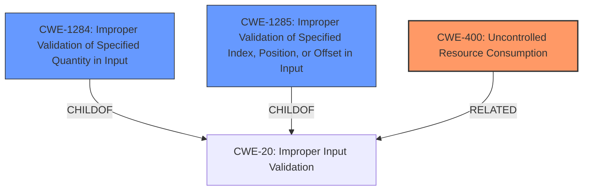

# Analysis for CVE-2022-24952

# Summary
| CWE ID    | CWE Name                                                                             | Confidence | CWE Abstraction Level | CWE Vulnerability Mapping Label | CWE-Vulnerability Mapping Notes |
| :---------- | :----------------------------------------------------------------------------------- | :--------- | :---------------------- | :------------------------------ | :------------------------------ |
| CWE-400     | Uncontrolled Resource Consumption ('Denial of Service')                                            | 0.70       | Class                     | Primary CWE                    | Allowed-with-Review                                     |
| CWE-1284   | Improper Validation of Specified Quantity in Input                                  | 0.60       | Base                      | Secondary CWE                    | Allowed                                     |
| CWE-1285   | Improper Validation of Specified Index, Position, or Offset in Input                                  | 0.50       | Base                      | Secondary CWE                    | Allowed                                     |

## Evidence and Confidence

*   **Confidence Score:** 0.70
*   **Evidence Strength:** MEDIUM

## Relationship Analysis
The primary CWE is CWE-400 [Uncontrolled Resource Consumption], which is a class-level CWE. The secondary CWEs are CWE-1284 [Improper Validation of Specified Quantity in Input] and CWE-1285 [Improper Validation of Specified Index, Position, or Offset in Input] both of which are Base-level CWEs. CWE-1284 and CWE-1285 are both children of CWE-20 [Improper Input Validation]. This relationship shows that the specific type of input validation issue relates to quantities, indexes, positions, or offsets, which can lead to resource consumption issues and ultimately a denial of service.

## Vulnerability Chain
The vulnerability chain starts with **invalid input**, specifically an **invalid sequence number** or other **invalid input**. The **improper or missing validation** of this input (CWE-1284, CWE-1285) leads to **uncontrolled resource consumption** (CWE-400), ultimately resulting in a **denial of service**.

## Summary of Analysis
The primary weakness is the potential for denial of service. The description states, "Several denial of service vulnerabilities exist in Eternal Terminal prior to version 6.2.0, including a DoS triggered remotely by an **invalid sequence number** and a local bug triggered by **invalid input** sent directly to the IPC socket." The root cause is the **improper validation** of the **invalid input**, whether it's an **invalid sequence number** or other malformed data. The lack of validation allows the application to consume excessive resources, leading to the DoS.

CWE-400 [Uncontrolled Resource Consumption] is chosen as the primary CWE because the stated impact is a "denial of service," which directly aligns with uncontrolled resource consumption. This is a Class-level CWE.

CWE-1284 [Improper Validation of Specified Quantity in Input] and CWE-1285 [Improper Validation of Specified Index, Position, or Offset in Input] are chosen as secondary CWEs because the **invalid input** could represent an improperly specified quantity, index, position, or offset. The vulnerability description mentions an **invalid sequence number**, which can be interpreted as an invalid quantity. Additionally, other **invalid input** sent to the IPC socket could represent invalid indices or positions. These are Base-level CWEs.

The retriever results showed other CWEs with high relevance scores, such as CWE-120 [Buffer Copy without Checking Size of Input] and CWE-407 [Inefficient Algorithmic Complexity]. However, these CWEs are not as directly relevant as CWE-400, CWE-1284, and CWE-1285 based on the provided description. The description does not explicitly mention a buffer overflow or algorithmic complexity issues, only **invalid input** leading to denial of service.

Relevant CWE Information:

# Enhanced Query for CVE-2022-24952

# Vulnerability Description

    Several denial of service vulnerabilities exist in Eternal Terminal prior to version 6.2.0, including a DoS triggered remotely by an **invalid sequence number** and a local bug triggered by **invalid input** sent directly to the IPC socket.

    # Keyphrase-Specific CWE Analysis
    This vulnerability contains multiple keyphrases that may map to different CWEs. 
    Please analyze each keyphrase separately and determine the most appropriate CWE(s) for each.

    ## WEAKNESS: 'invalid sequence number'

Relevant CWEs for this WEAKNESS:

### 1. CWE-120: Buffer Copy without Checking Size of Input ('Classic Buffer Overflow') (Score: 238.21)

The product copies an input buffer to an output buffer without verifying that the size of the input buffer is less than the size of the output buffer, leading to a buffer overflow....

### 2. CWE-362: Concurrent Execution using Shared Resource with Improper Synchronization ('Race Condition') (Score: 231.04)

The product contains a concurrent code sequence that requires temporary, exclusive access to a shared resource, but a timing window exists in which the shared resource can be modified by another code sequence operating concurrently....

### 3. CWE-407: Inefficient Algorithmic Complexity (Score: 227.08)

An algorithm in a product has an inefficient worst-case computational complexity that may be detrimental to system performance and can be triggered by an attacker, typically using crafted manipulations that ensure that the worst case is being reached....

### 4. CWE-476: NULL Pointer Dereference (Score: 225.69)

The product dereferences a pointer that it expects to be valid but is NULL....

### 5. CWE-1284: Improper Validation of Specified Quantity in Input (Score: 222.14)

The product receives input that is expected to specify a quantity (such as size or length), but it does not validate or incorrectly validates that the quantity has the required properties....

## WEAKNESS: 'invalid input'

Relevant CWEs for this WEAKNESS:

### 1. CWE-120: Buffer Copy without Checking Size of Input ('Classic Buffer Overflow') (Score: 238.21)

The product copies an input buffer to an output buffer without verifying that the size of the input buffer is less than the size of the output buffer, leading to a buffer overflow....

### 2. CWE-407: Inefficient Algorithmic Complexity (Score: 227.08)

An algorithm in a product has an inefficient worst-case computational complexity that may be detrimental to system performance and can be triggered by an attacker, typically using crafted manipulations that ensure that the worst case is being reached....

### 3. CWE-1333: Inefficient Regular Expression Complexity (Score: 222.63)

The product uses a regular expression with an inefficient, possibly exponential worst-case computational complexity that consumes excessive CPU cycles....

### 4. CWE-1284: Improper Validation of Specified Quantity in Input (Score: 222.14)

The product receives input that is expected to specify a quantity (such as size or length), but it does not validate or incorrectly validates that the quantity has the required properties....

### 5. CWE-1285: Improper Validation of Specified Index, Position, or Offset in Input (Score: 218.17)

The product receives input that is expected to specify an index, position, or offset into an indexable resource such as a buffer or file, but it does not validate or incorrectly validates that the specified index/position/offset has the required properties....

## IMPACT: 'denial of service'

Relevant CWEs for this IMPACT:

### 1. CWE-362: Concurrent Execution using Shared Resource with Improper Synchronization ('Race Condition') (Score: 231.04)

The product contains a concurrent code sequence that requires temporary, exclusive access to a shared resource, but a timing window exists in which the shared resource can be modified by another code sequence operating concurrently....

### 2. CWE-407: Inefficient Algorithmic Complexity (Score: 227.08)

An algorithm in a product has an inefficient worst-case computational complexity that may be detrimental to system performance and can be triggered by an attacker, typically using crafted manipulations that ensure that the worst case is being reached....

### 3. CWE-476: NULL Pointer Dereference (Score: 225.69)

The product dereferences a pointer that it expects to be valid but is NULL....

### 4. CWE-1333: Inefficient Regular Expression Complexity (Score: 222.63)

The product uses a regular expression with an inefficient, possibly exponential worst-case computational complexity that consumes excessive CPU cycles....

### 5. CWE-1284: Improper Validation of Specified Quantity in Input (Score: 222.14)

The product receives input that is expected to specify a quantity (such as size or length), but it does not validate or incorrectly validates that the quantity has the required properties....

## PRODUCT: 'Eternal Terminal'

Relevant CWEs for this PRODUCT:

### 1. CWE-362: Concurrent Execution using Shared Resource with Improper Synchronization ('Race Condition') (Score: 231.04)

The product contains a concurrent code sequence that requires temporary, exclusive access to a shared resource, but a timing window exists in which the shared resource can be modified by another code sequence operating concurrently....

### 2. CWE-407: Inefficient Algorithmic Complexity (Score: 227.08)

An algorithm in a product has an inefficient worst-case computational complexity that may be detrimental to system performance and can be triggered by an attacker, typically using crafted manipulations that ensure that the worst case is being reached....

### 3. CWE-476: NULL Pointer Dereference (Score: 225.69)

The product dereferences a pointer that it expects to be valid but is NULL....

### 4. CWE-277: Insecure Inherited Permissions (Score: 77.88)

A product defines a set of insecure permissions that are inherited by objects that are created by the program....

### 5. CWE-150: Improper Neutralization of Escape, Meta, or Control Sequences (Score: 71.79)

The product receives input from an upstream component, but it does not neutralize or incorrectly neutralizes special elements that could be interpreted as escape, meta, or control character sequences when they are sent to a downstream component....

## VERSION: 'prior to version 6.2.0'

Relevant CWEs for this VERSION:

### 1. CWE-362: Concurrent Execution using Shared Resource with Improper Synchronization ('Race Condition') (Score: 231.04)

The product contains a concurrent code sequence that requires temporary, exclusive access to a shared resource, but a timing window exists in which the shared resource can be modified by another code sequence operating concurrently....

### 2. CWE-476: NULL Pointer Dereference (Score: 225.69)

The product dereferences a pointer that it expects to be valid but is NULL....

### 3. CWE-1333: Inefficient Regular Expression Complexity (Score: 222.63)

The product uses a regular expression with an inefficient, possibly exponential worst-case computational complexity that consumes excessive CPU cycles....

### 4. CWE-1284: Improper Validation of Specified Quantity in Input (Score: 222.14)

The product receives input that is expected to specify a quantity (such as size or length), but it does not validate or incorrectly validates that the quantity has the required properties....

### 5. CWE-121: Stack-based Buffer Overflow (Score: 90.66)

A stack-based buffer overflow condition is a condition where the buffer being overwritten is allocated on the stack (i.e., is a local variable or, rarely, a parameter to a function)....

    # Analysis Instructions
    1. For each keyphrase, identify the most appropriate CWE(s) that represent the weakness.
    2. Consider how the different keyphrases might relate to each other in the vulnerability chain.
    3. Provide a final determination of primary CWE(s) and any secondary CWEs.
    4. Format your response using the standard analysis template.

    Please analyze how these different weaknesses interact and provide a comprehensive CWE classification.
    