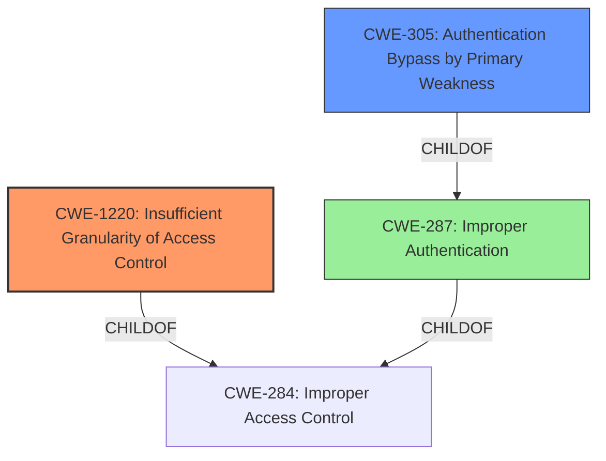

# Raw Analyzer Response for CVE-2022-24985

```markdown
# Summary
| CWE ID | CWE Name | Confidence | CWE Abstraction Level | CWE Vulnerability Mapping Label | CWE-Vulnerability Mapping Notes |
|---|---|---|---|---|---|
| CWE-1220 | Insufficient Granularity of Access Control | 0.9 | Base | Allowed | Primary CWE |
| CWE-305 | Authentication Bypass by Primary Weakness | 0.7 | Base | Allowed | Secondary Candidate |
| CWE-287 | Improper Authentication | 0.5 | Class | Discouraged | Secondary Candidate |

## Evidence and Confidence

*   **Confidence Score:** 0.8
*   **Evidence Strength:** HIGH

## Relationship Analysis
The primary CWE selected is CWE-1220, which falls under CWE-284 (Improper Access Control). While CWE-287 (Improper Authentication) is also related, CWE-1220 provides a more specific description of the **insufficient granularity** in the access control mechanism. CWE-305 (Authentication Bypass by Primary Weakness) is considered as a secondary weakness because the vulnerability is a result of an incorrect access control implementation. The abstraction levels guided the selection, preferring the Base level CWE-1220.



## Vulnerability Chain
The chain of events is as follows:
1.  The application stores the authentication status in `$_SESSION['authenticated']`.
2.  The application **incorrectly checks** this session variable across multiple forms.
3.  An attacker with a valid session on one form **bypasses authentication** on other forms.
4.  The attacker gains unauthorized access to administrative sections.

Here, the root cause is the **insufficient granularity of access control** (CWE-1220), which leads to the **authentication bypass** (CWE-305).

## Summary of Analysis
The primary CWE identified is CWE-1220 (Insufficient Granularity of Access Control). This is based on the evidence that the application's access control mechanism relies on a single session variable for authentication across all forms, leading to a bypass.

The "CVE Reference Links Content Summary" states: "The vulnerability arises from an incorrect access control implementation in JQueryForm.com's generated forms. Specifically, the authentication status of a user is stored in the `$_SESSION['authenticated']` variable. This variable is checked before validating credentials, allowing an attacker with a valid session on one form to bypass authentication checks on other forms hosted on the same server."

This clearly indicates an **insufficient granularity** in how access is controlled, because the authentication status of one form is being used to grant access to other forms without proper validation.

CWE-305 (Authentication Bypass by Primary Weakness) is a secondary candidate because the authentication algorithm isn't inherently flawed, but the overall mechanism can be bypassed due to the access control issue.

CWE-287 (Improper Authentication) is a more general class, and CWE-1220 is more specific to the **insufficient granularity** of the access control, making it a better fit.

The retriever results also support this, listing CWE-1220 as the top combined result. The mapping guidance for CWE-1220 allows its usage, stating "This CWE entry is at the Base level of abstraction, which is a preferred level of abstraction for mapping to the root causes of vulnerabilities."

The selected CWEs are at the optimal level of specificity because CWE-1220 directly addresses the root cause of the vulnerability which is that the access controls lack required granularity, allowing unauthorized access to security-sensitive assets.
```