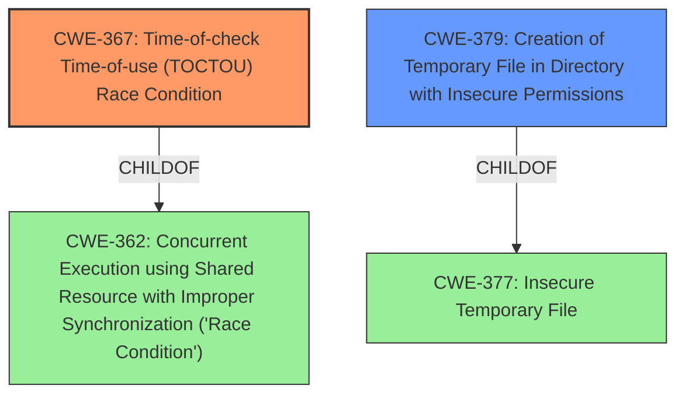

# Analysis Report for CVE-2022-24986

# Vulnerability Analysis Report: CVE-2022-24986

## Description


## Analysis (with Relationship Data)

# Summary
| CWE ID | CWE Name | Confidence | CWE Abstraction Level | CWE Vulnerability Mapping Label | CWE-Vulnerability Mapping Notes |
|---|---|---|---|---|---|
| CWE-367 | Time-of-check Time-of-use (TOCTOU) Race Condition | 0.8 | Base | Allowed | Primary CWE: The vulnerability involves a race condition where the state of a temporary file is checked before use, but can be altered by an attacker in between, leading to unauthorized command execution. |
| CWE-379 | Creation of Temporary File in Directory with Insecure Permissions | 0.7 | Base | Allowed | Secondary CWE: The vulnerability involves the creation of a temporary file with insecure permissions in a shared directory (/tmp), enabling unauthorized access and modification. |

## Evidence and Confidence

*   **Confidence Score:** 0.75
*   **Evidence Strength:** HIGH

## Relationship Analysis
The primary CWE, CWE-367 [Time-of-check Time-of-use (TOCTOU) Race Condition], is a base-level CWE that directly addresses the race condition vulnerability described. It is related to CWE-362 [Concurrent Execution using Shared Resource with Improper Synchronization ('Race Condition')], as it is a child of it. The secondary CWE, CWE-379 [Creation of Temporary File in Directory with Insecure Permissions], explains the insecure nature of the temporary file creation process, making the race condition possible.



## Vulnerability Chain
The vulnerability chain starts with the **reusing of filename for temporary file**, leading to a **TOCTOU race condition** (CWE-367) and the **creation of temporary files in a directory with insecure permissions** (CWE-379). An attacker can then exploit this race condition to **run unauthorized commands**.

## Summary of Analysis
Based on the provided vulnerability description and supporting evidence, the primary weakness is CWE-367 [Time-of-check Time-of-use (TOCTOU) Race Condition], because of the **reusing of filename for temporary file** by KCron which leads to a race condition.

The supporting evidence includes:

*   Vulnerability Description Key Phrases: "**rootcause:** **reusing filename for temporary file**" and "impact: run unauthorized commands"
*   CVE Reference Links Content Summary: "Filename reuse: The temporary filename is generated once when the application is initialized and reused for subsequent saves. An attacker can predict the filename and exploit it to create malicious content."

The secondary weakness is CWE-379 [Creation of Temporary File in Directory with Insecure Permissions], because the temp file is created in `/tmp`.

The Retriever Results supports selection of CWE-367, showing a high similarity score.

CWE-362 [Concurrent Execution using Shared Resource with Improper Synchronization ('Race Condition')] was considered but not selected as the primary CWE. CWE-367 is a child of CWE-362, and is more specific to the type of race condition.
CWE-59 [Improper Link Resolution Before File Access ('Link Following')] was considered but not selected. Although symlink attacks are mentioned in the CVE Reference Links Content Summary, the **reusing filename for temporary file** weakness is more important to focus on.
CWE-377 [Insecure Temporary File] was considered but not selected as the primary CWE. It is too generic, and CWE-379 [Creation of Temporary File in Directory with Insecure Permissions] is more specific.

The selected CWEs are at the optimal level of specificity because they directly address the root cause and contributing factors of the vulnerability, providing a clear and accurate representation of the weakness.


## CWE Relationship Analysis

Current CWEs represent these abstraction levels: .


### Vulnerability Chain Analysis

**Chain starting from CWE-377:**
- 377 (Insecure Temporary File) - ROOT


**Chain starting from CWE-379:**
- 379 (Creation of Temporary File in Directory with Insecure Permissions) - ROOT


### CWE Relationship Diagram

```mermaid
graph TD
    classDef primary fill:#f96,stroke:#333,stroke-width:2px
    classDef secondary fill:#69f,stroke:#333
    classDef tertiary fill:#9e9,stroke:#333
```


*Report generated on 2025-03-31 11:48:03*
