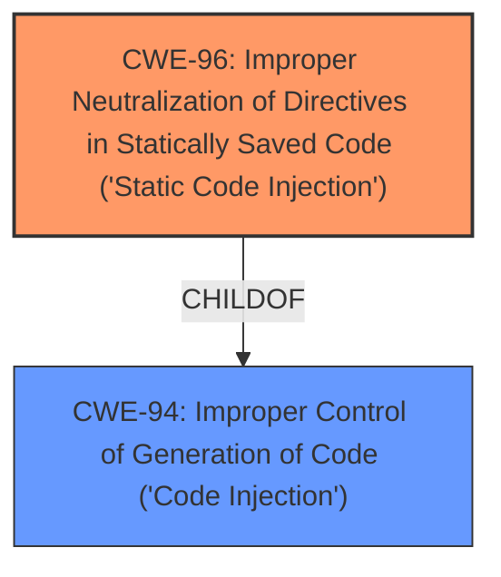

# Analysis for CVE-2022-25018

# Summary
| CWE ID | CWE Name | Confidence | CWE Abstraction Level | CWE Vulnerability Mapping Label | CWE-Vulnerability Mapping Notes |
|---|---|---|---|---|---|
| CWE-96 | Improper Neutralization of Directives in Statically Saved Code ('Static Code Injection') | 0.8 | Base | Allowed | Primary CWE |
| CWE-94 | Improper Control of Generation of Code ('Code Injection') | 0.6 | Base | Allowed-with-Review | Secondary Candidate |

## Evidence and Confidence

*   **Confidence Score:** 0.7
*   **Evidence Strength:** MEDIUM

## Relationship Analysis
The primary relationship considered was the ChildOf relationship between CWE-96 and CWE-94, indicating that static code injection is a specific type of code injection. Additionally, the Retriever Results suggested both CWE-96 and CWE-94 as potential matches. Since the vulnerability involves injecting code into static pages, CWE-96 was chosen as the primary CWE due to its greater specificity.

## Vulnerability Chain
The vulnerability chain involves the **improper neutralization** of PHP code within static pages, leading to arbitrary code execution.
  - Root Cause: **Improper neutralization** of PHP code (CWE-96).
  - Impact: Arbitrary code execution.

## Summary of Analysis
The initial assessment identified that attackers could execute arbitrary code via crafted PHP code inserted into static pages of Pluxml v5.8.7.
Based on the description, the vulnerability involves **injecting** PHP code into static pages, resulting in arbitrary code execution. The key phrase is "crafted PHP code inserted into static pages."

The Retriever Results indicated CWE-96 (Improper Neutralization of Directives in Statically Saved Code) as the top candidate. This CWE describes a scenario where a product receives input and does not properly neutralize code syntax before inserting it into an executable resource like a library, configuration file, or template. This aligns with the vulnerability description, as the crafted PHP code is inserted into static pages (which can be considered templates or configuration files in this context).

CWE-94 (Improper Control of Generation of Code) was also considered, as it represents a broader category of code injection vulnerabilities. However, since the vulnerability specifically involves static code injection, CWE-96 was chosen for its greater specificity.

The evidence supporting this decision includes the vulnerability description explicitly stating that PHP code is being injected into static pages. This aligns with the description of CWE-96, which mentions "inserting the input into an executable resource, such as a library, configuration file, or template."

The graph relationships influenced the decision by highlighting the hierarchical relationship between CWE-96 and CWE-94. While CWE-94 is a parent of CWE-96, the specific details of the vulnerability point towards the more specific CWE-96.

The selected CWE, CWE-96, is at the optimal level of specificity because it directly addresses the root cause of the vulnerability (static code injection) and provides a clear understanding of how the vulnerability can be exploited.

Relevant CWE Information:

# Enhanced Context (25 CWEs)

## CWE-96: Improper Neutralization of Directives in Statically Saved Code ('Static Code Injection')
**Abstraction Level**: Base
**Similarity Score**: 0.056
**Source**: sparse

**Description**:
The product receives input from an upstream component, but it does not neutralize or incorrectly neutralizes code syntax before inserting the input into an executable resource, such as a library, configuration file, or template.

**Mapping Guidance**
**Usage:** Allowed
**Rationale:** This CWE entry is at the Base level of abstraction, which is a preferred level of abstraction for mapping to the root causes of vulnerabilities.

## CWE-94: Improper Control of Generation of Code ('Code Injection')
**Abstraction Level**: Base
**Similarity Score**: 0.036
**Source**: sparse

**Description**:
The product constructs all or part of a code segment using externally-influenced input from an upstream component, but it does not neutralize or incorrectly neutralizes special elements that could modify the syntax or behavior of the intended code segment.

**Mapping Guidance**
**Usage:** Allowed-with-Review
**Rationale:** This entry is frequently misused for vulnerabilities with a technical impact of "code execution," which does not by itself indicate a root cause weakness, since dozens of weaknesses can enable code execution.
# Supporting Evidence

## CWE-96: Improper Neutralization of Directives in Statically Saved Code ('Static Code Injection')
The product receives input from an upstream component, but it **does not neutralize or incorrectly neutralizes code syntax before inserting the input into an executable resource, such as a library, configuration file, or template.**

The vulnerability description states that "attackers to execute arbitrary code via **crafted PHP code inserted into static pages**." This aligns with CWE-96's description of injecting code syntax into a static resource.

Confidence: 0.8

## CWE-94: Improper Control of Generation of Code ('Code Injection')
The product constructs all or part of a code segment using externally-influenced input from an upstream component, but it **does not neutralize or incorrectly neutralizes special elements that could modify the syntax or behavior of the intended code segment.**

The vulnerability description states that "attackers to **execute arbitrary code via crafted PHP code** inserted into static pages." This aligns with CWE-94's description of constructing a code segment using external input without proper neutralization. However, CWE-96 is more specific because it targets static code injection.

Confidence: 0.6