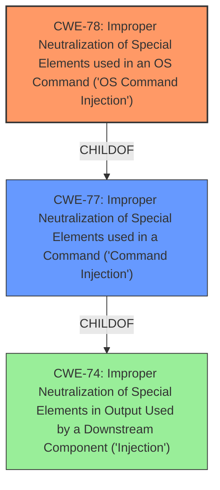

# Raw Analyzer Response for CVE-2022-25077

# Summary
| CWE ID | CWE Name | Confidence | CWE Abstraction Level | CWE Vulnerability Mapping Label | CWE-Vulnerability Mapping Notes |
|---|---|---|---|---|---|
| CWE-78 | Improper Neutralization of Special Elements used in an OS Command ('OS Command Injection') | 1.0 | Base | Allowed | Primary CWE |

## Evidence and Confidence

*   **Confidence Score:** 1.0
*   **Evidence Strength:** HIGH

## Relationship Analysis
The primary relationship that influenced the selection was the ChildOf relationship between CWE-78 and CWE-77. While the initial description mentioned "command injection," the specifics pointed towards OS command injection, making CWE-78 a more precise and appropriate choice. The base level abstraction of CWE-78 aligns with the detailed nature of the vulnerability.

## Vulnerability Chain
The vulnerability chain consists of the **improper neutralization** of special elements used in an OS command, leading to the ability to execute arbitrary commands. The root cause is the **command injection** vulnerability itself, and the impact is arbitrary command execution.

## Summary of Analysis
The initial assessment strongly suggested CWE-78 as the primary weakness, based on the **command injection** vulnerability detailed in the description. The vulnerability description explicitly states "TOTOLink A3100R V4.1.2cu.5050_B20200504 was discovered to contain a **command injection** vulnerability in the Main function. This vulnerability allows attackers to execute arbitrary commands via the QUERY_STRING parameter." This statement directly indicates an OS command injection, making CWE-78 the most appropriate and specific classification. The relationship graph further supports this decision, showing that CWE-78 is a child of CWE-77, which is a more general form of command injection. Since the specifics point towards OS commands, CWE-78 is the optimal choice.

Relevant CWE Information:

# Enhanced Context (25 CWEs)
The following CWEs were identified as potentially relevant to this vulnerability:

## CWE-74: Improper Neutralization of Special Elements in Output Used by a Downstream Component ('Injection')
**Abstraction Level**: Class
**Similarity Score**: 0.78
**Source**: dense

**Description**:
The product constructs all or part of a command, data structure, or record using externally-influenced input from an upstream component, but it does not neutralize or incorrectly neutralizes special elements that could modify how it is parsed or interpreted when it is sent to a downstream component.

**Mapping Guidance**:
- Usage: Discouraged
- Rationale: CWE-74 is high-level and often misused when lower-level weaknesses are more appropriate.

## CWE-77: Improper Neutralization of Special Elements used in a Command ('Command Injection')
**Abstraction:** Class
**Status:** Draft

### Description
The product constructs all or part of a command using externally-influenced input from an upstream component, but it does not neutralize or incorrectly neutralizes special elements that could modify the intended command when it is sent to a downstream component.

### Mapping Guidance
**Usage:** Allowed-with-Review
**Rationale:** CWE-77 is often misused when OS command injection (CWE-78) was intended instead [REF-1287].
**Comments:** Ensure that the analysis focuses on the root-cause error that allows the execution of commands, as there are many weaknesses that can lead to this consequence. See Terminology Notes. If the weakness involves a command language besides OS shell invocation, then CWE-77 could be used.
**Reasons:**
- Frequent Misuse
**Suggested Alternatives:**
- CWE-78: OS Command Injection

## CWE-78: Improper Neutralization of Special Elements used in an OS Command ('OS Command Injection')
**Abstraction:** Base
**Status:** Stable

### Description
The product constructs all or part of an OS command using externally-influenced input from an upstream component, but it does not neutralize or incorrectly neutralizes special elements that could modify the intended OS command when it is sent to a downstream component.

### Mapping Guidance
**Usage:** Allowed
**Rationale:** This CWE entry is at the Base level of abstraction, which is a preferred level of abstraction for mapping to the root causes of vulnerabilities.
**Comments:** Carefully read both the name and description to ensure that this mapping is an appropriate fit. Do not try to 'force' a mapping to a lower-level Base/Variant simply to comply with this preferred level of abstraction.

### Technical Explanation for CWE-78:
The TOTOLink A3100R router is vulnerable to **command injection** in the Main function, specifically via the QUERY_STRING parameter. This means the application fails to properly neutralize special elements within the user-supplied input, which is then used to construct an OS command. An attacker can inject malicious commands that are then executed by the operating system.

### Security Implications and Potential Impact:
The security implication is significant as an attacker can execute arbitrary commands on the system. This could lead to complete system compromise, data theft, denial of service, or further exploitation of the network.

### Parent-Child Relationships and Chain Patterns:
CWE-78 is a child of CWE-77 (Improper Neutralization of Special Elements used in a Command) and CWE-74 (Improper Neutralization of Special Elements in Output Used by a Downstream Component ('Injection')). This reflects a hierarchy where CWE-78 is a specific type of command injection related to OS commands.

### MITRE Mapping Guidance:
The MITRE mapping guidance for CWE-78 recommends its use and states that it is at the Base level of abstraction, which is preferred.

### Considered but not used:
- CWE-77: While initially considered because the description mentioned "command injection," CWE-78 is a more specific and accurate classification for OS command injection, as the vulnerability description implies.
- CWE-74: This is a high-level class, and more specific CWEs like CWE-78 are more appropriate.