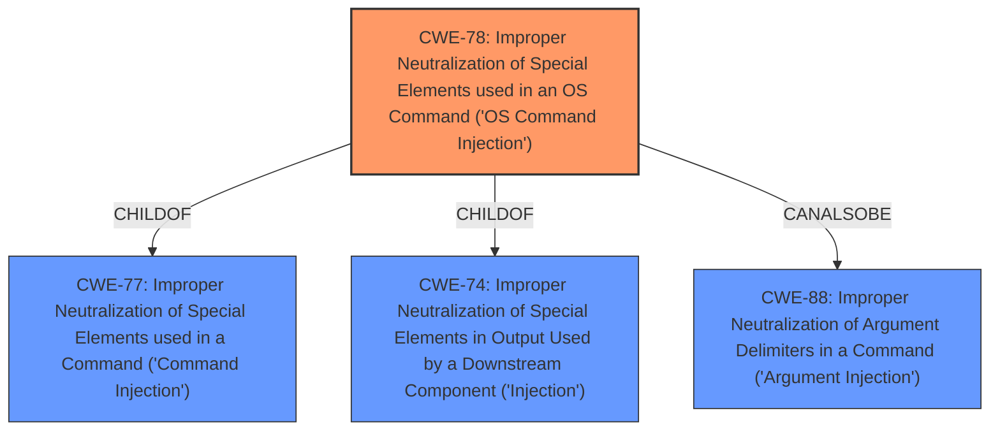

# Analysis Report for CVE-2022-25083

# Vulnerability Analysis Report: CVE-2022-25083

## Description


## Analysis (with Relationship Data)

# Summary
| CWE ID | CWE Name | Confidence | CWE Abstraction Level | CWE Vulnerability Mapping Label | CWE-Vulnerability Mapping Notes |
|---|---|---|---|---|---|
| CWE-78 | Improper Neutralization of Special Elements used in an OS Command ('OS Command Injection') | 1.0 | Base | Allowed | Primary CWE |

## Evidence and Confidence

*   **Confidence Score:** 1.0
*   **Evidence Strength:** HIGH

## Relationship Analysis
The primary CWE is CWE-78, which is a Base level CWE. It is a child of CWE-77 (Class) and CWE-74 (Class). CWE-78 can also be related to CWE-88. The hierarchy shows that CWE-78 is more specific than its parents, making it a better fit for the vulnerability description.



## Vulnerability Chain
The vulnerability chain is relatively simple:
1.  **Root Cause:** **Command Injection** (CWE-78) due to **improper neutralization** of special elements in the QUERY_STRING parameter.
2.  **Impact:** Attackers can execute arbitrary commands.

## Summary of Analysis
The vulnerability description clearly states that there is a **command injection** vulnerability in the Main function of TOTOLink A860R V4.1.2cu.5182_B20201027. Attackers can execute arbitrary commands via the QUERY_STRING parameter.

The **CWE for similar CVE Descriptions** lists CWE-78 as the Primary CWE Match.
The **Retriever Results** lists CWE-78 as the second best match.

CWE-78 (Improper Neutralization of Special Elements used in an OS Command ('OS Command Injection')) is the most appropriate CWE because the vulnerability description explicitly mentions **command injection** which allows attackers to execute arbitrary commands via the QUERY_STRING parameter. This aligns with the description of CWE-78: "The product constructs all or part of an OS command using externally-influenced input from an upstream component, but it does not neutralize or incorrectly neutralizes special elements that could modify the intended OS command when it is sent to a downstream component." The **Vulnerability Description Key Phrases** also indicates the **weakness** is **command injection**. The evidence is strong.

CWE-77 (Improper Neutralization of Special Elements used in a Command ('Command Injection')) was considered, as listed in the Retriever Results, but it is a Class-level CWE and more general than CWE-78. The Mapping Guidance for CWE-77 also says that CWE-77 is often misused when OS command injection (CWE-78) was intended instead.

CWE-88 (Improper Neutralization of Argument Delimiters in a Command ('Argument Injection')) was considered because it can be related to CWE-78, but the description doesn't give enough information to indicate that argument delimiters are the specific problem.

The choice of CWE-78 is at the optimal level of specificity (Base) based on the provided evidence.


## CWE Relationship Analysis

Current CWEs represent these abstraction levels: .


### Vulnerability Chain Analysis

**Chain starting from CWE-78:**
- 78 (Improper Neutralization of Special Elements used in an OS Command ('OS Command Injection')) - ROOT


**Chain starting from CWE-77:**
- 77 (Improper Neutralization of Special Elements used in a Command ('Command Injection')) - ROOT


### CWE Relationship Diagram

```mermaid
graph TD
    classDef primary fill:#f96,stroke:#333,stroke-width:2px
    classDef secondary fill:#69f,stroke:#333
    classDef tertiary fill:#9e9,stroke:#333
```


*Report generated on 2025-03-30 22:42:58*
