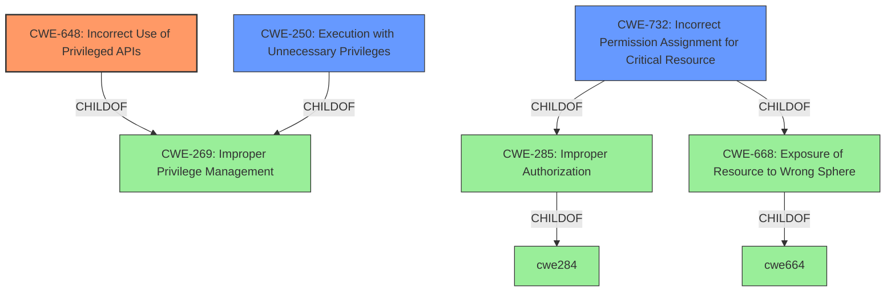

# Analysis for CVE-2022-25089

# Summary
| CWE ID | CWE Name | Confidence | CWE Abstraction Level | CWE Vulnerability Mapping Label | CWE-Vulnerability Mapping Notes |
|---|---|---|---|---|---|
| CWE-648 | Incorrect Use of Privileged APIs | 1 | Base | Allowed | Primary CWE |
| CWE-250 | Execution with Unnecessary Privileges | 0.8 | Base | Allowed | Secondary Candidate |
| CWE-732 | Incorrect Permission Assignment for Critical Resource | 0.6 | Class | Allowed-with-Review | Secondary Candidate |

## Evidence and Confidence

*   **Confidence Score:** 0.9
*   **Evidence Strength:** HIGH

## Relationship Analysis
The primary CWE, CWE-648 (Incorrect Use of Privileged APIs), is a Base level CWE, making it a good fit for the root cause. It is related to CWE-269 (Improper Privilege Management) as a child. CWE-250 (Execution with Unnecessary Privileges) is also a child of CWE-269 and represents a related but slightly different aspect of the vulnerability. CWE-732 (Incorrect Permission Assignment for Critical Resource) is a Class level CWE, and a child of both CWE-285 (Improper Authorization) and CWE-668 (Exposure of Resource to Wrong Sphere). The selection of CWE-648 as primary is based on the specific description of **incorrectly using privileged APIs**.

## Vulnerability Chain
The vulnerability chain starts with the **incorrect use of privileged APIs** (CWE-648). This leads to the ability to modify values in HKEY_LOCAL_MACHINE, which can result in remote code execution and system compromise. The **lack of authentication** further exacerbates the issue, allowing both local and remote attackers to exploit the vulnerability.
  - Printix uses incorrect privileged APIs -> arbitrary registry modification -> remote code execution / system compromise

## Summary of Analysis
The initial analysis focused on the **incorrect use of privileged APIs** as the root cause, which aligns well with CWE-648. The vulnerability description explicitly mentions this weakness: "Printix Secure Cloud Print Management through 1.3.1106.0 **incorrectly uses Privileged APIs** to modify values in HKEY_LOCAL_MACHINE via UITasks.PersistentRegistryData." The "CVE Reference Links Content Summary" confirms that the root cause is an "Incorrect Use of a Privileged API" within the `PrintixService.exe` application.
The graph relationships reinforced the selection of CWE-648, as it is a Base level CWE and provides a more specific description of the vulnerability compared to its parent, CWE-269 (Improper Privilege Management), which is a broader Class level CWE. While CWE-250 (Execution with Unnecessary Privileges) and CWE-732 (Incorrect Permission Assignment for Critical Resource) were considered, CWE-648 was deemed the most accurate representation of the root cause. CWE-250 is applicable because the registry modifications are performed in the SYSTEM context. CWE-732 is less applicable because the core issue is the improper API usage, not necessarily the incorrect assignment of permissions, though the registry is a critical resource.

Relevant CWE Information:

# Enhanced Context (25 CWEs)
The following CWEs were identified as potentially relevant to this vulnerability:

## CWE-668: Exposure of Resource to Wrong Sphere
**Abstraction Level**: Class
**Similarity Score**: 0.76
**Source**: dense

**Description**:
The product exposes a resource to the wrong control sphere, providing unintended actors with inappropriate access to the resource.

**Mapping Guidance**:
- Usage: Discouraged
- Rationale: CWE-668 is high-level and is often misused as a catch-all when lower-level CWE IDs might be applicable. It is sometimes used for low-information vulnerability reports [REF-1287]. It is a level-1 Class (i.e., a child of a Pillar). It is not useful for trend analysis.

## CWE-664: Improper Control of a Resource Through its Lifetime
**Abstraction Level**: Pillar
**Similarity Score**: 0.75
**Source**: dense

**Description**:
The product does not maintain or incorrectly maintains control over a resource throughout its lifetime of creation, use, and release.

**Mapping Guidance**:
- Usage: Discouraged
- Rationale: This CWE entry is high-level when lower-level children are available.

## CWE-653: Improper Isolation or Compartmentalization
**Abstraction Level**: Class
**Similarity Score**: 0.74
**Source**: dense

**Description**:
The product does not properly compartmentalize or isolate functionality, processes, or resources that require different privilege levels, rights, or permissions.

**Mapping Guidance**:
- Usage: Allowed
- Rationale: This CWE entry is at the Base level of abstraction, which is a preferred level of abstraction for mapping to the root causes of vulnerabilities.

## CWE-552: Files or Directories Accessible to External Parties
**Abstraction Level**: Base
**Similarity Score**: 0.72
**Source**: dense

**Description**:
The product makes files or directories accessible to unauthorized actors, even though they should not be.

**Mapping Guidance**:
- Usage: Allowed
- Rationale: This CWE entry is at the Base level of abstraction, which is a preferred level of abstraction for mapping to the root causes of vulnerabilities.

## CWE-610: Externally Controlled Reference to a Resource in Another Sphere
**Abstraction Level**: Class
**Similarity Score**: 0.72
**Source**: dense

**Description**:
The product uses an externally controlled name or reference that resolves to a resource that is outside of the intended control sphere.

**Mapping Guidance**:
- Usage: Discouraged
- Rationale: This CWE entry is a level-1 Class (i.e., a child of a Pillar). It might have lower-level children that would be more appropriate

## CWE-405: Asymmetric Resource Consumption (Amplification)
**Abstraction Level**: Class
**Similarity Score**: 0.72
**Source**: dense

**Description**:
The product does not properly control situations in which an adversary can cause the product to consume or produce excessive resources without requiring the adversary to invest equivalent work or otherwise prove authorization, i.e., the adversary's influence is "asymmetric."

**Mapping Guidance**:
- Usage: Allowed-with-Review
- Rationale: This CWE entry is a Class and might have Base-level children that would be more appropriate

## CWE-274: Improper Handling of Insufficient Privileges
**Abstraction Level**: Base
**Similarity Score**: 0.72
**Source**: dense

**Description**:
The product does not handle or incorrectly handles when it has insufficient privileges to perform an operation, leading to resultant weaknesses.

**Mapping Guidance**:
- Usage: Discouraged
- Rationale: This CWE entry could be deprecated in a future version of CWE.

## CWE-59: Improper Link Resolution Before File Access ('Link Following')
**Abstraction Level**: Base
**Similarity Score**: 0.72
**Source**: dense

**Description**:
The product attempts to access a file based on the filename, but it does not properly prevent that filename from identifying a link or shortcut that resolves to an unintended resource.

**Mapping Guidance**:
- Usage: Allowed
- Rationale: This CWE entry is at the Base level of abstraction, which is a preferred level of abstraction for mapping to the root causes of vulnerabilities.

## CWE-404: Improper Resource Shutdown or Release
**Abstraction Level**: Class
**Similarity Score**: 0.72
**Source**: dense

**Description**:
The product does not release or incorrectly releases a resource before it is made available for re-use.

**Mapping Guidance**:
- Usage: Allowed-with-