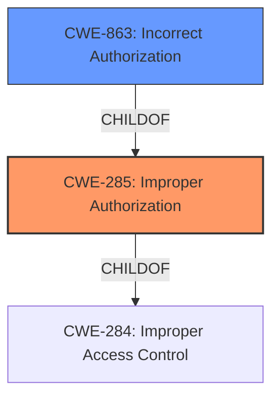

# Analysis Report for CVE-2022-2512

# Vulnerability Analysis Report: CVE-2022-2512

## Description


## Analysis (with Relationship Data)

# Summary
| CWE ID  | CWE Name                                                                      | Confidence | CWE Abstraction Level | CWE Vulnerability Mapping Label | CWE-Vulnerability Mapping Notes |
| :-------- | :---------------------------------------------------------------------------- | :---------- | :---------------------- | :------------------------------ | :------------------------------ |
| CWE-285   | Improper Authorization                                                        | 0.95        | Class                   | Primary CWE                     | Discouraged                   |
| CWE-863 | Incorrect Authorization                                                        | 0.8        | Class                   | Secondary CWE                   | Allowed-with-Review                    |

## Evidence and Confidence

*   **Confidence Score:** 0.9
*   **Evidence Strength:** HIGH

## Relationship Analysis
The primary relationship considered was the ChildOf relationship between CWE-863 and CWE-285. CWE-863 is a more specific case of CWE-285, where an authorization check is performed, but it's done incorrectly. Both CWEs are children of CWE-284. Because the provided information does not give details of what kind of authorization error occurred, it's safer to pick the higher level CWE-285.



## Vulnerability Chain
The chain starts with **membership changes not being reflected in TODO for confidential notes**, leading to a former project member being able to **read updates via TODOs**.

## Summary of Analysis
The initial assessment identified **CWE-285 Improper Authorization** as the primary weakness, with **CWE-863 Incorrect Authorization** as a possible, more specific alternative.

The vulnerability description states: "**Membership changes are not reflected in TODO for confidential notes**, allowing a former project members to read updates via TODOs." This clearly indicates an authorization issue where former members retain access to information they should no longer have access to.

The **Vulnerability Description Key Phrases** support this assessment, explicitly stating the **rootcause** as "**Membership changes are not reflected in TODO for confidential notes**" and the **impact** as "**read updates via TODOs**". This directly aligns with the description of **CWE-285 Improper Authorization**, where the product "**does not perform or incorrectly performs an authorization check when an actor attempts to access a resource or perform an action**". The "former project members" are attempting to "access a resource" (the confidential notes), and the system is failing to properly authorize this action.

**CWE-863 Incorrect Authorization** is a child of CWE-285 and describes situations where "**The product performs an authorization check when an actor attempts to access a resource or perform an action, but it does not correctly perform the check**". While this could be the case, the description does not provide enough information to determine if an authorization check was performed incorrectly, or if one was simply missing.

Based on the available evidence, **CWE-285** is the most appropriate classification, as it directly reflects the **rootcause** of the vulnerability.

Relevant CWE Information:

# Enhanced Context (25 CWEs)

## CWE-639: Authorization Bypass Through User-Controlled Key
**Abstraction Level**: Base
**Similarity Score**: 0.79
**Source**: dense

**Description**:
The system's authorization functionality does not prevent one user from gaining access to another user's data or record by modifying the key value identifying the data.

**Mapping Guidance**:
- Usage: Allowed
- Rationale: This CWE entry is at the Base level of abstraction, which is a preferred level of abstraction for mapping to the root causes of vulnerabilities.

This CWE was considered but not selected because the vulnerability does not involve the modification of a key value to gain unauthorized access. The issue is related to membership changes not being properly reflected in TODOs.

## CWE-80: Improper Neutralization of Script-Related HTML Tags in a Web Page (Basic XSS)
**Abstraction Level**: Variant
**Similarity Score**: 0.78
**Source**: dense

**Description**:
The product receives input from an upstream component, but it does not neutralize or incorrectly neutralizes special characters such as "<", ">", and "&" that could be interpreted as web-scripting elements when they are sent to a downstream component that processes web pages.

**Mapping Guidance**:
- Usage: Allowed
- Rationale: This CWE entry is at the Variant level of abstraction, which is a preferred level of abstraction for mapping to the root causes of vulnerabilities.

This CWE was considered but not selected because the vulnerability is not related to Cross-Site Scripting (XSS). The issue is related to membership changes not being properly reflected in TODOs.

## CWE-74: Improper Neutralization of Special Elements in Output Used by a Downstream Component ('Injection')
**Abstraction Level**: Class
**Similarity Score**: 0.78
**Source**: dense

**Description**:
The product constructs all or part of a command, data structure, or record using externally-influenced input from an upstream component, but it does not neutralize or incorrectly neutralizes special elements that could modify how it is parsed or interpreted when it is sent to a downstream component.

**Mapping Guidance**:
- Usage: Discouraged
- Rationale: CWE-74 is high-level and often misused when lower-level weaknesses are more appropriate.

This CWE was considered but not selected because the vulnerability is not related to injection. The issue is related to membership changes not being properly reflected in TODOs.

## CWE-610: Externally Controlled Reference to a Resource in Another Sphere
**Abstraction Level**: Class
**Similarity Score**: 0.77
**Source**: dense

**Description**:
The product uses an externally controlled name or reference that resolves to a resource that is outside of the intended control sphere.

**Mapping Guidance**:
- Usage: Discouraged
- Rationale: This CWE entry is a level-1 Class (i.e., a child of a Pillar). It might have lower-level children that would be more appropriate

This CWE was considered but not selected because the vulnerability does not involve an externally controlled reference to a resource in another sphere. The issue is related to membership changes not being properly reflected in TODOs.

## CWE-668: Exposure of Resource to Wrong Sphere
**Abstraction Level**: Class
**Similarity Score**: 0.77
**Source**: dense

**Description**:
The product exposes a resource to the wrong control sphere, providing unintended actors with inappropriate access to the resource.

**Mapping Guidance**:
- Usage: Discouraged
- Rationale: CWE-668 is high-level and is often misused as a catch-all when lower-level CWE IDs might be applicable. It is sometimes used for low-information vulnerability reports [REF-1287]. It is a level-1 Class (i.e., a child of a Pillar). It is not useful for trend analysis.

This CWE was considered but not selected because the vulnerability is better described by Improper Authorization.

## CWE-1289: Improper Validation of Unsafe Equivalence in Input
**Abstraction Level**: Base
**Similarity Score**: 0.77
**Source**: dense

**Description**:
The product receives an input value that is used as a resource identifier or other type of reference, but it does not validate or incorrectly validates that the input is equivalent to a potentially-unsafe value.

**Mapping Guidance**:
- Usage: Allowed
- Rationale: This CWE entry is at the Base level of abstraction, which is a preferred level of abstraction for mapping to the root causes of vulnerabilities.

This CWE was considered but not selected because the vulnerability does not involve improper validation of unsafe equivalence in input. The issue is related to membership changes not being properly reflected in TODOs.

## CWE-116: Improper Encoding or Escaping of Output
**Abstraction Level**: Class
**Similarity Score**: 0.77
**Source**: dense

**Description**:
The product prepares a structured message for communication with another component, but encoding or escaping of the data is either missing or done incorrectly. As a result, the intended structure of the message is not preserved.

**Mapping Guidance**:
- Usage: Allowed-with-Review
- Rationale: This CWE entry is a Class and might have Base-level children that would be more appropriate

This CWE was considered but not selected because the vulnerability is not related to encoding or escaping of output. The issue is related to membership changes not being properly reflected in TODOs.

## CWE-472: External Control of Assumed-Immutable Web Parameter
**Abstraction Level**: Base
**Similarity Score**: 0.77
**Source**: dense

**Description**:
The web application does not sufficiently verify inputs that are assumed to be immutable but are actually externally controllable, such as hidden form fields.

**Mapping Guidance**:
- Usage: Allowed
- R


## CWE Relationship Analysis

Current CWEs represent these abstraction levels: .


### Vulnerability Chain Analysis

**Chain starting from CWE-80:**
- 80 (Improper Neutralization of Script-Related HTML Tags in a Web Page (Basic XSS)) - ROOT


**Chain starting from CWE-472:**
- 472 (External Control of Assumed-Immutable Web Parameter) - ROOT


### CWE Relationship Diagram

```mermaid
graph TD
    classDef primary fill:#f96,stroke:#333,stroke-width:2px
    classDef secondary fill:#69f,stroke:#333
    classDef tertiary fill:#9e9,stroke:#333
```


*Report generated on 2025-03-31 06:32:38*
