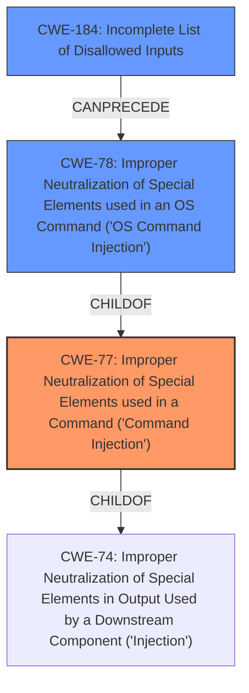

# Analysis for CVE-2022-25131

# Summary
| CWE ID  | CWE Name                                                                                                   | Confidence | CWE Abstraction Level | CWE Vulnerability Mapping Label | CWE-Vulnerability Mapping Notes |
| :-------- | :--------------------------------------------------------------------------------------------------------- | :--------- | :---------------------- | :------------------------------ | :-------------------------------- |
| CWE-77  | Improper Neutralization of Special Elements used in a Command ('Command Injection')                         | 0.9        | Class                  | Primary                           | Allowed-with-Review               |
| CWE-78  | Improper Neutralization of Special Elements used in an OS Command ('OS Command Injection')                    | 0.7        | Base                   | Secondary                         | Allowed                           |
| CWE-184 | Incomplete List of Disallowed Inputs                                                                        | 0.6        | Base                   | Secondary                         | Allowed                           |

## Evidence and Confidence

*   **Confidence Score:** 0.8
*   **Evidence Strength:** HIGH

## Relationship Analysis
The primary CWE is CWE-77, which is a Class-level CWE. The vulnerability involves **command injection** via a crafted MQTT packet. While CWE-77 is a class, it encompasses command injection vulnerabilities. CWE-78, a Base-level CWE and a child of CWE-77, is more specific to OS command injection. Since the vulnerability description doesn't explicitly state that the command injection is specifically an OS command, but rather a more general command injection, CWE-77 is initially favored. However, given the context of routers, OS command injection is highly probable, making CWE-78 a strong secondary candidate. Additionally, CWE-184 is relevant as a potential weakness related to an incomplete list of disallowed inputs, which could contribute to the **command injection**.

## Vulnerability Chain
The vulnerability chain starts with **improper input sanitization**, leading to **command injection**, and ultimately allows attackers to execute arbitrary commands.
  - **Root Cause:** **Improper input sanitization**
  - **Weakness:** **Command injection**
  - **Impact:** Execute arbitrary commands

## Summary of Analysis
Initially, the analysis pointed towards CWE-77 because the description mentions **command injection** without specifying the type of command. However, considering the context of the vulnerability (routers) and the high probability of OS commands being involved, CWE-78 becomes a strong candidate. The description explicitly mentions **improper input sanitization**, which directly relates to the **command injection** vulnerability. The final decision is to assign CWE-77 as the primary due to the general nature of the **command injection** mentioned, with CWE-78 considered as a secondary more specific to OS commands. Furthermore, CWE-184 addresses the root cause of **improper input sanitization** which could involve an incomplete list of disallowed inputs.

The selection of CWE-77 and CWE-78 is based on the following evidence:
*   "A **command injection** vulnerability in the function recvSlaveCloudCheckStatus" - This clearly indicates a **command injection** vulnerability.
*   "allows attackers to execute arbitrary commands via a crafted MQTT packet." - This confirms the impact of the vulnerability.
*   "**rootcause: improper input sanitization**" - This phrase highlights the root cause of the command injection.

The graph relationships influenced the decision by illustrating the hierarchical connections between CWE-77 and CWE-78, helping determine the appropriate level of specificity.

The selected CWEs are at the optimal level of specificity because CWE-77 is a general Class covering **command injection**, while CWE-78 provides more specificity if it is determined that the **command injection** is specifically related to OS commands. CWE-184 highlights a potential cause for the **improper input sanitization**.

Relevant CWE Information:

# Enhanced Context (25 CWEs)
The following CWEs were identified as potentially relevant to this vulnerability:

## CWE-1289: Improper Validation of Unsafe Equivalence in Input
**Abstraction Level**: Base
**Similarity Score**: 0.78
**Source**: dense

**Description**:
The product receives an input value that is used as a resource identifier or other type of reference, but it does not validate or incorrectly validates that the input is equivalent to a potentially-unsafe value.

**Mapping Guidance**:
- Usage: Allowed
- Rationale: This CWE entry is at the Base level of abstraction, which is a preferred level of abstraction for mapping to the root causes of vulnerabilities.

*This CWE was considered, but ultimately not selected, as the vulnerability's description does not emphasize the equivalence of inputs, but rather the general **improper sanitization** leading to **command injection**.*

## CWE-184: Incomplete List of Disallowed Inputs
**Abstraction Level**: Base
**Similarity Score**: 0.78
**Source**: dense

**Description**:
The product implements a protection mechanism that relies on a list of inputs (or properties of inputs) that are not allowed by policy or otherwise require other action to neutralize before additional processing takes place, but the list is incomplete.

**Mapping Guidance**:
- Usage: Allowed
- Rationale: This CWE entry is at the Base level of abstraction, which is a preferred level of abstraction for mapping to the root causes of vulnerabilities.

*This CWE was selected as a secondary mapping as the **improper input sanitization** could result from an incomplete list of disallowed inputs.*

## CWE-74: Improper Neutralization of Special Elements in Output Used by a Downstream Component ('Injection')
**Abstraction Level**: Class
**Similarity Score**: 0.77
**Source**: dense

**Description**:
The product constructs all or part of a command, data structure, or record using externally-influenced input from an upstream component, but it does not neutralize or incorrectly neutralizes special elements that could modify how it is parsed or interpreted when it is sent to a downstream component.

**Mapping Guidance**:
- Usage: Discouraged
- Rationale: CWE-74 is high-level and often misused when lower-level weaknesses are more appropriate.

*This CWE was considered but not selected as CWE-77 and CWE-78 are more specific to the described **command injection**.*

## CWE-183: Permissive List of Allowed Inputs
**Abstraction Level**: Base
**Similarity Score**: 0.77
**Source**: dense

**Description**:
The product implements a protection mechanism that relies on a list of inputs (or properties of inputs) that are explicitly allowed by policy because the inputs are assumed to be safe, but the list is too permissive - that is, it allows an input that is unsafe, leading to resultant weaknesses.

**Mapping Guidance**:
- Usage: Allowed
- Rationale: This CWE entry is at the Base level of abstraction, which is a preferred level of abstraction for mapping to the root causes of vulnerabilities.

*This CWE was considered but not selected because the description does not explicitly mention a permissive list of allowed inputs as the root cause, but focuses on the general **improper sanitization**.*

## CWE-807: Reliance on Untrusted Inputs in a Security Decision
**Abstraction Level**: Base
**Similarity Score**: 0.76
**Source**: dense

**Description**:
The product uses a protection mechanism that relies on the existence or values of an input, but the input can be modified by an untrusted actor in a way that bypasses the protection mechanism.

**Mapping Guidance**:
- Usage: Allowed
- Rationale: This CWE entry is at the Base level of abstraction, which is a preferred level of abstraction for mapping to the root causes of vulnerabilities.

*This CWE was considered but not selected because the description focuses on the **improper sanitization** and **command injection** rather than a reliance on untrusted inputs in a security decision.*

## CWE-138: Improper Neutralization of Special Elements
**Abstraction Level**: Class
**Similarity Score**: 0.76
**Source**: dense

**Description**:
The product receives input from an upstream component, but it does not neutralize or incorrectly neutralizes special elements that could be interpreted as control elements or syntactic markers when they are sent to a downstream component.

**Mapping Guidance**:
- Usage: Discouraged
- Rationale: This CWE entry is a level-1 Class (i.e., a child of a Pillar). It might have lower-level children that would be more appropriate

*This CWE was considered, but CWE-77 and