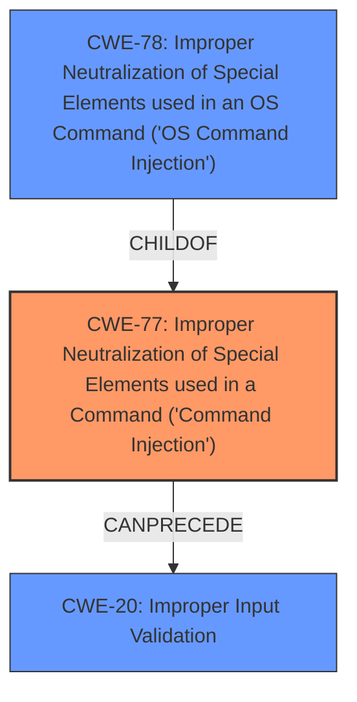

# Raw Analyzer Response for CVE-2022-25133

# Summary
| CWE ID | CWE Name | Confidence | CWE Abstraction Level | CWE Vulnerability Mapping Label | CWE-Vulnerability Mapping Notes |
|---|---|---|---|---|---|
| CWE-77 | Improper Neutralization of Special Elements used in a Command ('Command Injection') | 1.0 | Class | Allowed-with-Review | Primary CWE. The vulnerability involves command injection via a crafted MQTT packet, indicating that the application is constructing a command and failing to neutralize special elements. |
| CWE-78 | Improper Neutralization of Special Elements used in an OS Command ('OS Command Injection') | 0.8 | Base | Allowed | Secondary candidate. Could be used if the command injection is specifically an OS command. Further investigation would be needed to confirm if the crafted MQTT packet results in the construction of an OS command. |
| CWE-20 | Improper Input Validation | 0.6 | Class | Discouraged | Secondary candidate. The vulnerability description mentions "**improper input validation**" but lacks specifics. CWE-20 is a high-level classification and more specific CWEs might be applicable. |

## Evidence and Confidence

*   **Confidence Score:** 0.9
*   **Evidence Strength:** HIGH

## Relationship Analysis
The primary CWE is CWE-77, which is a class-level CWE. CWE-78 is a base-level CWE and a child of CWE-77. The vulnerability description and key phrases indicate **command injection** due to **improper input validation**. This suggests a failure to neutralize special elements when constructing a command. CWE-20, while mentioned in the key phrases, is a discouraged CWE due to its high level of abstraction. CWE-77 seems to be the best fit based on the information available.

## Vulnerability Chain
The vulnerability chain begins with **improper input validation**, which leads to **command injection**, ultimately allowing attackers to execute arbitrary commands.

Improper Input Validation -> Command Injection -> Arbitrary Command Execution

## Summary of Analysis
The initial assessment focused on the vulnerability description, which clearly points to a **command injection** vulnerability stemming from **improper input validation**. The key phrases and retriever results support this assessment.

The evidence from the vulnerability description includes the following phrases:
* "command injection vulnerability"
* "improper input validation"
* "execute arbitrary commands"
* "crafted MQTT packet"

These phrases strongly indicate a scenario where a crafted input leads to the execution of unintended commands. The retriever results reinforce this, with CWE-77 being the top-ranked CWE.

CWE-77 is selected because the application constructs a command using external input but fails to properly neutralize special elements. If the command is specifically an OS command, then CWE-78 could be used. However, without further details, CWE-77 provides a more general classification for command injection vulnerabilities. CWE-20 is a less desirable mapping due to its high level of abstraction.

Relevant CWE Information:

# Enhanced Context (25 CWEs)
The following CWEs were identified as potentially relevant to this vulnerability:

## CWE-184: Incomplete List of Disallowed Inputs
**Abstraction Level**: Base
**Similarity Score**: 0.78
**Source**: dense

**Description**:
The product implements a protection mechanism that relies on a list of inputs (or properties of inputs) that are not allowed by policy or otherwise require other action to neutralize before additional processing takes place, but the list is incomplete.

**Mapping Guidance**:
- Usage: Allowed
- Rationale: This CWE entry is at the Base level of abstraction, which is a preferred level of abstraction for mapping to the root causes of vulnerabilities.

CWE-184 was considered since it related to input validation, but it was not selected since the issue is not necessarily related to an incomplete list of disallowed inputs.

## CWE-1289: Improper Validation of Unsafe Equivalence in Input
**Abstraction Level**: Base
**Similarity Score**: 0.77
**Source**: dense

**Description**:
The product receives an input value that is used as a resource identifier or other type of reference, but it does not validate or incorrectly validates that the input is equivalent to a potentially-unsafe value.

**Mapping Guidance**:
- Usage: Allowed
- Rationale: This CWE entry is at the Base level of abstraction, which is a preferred level of abstraction for mapping to the root causes of vulnerabilities.

CWE-1289 was considered since it related to input validation, but it was not selected since the issue is not related to unsafe equivalence.

## CWE-138: Improper Neutralization of Special Elements
**Abstraction Level**: Class
**Similarity Score**: 0.77
**Source**: dense

**Description**:
The product receives input from an upstream component, but it does not neutralize or incorrectly neutralizes special elements that could be interpreted as control elements or syntactic markers when they are sent to a downstream component.

**Mapping Guidance**:
- Usage: Discouraged
- Rationale: This CWE entry is a level-1 Class (i.e., a child of a Pillar). It might have lower-level children that would be more appropriate

CWE-138 was considered since it relates to improper neutralization of special elements. However, CWE-77 is a better match.

## CWE-74: Improper Neutralization of Special Elements in Output Used by a Downstream Component ('Injection')
**Abstraction Level**: Class
**Similarity Score**: 0.77
**Source**: dense

**Description**:
The product constructs all or part of a command, data structure, or record using externally-influenced input from an upstream component, but it does not neutralize or incorrectly neutralizes special elements that could modify how it is parsed or interpreted when it is sent to a downstream component.

**Mapping Guidance**:
- Usage: Discouraged
- Rationale: CWE-74 is high-level and often misused when lower-level weaknesses are more appropriate.

CWE-74 was considered since it relates to injection. However, CWE-77 is a better match.

## CWE-150: Improper Neutralization of Escape, Meta, or Control Sequences
**Abstraction Level**: Variant
**Similarity Score**: 0.76
**Source**: dense

**Description**:
The product receives input from an upstream component, but it does not neutralize or incorrectly neutralizes special elements that could be interpreted as escape, meta, or control character sequences when they are sent to a downstream component.

**Mapping Guidance**:
- Usage: Allowed
- Rationale: This CWE entry is at the Variant level of abstraction, which is a preferred level of abstraction for mapping to the root causes of vulnerabilities.

CWE-150 was considered, but it's more specific about escape sequences.

## CWE-183: Permissive List of Allowed Inputs
**Abstraction Level**: Base
**Similarity Score**: 0.76
**Source**: dense

**Description**:
The product implements a protection mechanism that relies on a list of inputs (or properties of inputs) that are explicitly allowed by policy because the inputs are assumed to be safe, but the list is too permissive - that is, it allows an input that is unsafe, leading to resultant weaknesses.

**Mapping Guidance**:
- Usage: Allowed
- Rationale: This CWE entry is at the Base level of abstraction, which is a preferred level of abstraction for mapping to the root causes of vulnerabilities.

CWE-183 was considered, but it's about overly permissive allow lists.

## CWE-807: Reliance on Untrusted Inputs in a Security Decision
**Abstraction Level**: Base
**Similarity Score**: 0.76
**Source**: dense

**Description**:
The product uses a protection mechanism that relies on the existence or values of an input, but the input can be modified by an untrusted actor in a way that bypasses the protection mechanism.

**Mapping Guidance**:
- Usage: Allowed
- Rationale: This CWE entry is at the Base level of abstraction, which is a preferred level of abstraction for mapping to the root causes of vulnerabilities.

CWE-807 was considered, but it's about reliance on untrusted inputs in security decisions.

## CWE-162: Improper Neutralization of Trailing Special Elements
**Abstraction Level**: Variant
**Similarity Score**: 0.75
**Source**: dense

**Description**:
The product receives input from an upstream component, but it does not neutralize or incorrectly neutralizes trailing special elements that could be interpreted in unexpected ways when they are sent to a downstream component.

**Mapping Guidance**:
- Usage: Allowed
- Rationale: This CWE entry is at the Variant level of abstraction, which is a preferred level