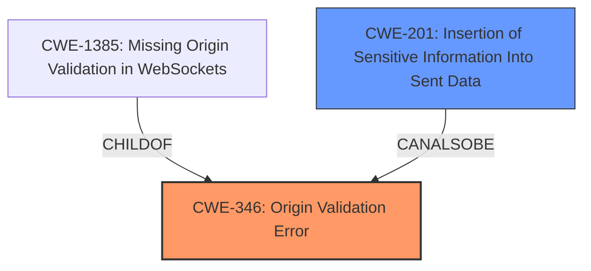

# Enhanced Analysis for CVE-2022-25146

# Summary
| CWE ID | CWE Name | Confidence | CWE Abstraction Level | CWE Vulnerability Mapping Label | CWE-Vulnerability Mapping Notes |
|---|---|---|---|---|---|
| CWE-346 | Origin Validation Error | 0.9 | Class | Primary | Allowed-with-Review |
| CWE-201 | Insertion of Sensitive Information Into Sent Data | 0.7 | Base | Secondary | Allowed |

## Evidence and Confidence

*   **Confidence Score:** 0.8
*   **Evidence Strength:** HIGH

## Relationship Analysis
The primary CWE is CWE-346, Origin Validation Error, which is a Class-level CWE. The vulnerability description clearly indicates a **lack of origin validation**. The secondary CWE, CWE-201, Insertion of Sensitive Information Into Sent Data, highlights the impact of the vulnerability, where the **CSRF token**, a sensitive piece of data, is included in the response. CWE-346 is a Class CWE so the Retriever suggested looking at the child CWEs. CWE-1385, Missing Origin Validation in WebSockets, is a child of CWE-346 and a Variant level CWE, but this vulnerability description is not specific to WebSockets so I did not choose this CWE.



## Vulnerability Chain
The chain of events starts with the **missing origin validation** (CWE-346). Because of this, an attacker can send a crafted message that results in the server including the **CSRF token** (sensitive information) in its response (CWE-201), which could then be exfiltrated.

## Summary of Analysis
The initial assessment focused on identifying the **root cause** of the vulnerability, which is the **lack of origin validation** in the Remote App module. The vulnerability description states the module "**does not check if the origin of event messages it receives matches the origin of the Remote App**". This aligns directly with the definition of CWE-346, Origin Validation Error: "The product does not properly verify that the source of data or communication is valid." The CVE Reference Links Content Summary also states, "The root cause is a lack of origin validation in the Remote App module when processing event messages."

While several other CWEs were considered based on the Retriever Results, they were deemed less relevant. For instance, CWE-863, Incorrect Authorization, and CWE-862, Missing Authorization, relate to authorization mechanisms, but the primary issue here is the **lack of validation** of the message origin, not the authorization process itself. CWE-201, Insertion of Sensitive Information Into Sent Data, was considered because the **CSRF token** is being leaked, but is a secondary effect of the **missing origin validation** and is not the **root cause**.

The choice of CWE-346 is at the Class level because the vulnerability description does not provide enough information to narrow it down to a more specific Base or Variant CWE. The mapping guidance for CWE-346 suggests examining its children for a better fit, but none of the children CWEs are more appropriate.

The final assessment is that CWE-346, Origin Validation Error, accurately represents the **root cause** of the vulnerability, with CWE-201, Insertion of Sensitive Information Into Sent Data, as a secondary contributing factor describing the impact.


## CWE Relationship Analysis

Current CWEs represent these abstraction levels: .


### Vulnerability Chain Analysis

**Chain starting from CWE-201:**
- 201 (Insertion of Sensitive Information Into Sent Data) - ROOT


**Chain starting from CWE-862:**
- 862 (Missing Authorization) - ROOT


### CWE Relationship Diagram

```mermaid
graph TD
    classDef primary fill:#f96,stroke:#333,stroke-width:2px
    classDef secondary fill:#69f,stroke:#333
    classDef tertiary fill:#9e9,stroke:#333
```