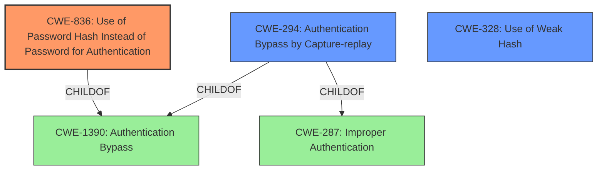

# Analysis Report for CVE-2022-25155

# Vulnerability Analysis Report: CVE-2022-25155

## Description


## Analysis (with Relationship Data)

# Summary
| CWE ID  | CWE Name                                                       | Confidence | CWE Abstraction Level | CWE Vulnerability Mapping Label | CWE-Vulnerability Mapping Notes |
| :-------- | :------------------------------------------------------------- | :--------- | :---------------------- | :------------------------------ | :------------------------------ |
| CWE-836   | Use of Password Hash Instead of Password for Authentication   | 1          | Base                    | Primary                         | Allowed                       |
| CWE-294   | Authentication Bypass by Capture-replay                       | 0.9        | Base                    | Secondary                       | Allowed                       |
| CWE-328   | Use of Weak Hash                                               | 0.8        | Base                    | Secondary                       | Allowed                       |

## Evidence and Confidence

*   **Confidence Score:** 0.9
*   **Evidence Strength:** HIGH

## Relationship Analysis
The primary relationship is between CWE-836 **Use of Password Hash Instead of Password for Authentication**, and CWE-1390 **Authentication Bypass**. CWE-294 **Authentication Bypass by Capture-replay** is a child of CWE-1390 as well. Also, CWE-328 **Use of Weak Hash** can lead to the exposure of the password hashes making the attack easier.



## Vulnerability Chain
The vulnerability chain starts with the **Use of Password Hash Instead of Password for Authentication** (CWE-836), which allows an attacker to capture and replay the password hash (CWE-294), leading to **Authentication Bypass** (CWE-1390). The use of a **Weak Hash** (CWE-328) can make capturing the hash easier.

## Summary of Analysis
The initial analysis strongly points towards CWE-836 **Use of Password Hash Instead of Password for Authentication** as the primary weakness, as this is the **rootcause** explicitly mentioned in the "Vulnerability Description Key Phrases" and "CVE Reference Links Content Summary". The advisory states: "The vulnerability stems from the **use of password hashes instead of the actual password for authentication**."

The Retriever Results also lists CWE-836 as the top candidate with a score of 5.320. The CWE description aligns perfectly with the vulnerability description.

CWE-294 **Authentication Bypass by Capture-replay** is also a strong candidate, as the attack vector involves replaying an eavesdropped password hash. The vulnerability description mentions: "allows a remote unauthenticated attacker to login to the product by replaying an eavesdropped password hash." This indicates that the system is vulnerable to a capture-replay attack.

CWE-328 **Use of Weak Hash** is a secondary candidate because the advisory mentions it as a weakness present. However, the vulnerability description doesn't explicitly state that a weak hash is being used, but its presence would make the replay attack easier.

The final selection is based on the explicit mention of CWE-836 as the root cause and the attack vector clearly demonstrating a capture-replay scenario (CWE-294). CWE-328 is also considered due to its presence in the advisory as a weakness. These CWEs are at the optimal level of specificity (Base) as they directly describe the weaknesses present in the system.

Relevant CWE Information:

# Enhanced Context (25 CWEs)
The following CWEs were identified as potentially relevant to this vulnerability:

## CWE-405: Asymmetric Resource Consumption (Amplification)
**Abstraction Level**: Class
**Similarity Score**: 0.80
**Source**: dense

**Description**:
The product does not properly control situations in which an adversary can cause the product to consume or produce excessive resources without requiring the adversary to invest equivalent work or otherwise prove authorization, i.e., the adversary's influence is "asymmetric."

**Mapping Guidance**:
- Usage: Allowed-with-Review
- Rationale: This CWE entry is a Class and might have Base-level children that would be more appropriate

## CWE-226: Sensitive Information in Resource Not Removed Before Reuse
**Abstraction Level**: Base
**Similarity Score**: 0.79
**Source**: dense

**Description**:
The product releases a resource such as memory or a file so that it can be made available for reuse, but it does not clear or "zeroize" the information contained in the resource before the product performs a critical state transition or makes the resource available for reuse by other entities.

**Mapping Guidance**:
- Usage: Allowed
- Rationale: This CWE entry is at the Base level of abstraction, which is a preferred level of abstraction for mapping to the root causes of vulnerabilities.

## CWE-404: Improper Resource Shutdown or Release
**Abstraction Level**: Class
**Similarity Score**: 0.79
**Source**: dense

**Description**:
The product does not release or incorrectly releases a resource before it is made available for re-use.

**Mapping Guidance**:
- Usage: Allowed-with-Review
- Rationale: This CWE entry is a Class and might have Base-level children that would be more appropriate

## CWE-789: Memory Allocation with Excessive Size Value
**Abstraction Level**: Variant
**Similarity Score**: 0.77
**Source**: dense

**Description**:
The product allocates memory based on an untrusted, large size value, but it does not ensure that the size is within expected limits, allowing arbitrary amounts of memory to be allocated.

**Mapping Guidance**:
- Usage: Allowed
- Rationale: This CWE entry is at the Variant level of abstraction, which is a preferred level of abstraction for mapping to the root causes of vulnerabilities.

## CWE-799: Improper Control of Interaction Frequency
**Abstraction Level**: Class
**Similarity Score**: 0.77
**Source**: dense

**Description**:
The product does not properly limit the number or frequency of interactions that it has with an actor, such as the number of incoming requests.

**Mapping Guidance**:
- Usage: Allowed-with-Review
- Rationale: This CWE entry is a Class and might have Base-level children that would be more appropriate

## CWE-664: Improper Control of a Resource Through its Lifetime
**Abstraction Level**: Pillar
**Similarity Score**: 0.77
**Source**: dense

**Description**:
The product does not maintain or incorrectly maintains control over a resource throughout its lifetime of creation, use, and release.

**Mapping Guidance**:
- Usage: Discouraged
- Rationale: This CWE entry is high-level when lower-level children are available.

## CWE-407: Inefficient Algorithmic Complexity
**Abstraction Level**: Class
**Similarity Score**: 0.77
**Source**: dense

**Description**:
An algorithm in a product has an inefficient worst-case computational complexity that may be detrimental to system performance and can be triggered by an attacker, typically using crafted manipulations that ensure that the worst case is being reached.

**Mapping Guidance**:
- Usage: Allowed-with-Review
- Rationale: This CWE entry is a Class and might have Base-level children that would be more appropriate

## CWE-667: Improper Locking
**Abstraction Level**: Class
**Similarity Score**: 0.76
**Source**: dense

**Description**:
The product does not properly acquire or release a lock on a resource, leading to unexpected resource state changes and behaviors.

**Mapping Guidance**:
- Usage: Allowed-with-Review
- Rationale: This CWE entry is a Class and might have Base-level children that would be more appropriate

## CWE-668: Exposure of Resource to Wrong Sphere
**Abstraction Level**: Class
**Similarity Score**: 0.76
**Source**: dense

**Description**:
The product exposes a resource to the wrong control sphere, providing unintended actors with inappropriate access to the resource.

**Mapping Guidance**:
- Usage: Discouraged
- Rationale: CWE-668 is high-level and is often misused as a catch-all when lower-level CWE IDs might be applicable. It is sometimes used for low-information vulnerability reports [REF-1287]. It is a level-1 Class (i.e., a child of a Pillar). It is not useful for trend analysis.

## CWE-130: Improper Handling of Length Parameter Inconsistency
**


## CWE Relationship Analysis

Current CWEs represent these abstraction levels: .


### Vulnerability Chain Analysis

**Chain starting from CWE-130:**
- 130 (Improper Handling of Length Parameter Inconsistency) - ROOT


**Chain starting from CWE-328:**
- 328 (Use of Weak Hash) - ROOT


### CWE Relationship Diagram

```mermaid
graph TD
    classDef primary fill:#f96,stroke:#333,stroke-width:2px
    classDef secondary fill:#69f,stroke:#333
    classDef tertiary fill:#9e9,stroke:#333
```


*Report generated on 2025-03-30 23:32:27*
