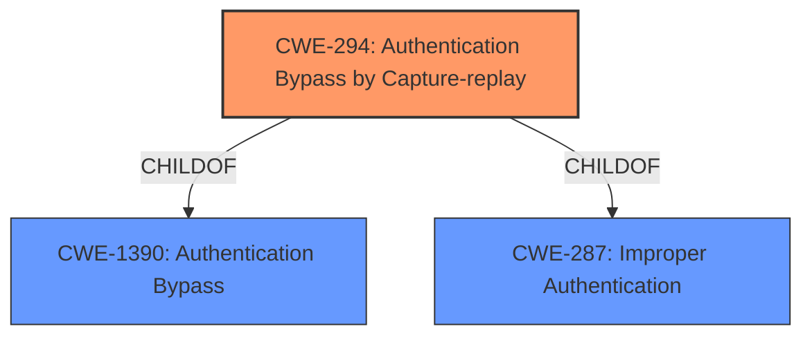

# Analysis Report for CVE-2022-25159

# Vulnerability Analysis Report: CVE-2022-25159

## Description


## Analysis (with Relationship Data)

# Summary
| CWE ID | CWE Name | Confidence | CWE Abstraction Level | CWE Vulnerability Mapping Label | CWE-Vulnerability Mapping Notes |
|---|---|---|---|---|---|
| CWE-294 | Authentication Bypass by Capture-replay | 1.0 | Base | Allowed | Primary CWE |

## Evidence and Confidence

*   **Confidence Score:** 1.0
*   **Evidence Strength:** HIGH

## Relationship Analysis
The primary relationship to consider is that CWE-294 is a child of CWE-1390: Authentication Bypass and CWE-287: Improper Authentication, which makes sense given that the vulnerability is a specific type of authentication bypass. There are no other chain or peer relationships that strongly influence the classification.



## Vulnerability Chain
The vulnerability chain is relatively straightforward:

1.  **Root Cause:** **Capture-replay** vulnerability (CWE-294) due to the design of the product.
2.  **Impact:** Authentication Bypass, allowing a remote unauthenticated attacker to log in.

## Summary of Analysis
The analysis clearly points to CWE-294 as the most appropriate classification. This decision is based on a high confidence level, supported by strong evidence from the vulnerability description and CVE reference. The **rootcause** of the vulnerability is explicitly identified as a **capture-replay** flaw, which perfectly aligns with the definition of CWE-294.

The vulnerability description states: "Authentication Bypass by Capture-replay vulnerability...allows a remote unauthenticated attacker to login to the product by replay attack." The CVE Reference Links Content Summary further reinforces this by stating: "The vulnerability stems from the use of a capture-replay authentication method...Authentication Bypass by Capture-replay (CWE-294): The system is vulnerable to replay attacks..."

The retriever results also list CWE-294 as the second best match, with a base level of abstraction that is a preferred level.

Several other CWEs were considered, but ultimately deemed less suitable:

*   CWE-836: Use of Password Hash Instead of Password for Authentication: While this CWE relates to authentication issues, it focuses on the use of password hashes rather than the **capture-replay** mechanism.
*   CWE-328: Use of Weak Hash: This is not directly relevant as the vulnerability is not primarily about the weakness of a hash function, but about the **capture-replay** of authentication data.
*   CWE-337: Predictable Seed in Pseudo-Random Number Generator (PRNG): This is unrelated to the authentication bypass via **capture-replay**.
*   CWE-130: Improper Handling of Length Parameter Inconsistency: This is not applicable as the vulnerability does not involve inconsistencies in length parameters.
*   CWE-326: Inadequate Encryption Strength: This is not applicable, as the issue is **capture-replay**, not specifically related to encryption strength.

The selection of CWE-294 is at the optimal level of specificity, as it directly addresses the **rootcause** of the vulnerability: the susceptibility to **capture-replay** attacks.


## CWE Relationship Analysis

Current CWEs represent these abstraction levels: .


### Vulnerability Chain Analysis

**Chain starting from CWE-328:**
- 328 (Use of Weak Hash) - ROOT


**Chain starting from CWE-294:**
- 294 (Authentication Bypass by Capture-replay) - ROOT


### CWE Relationship Diagram

```mermaid
graph TD
    classDef primary fill:#f96,stroke:#333,stroke-width:2px
    classDef secondary fill:#69f,stroke:#333
    classDef tertiary fill:#9e9,stroke:#333
```


*Report generated on 2025-03-31 12:47:13*
