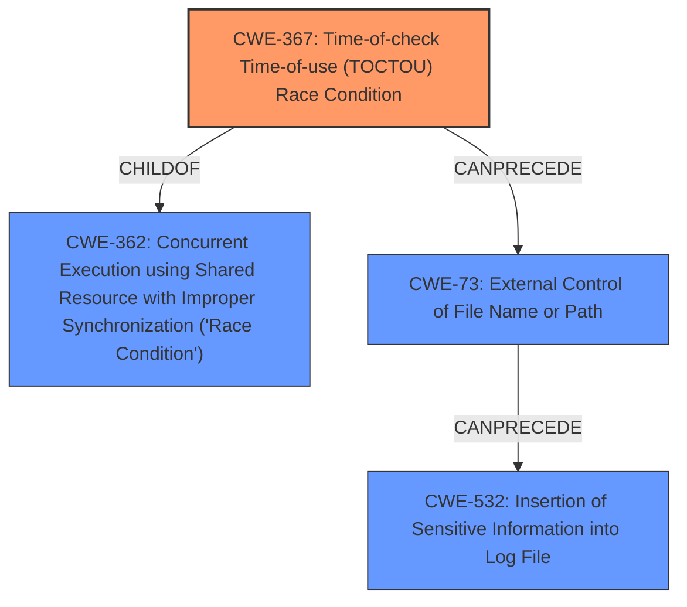

# Enhanced Analysis for CVE-2022-25165

# Summary
| CWE ID | CWE Name | Confidence | CWE Abstraction Level | CWE Vulnerability Mapping Label | CWE-Vulnerability Mapping Notes |
|---|---|---|---|---|---|
| CWE-367 | Time-of-check Time-of-use (TOCTOU) Race Condition | 0.9 | Base | Allowed | Primary CWE |
| CWE-73 | External Control of File Name or Path | 0.7 | Base | Allowed | Secondary Candidate |
| CWE-532 | Insertion of Sensitive Information into Log File | 0.6 | Base | Allowed | Secondary Candidate |

## Evidence and Confidence

*   **Confidence Score:** 0.8
*   **Evidence Strength:** HIGH

## Relationship Analysis
The primary CWE is CWE-367, which is a child of CWE-362 (Concurrent Execution using Shared Resource with Improper Synchronization ('Race Condition')). CWE-73 and CWE-532 are related because the **TOCTOU race condition** allows external control of the filename or path, which can then lead to sensitive information being written to a log file. The Base abstraction level is appropriate for these CWEs because they directly represent the specific weaknesses in the vulnerability description.



## Vulnerability Chain
The vulnerability chain starts with a **TOCTOU race condition** (CWE-367). This allows a low-level user to inject dangerous arguments into the configuration file (CWE-73), ultimately leading to an arbitrary file write as SYSTEM with partial control over the files content, and potential insertion of sensitive information into log files (CWE-532).

## Summary of Analysis
The initial assessment, based on the provided evidence, strongly indicates a **TOCTOU race condition** (CWE-367) as the primary weakness. The vulnerability description explicitly mentions a **"TOCTOU race condition"** during the validation of VPN configuration files. The CVE Reference Links Content Summary also corroborates this, describing the vulnerability stemming from the AWS VPN Client's handling of file paths. The attacker's ability to inject parameters outside the allow list (CWE-73) and the resulting arbitrary file write as SYSTEM (CWE-532) are secondary consequences of this primary weakness.

The graph relationships influenced the final selection by illustrating how the initial race condition can lead to other vulnerabilities. The selected CWEs are at the optimal level of specificity because they accurately represent the root cause (CWE-367) and the immediate consequences (CWE-73, CWE-532) of the vulnerability.

Relevant CWE Information:

# Enhanced Context (25 CWEs)
The following CWEs were identified as potentially relevant to this vulnerability:

## CWE-59: Improper Link Resolution Before File Access ('Link Following')
**Abstraction Level**: Base
**Similarity Score**: 0.77
**Source**: dense

**Description**:
The product attempts to access a file based on the filename, but it does not properly prevent that filename from identifying a link or shortcut that resolves to an unintended resource.

**Why Not Used:** This CWE is not selected because the core issue is not about following links, but about a **race condition** that allows unauthorized modifications before processing.

## CWE-23: Relative Path Traversal
**Abstraction Level**: Base
**Similarity Score**: 0.76
**Source**: dense

**Description**:
The product uses external input to construct a pathname that should be within a restricted directory, but it does not properly neutralize sequences such as ".." that can resolve to a location that is outside of that directory.

**Why Not Used:** This CWE is not selected because, while path manipulation is possible, the primary issue is the **race condition** and not directly a path traversal vulnerability.

## CWE-41: Improper Resolution of Path Equivalence
**Abstraction Level**: Base
**Similarity Score**: 0.76
**Source**: dense

**Description**:
The product is vulnerable to file system contents disclosure through path equivalence. Path equivalence involves the use of special characters in file and directory names. The associated manipulations are intended to generate multiple names for the same object.

**Why Not Used:** This CWE is not selected because the vulnerability doesn't primarily revolve around path equivalence issues, but the **TOCTOU race condition**.

## CWE-668: Exposure of Resource to Wrong Sphere
**Abstraction Level**: Class
**Similarity Score**: 0.76
**Source**: dense

**Description**:
The product exposes a resource to the wrong control sphere, providing unintended actors with inappropriate access to the resource.

**Why Not Used:** This CWE is too high-level and doesn't accurately describe the specific weakness, which is a **TOCTOU race condition**.

## CWE-667: Improper Locking
**Abstraction Level**: Class
**Similarity Score**: 0.75
**Source**: dense

**Description**:
The product does not properly acquire or release a lock on a resource, leading to unexpected resource state changes and behaviors.

**Why Not Used:** This CWE is too high-level. While locking might be a solution, the core problem is the **TOCTOU race condition** itself.

## CWE-538: Insertion of Sensitive Information into Externally-Accessible File or Directory
**Abstraction Level**: Base
**Similarity Score**: 0.75
**Source**: dense

**Description**:
The product places sensitive information into files or directories that are accessible to actors who are allowed to have access to the files, but not to the sensitive information.

**Why Not Used:** This CWE is close, but not directly applicable. CWE-532 (Insertion of Sensitive Information into Log File) is a better fit as a secondary weakness, since the provided description calls out the 'log' parameter.

## CWE-212: Improper Removal of Sensitive Information Before Storage or Transfer
**Abstraction Level**: Base
**Similarity Score**: 0.75
**Source**: dense

**Description**:
The product stores, transfers, or shares a resource that contains sensitive information, but it does not properly remove that information before the product makes the resource available to unauthorized actors.

**Why Not Used:** This CWE is not applicable because the issue isn't about removing sensitive information, but about a **race condition**.

## CWE-367: Time-of-check Time-of-use (TOCTOU) Race Condition
**Abstraction Level**: Base
**Similarity Score**: 0.75
**Source**: dense

**Description**:
The product checks the state of a resource before using that resource, but the resource's state can change between the check and the use in a way that invalidates the results of the check. This can cause the product to perform invalid actions when the resource is in an unexpected state.

**Why Used:** This is the primary CWE because the vulnerability description explicitly states a **"TOCTOU race condition"** exists.

## CWE-73: External Control of File Name or Path
**Abstraction Level**: Base
**Similarity Score**: 0.75
**Source**: dense

**Description**:
The product allows user input to control or influence paths or file names that are used in filesystem operations.

**Why Used:** This is a secondary CWE because the **race condition** allows parameters outside of the allow list to be injected, giving external control of the filename or path.

## CWE-552: Files or Directories Accessible to External Parties
**Abstraction Level**: Base
**Similarity Score**: 0.75
**Source**: dense

**Description**:
The product makes files or directories accessible to unauthorized actors, even though they should not be.

**Why Not Used:** The issue is not primarily about file accessibility, but about a **race condition**.

## CWE-476: NULL Pointer Dereference
**Abstraction Level**: base
**Similarity Score**: 4.33
**Source**: graph

**Description**:
CWE-476: NULL Pointer Dereference

**Why Not Used:** This CWE is not applicable based on the provided information.

## CWE-363: Race Condition Enabling Link Following
**Abstraction Level**: base
**Similarity Score**: 4.33
**Source**: graph

**Description**:
CWE-363: Race Condition Enabling Link Following

**Why Not Used:** This is not the primary issue, and CWE-59 is not implicated, the root cause is the **TOCTOU race condition** which does


## CWE Relationship Analysis

Current CWEs represent these abstraction levels: .


### Vulnerability Chain Analysis

**Chain starting from CWE-552:**
- 552 (Files or Directories Accessible to External Parties) - ROOT


**Chain starting from CWE-363:**
- 363 (Race Condition Enabling Link Following) - ROOT


### CWE Relationship Diagram

```mermaid
graph TD
    classDef primary fill:#f96,stroke:#333,stroke-width:2px
    classDef secondary fill:#69f,stroke:#333
    classDef tertiary fill:#9e9,stroke:#333
```