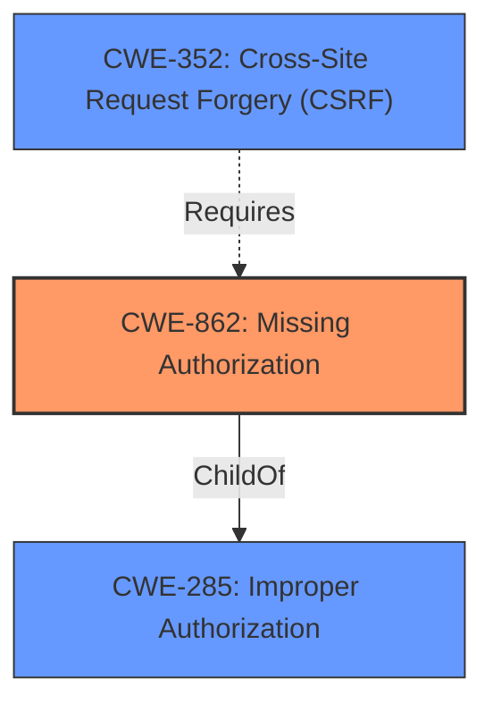

# Raw Analyzer Response for CVE-2022-25208

# Summary
| CWE ID | CWE Name | Confidence | CWE Abstraction Level | CWE Vulnerability Mapping Label | CWE-Vulnerability Mapping Notes |
|---|---|---|---|---|---|
| CWE-862 | Missing Authorization | 1.0 | Class | Allowed-with-Review | Primary CWE. The product **does not perform an authorization check** when an actor attempts to access a resource or perform an action. |
| CWE-352 | Cross-Site Request Forgery (CSRF) | 0.75 | Compound | Allowed | Secondary CWE. The affected method does not require POST requests, making it vulnerable to CSRF attacks. |

## Evidence and Confidence

*   **Confidence Score:** 0.9
*   **Evidence Strength:** HIGH

## Relationship Analysis
The primary relationship influencing my decision is the hierarchical structure with CWE-862 as a child of CWE-285 (Improper Authorization). Given the specific nature of the vulnerability being a **missing permission check**, CWE-862 is a more precise classification than its parent. Additionally, CWE-352 (Cross-Site Request Forgery) is identified as a secondary weakness due to the affected method not requiring POST requests.

## Vulnerability Chain
The vulnerability chain begins with the **missing permission check** (CWE-862), leading to the potential for an attacker to send an HTTP request to an attacker-controlled URL and have it parse an XML response. The fact that the method does not require POST requests makes the plugin also vulnerable to CSRF (CWE-352).

## Summary of Analysis
The analysis is based on the provided evidence, which clearly indicates a **missing permission check** in the Jenkins Chef Sinatra Plugin.

The key phrase "**missing permission check**" directly aligns with the description of CWE-862 (Missing Authorization): "The product **does not perform an authorization check** when an actor attempts to access a resource or perform an action." The CVE Reference Links Content Summary confirms this by stating that "The Chef Sinatra Plugin **does not perform a permission check** in a method implementing form validation."

Additionally, the vulnerability description notes that the affected method does not require POST requests, indicating a susceptibility to CSRF attacks, aligning with CWE-352.

The selection of CWE-862 is based on the direct evidence of a **missing authorization check**, making it the most specific and appropriate classification. CWE-352 is also selected as a secondary weakness because the method doesn't require POST requests. Both are at the optimal level of specificity based on the available information.

Relevant CWE Information:

# Enhanced Context (25 CWEs)
The following CWEs were identified as potentially relevant to this vulnerability:

## CWE-693: Protection Mechanism Failure
**Abstraction Level**: Pillar
**Similarity Score**: 0.77
**Source**: dense

**Description**:
The product does not use or incorrectly uses a protection mechanism that provides sufficient defense against directed attacks against the product.

**Mapping Guidance**:
- Usage: Discouraged
- Rationale: This CWE entry is extremely high-level, a Pillar.

*NOT USED*: This is too high-level.

## CWE-807: Reliance on Untrusted Inputs in a Security Decision
**Abstraction Level**: Base
**Similarity Score**: 0.75
**Source**: dense

**Description**:
The product uses a protection mechanism that relies on the existence or values of an input, but the input can be modified by an untrusted actor in a way that bypasses the protection mechanism.

**Mapping Guidance**:
- Usage: Allowed
- Rationale: This CWE entry is at the Base level of abstraction, which is a preferred level of abstraction for mapping to the root causes of vulnerabilities.

*NOT USED*: While potentially relevant, the core issue is the lack of a permission check, not the reliance on untrusted inputs.

## CWE-668: Exposure of Resource to Wrong Sphere
**Abstraction Level**: Class
**Similarity Score**: 0.74
**Source**: dense

**Description**:
The product exposes a resource to the wrong control sphere, providing unintended actors with inappropriate access to the resource.

**Mapping Guidance**:
- Usage: Discouraged
- Rationale: CWE-668 is high-level and is often misused as a catch-all when lower-level CWE IDs might be applicable. It is sometimes used for low-information vulnerability reports [REF-1287]. It is a level-1 Class (i.e., a child of a Pillar). It is not useful for trend analysis.

*NOT USED*: This is too high-level and not as specific as CWE-862.

## CWE-274: Improper Handling of Insufficient Privileges
**Abstraction Level**: Base
**Similarity Score**: 0.74
**Source**: dense

**Description**:
The product does not handle or incorrectly handles when it has insufficient privileges to perform an operation, leading to resultant weaknesses.

**Mapping Guidance**:
- Usage: Discouraged
- Rationale: This CWE entry could be deprecated in a future version of CWE.

*NOT USED*: While potentially relevant, the core issue is the lack of a permission check.

## CWE-74: Improper Neutralization of Special Elements in Output Used by a Downstream Component ('Injection')
**Abstraction Level**: Class
**Similarity Score**: 0.74
**Source**: dense

**Description**:
The product constructs all or part of a command, data structure, or record using externally-influenced input from an upstream component, but it does not neutralize or incorrectly neutralizes special elements that could modify how it is parsed or interpreted when it is sent to a downstream component.

**Mapping Guidance**:
- Usage: Discouraged
- Rationale: CWE-74 is high-level and often misused when lower-level weaknesses are more appropriate.

*NOT USED*: This is not directly related to the **missing authorization**.

## CWE-653: Improper Isolation or Compartmentalization
**Abstraction Level**: Class
**Similarity Score**: 0.73
**Source**: dense

**Description**:
The product does not properly compartmentalize or isolate functionality, processes, or resources that require different privilege levels, rights, or permissions.

**Mapping Guidance**:
- Usage: Allowed
- Rationale: This CWE entry is at the Base level of abstraction, which is a preferred level of abstraction for mapping to the root causes of vulnerabilities.

*NOT USED*: While potentially relevant, the core issue is the lack of a permission check.

## CWE-703: Improper Check or Handling of Exceptional Conditions
**Abstraction Level**: Pillar
**Similarity Score**: 0.73
**Source**: dense

**Description**:
The product does not properly anticipate or handle exceptional conditions that rarely occur during normal operation of the product.

**Mapping Guidance**:
- Usage: Discouraged
- Rationale: This CWE entry is extremely high-level, a Pillar.

*NOT USED*: This is too high-level.

## CWE-41: Improper Resolution of Path Equivalence
**Abstraction Level**: Base
**Similarity Score**: 0.73
**Source**: dense

**Description**:
The product is vulnerable to file system contents disclosure through path equivalence. Path equivalence involves the use of special characters in file and directory names. The associated manipulations are intended to generate multiple names for the same object.

**Mapping Guidance**:
- Usage: Allowed
- Rationale: This CWE entry is at the Base level of abstraction, which is a preferred level of abstraction for mapping to the root causes of vulnerabilities.

*NOT USED*: This is not related to the vulnerability description.

## CWE-1390: Weak Authentication
**Abstraction Level**: Class
**Similarity Score**: 0.73
**Source**: dense

**Description**:
The product uses an authentication mechanism to restrict access to specific users or identities, but the mechanism does not sufficiently prove that the claimed identity is correct.

**Mapping Guidance**:
- Usage: Allowed-with-Review
- Rationale: This CWE entry is a Class and might have Base-level children that would be more appropriate

*NOT USED*: The issue is not about weak authentication, but **missing authorization**.

## CWE-657: Violation of Secure Design Principles
**Abstraction Level**: Class
**Similarity Score**: 0.73
**Source**: dense

**Description**:
The product violates well-established principles for secure design.

**Mapping Guidance**:
- Usage: Discouraged
- Rationale: This CWE entry is a level-1 Class (i.e., a child of a Pillar). It might have lower-level children that would be more appropriate

*NOT USED*: This is too general.

## CWE-116: Improper Encoding or Escaping of Output
**