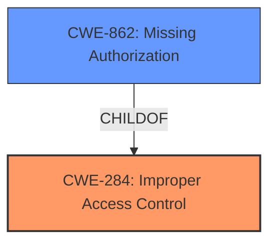

# Analysis Report for CVE-2022-25215

# Vulnerability Analysis Report: CVE-2022-25215

## Description


## Analysis (with Relationship Data)

# Summary
| CWE ID | CWE Name | Confidence | CWE Abstraction Level | CWE Vulnerability Mapping Label | CWE-Vulnerability Mapping Notes |
|---|---|---|---|---|---|
| CWE-284 | Improper Access Control | 0.8 | Pillar | Primary | Discouraged |
| CWE-862 | Missing Authorization | 0.7 | Base | Secondary | Allowed |

## Evidence and Confidence

*   **Confidence Score:** 0.7
*   **Evidence Strength:** MEDIUM

## Relationship Analysis
The primary relationship that influenced the CWE selection is the parent-child relationship between CWE-284 and CWE-862. CWE-284 is a high-level *Pillar*, while CWE-862 is a *Base* level CWE that describes the specific absence of an authorization check. The vulnerability description indicates an **improper access control** issue on a specific interface, but doesn't provide specifics of an authorization check. Because CWE-284 is too abstract, it is only listed as the primary CWE, but is not the most appropriate.



## Vulnerability Chain
The vulnerability chain starts with the **improper access control** (**ROOT CAUSE**) which then leads to an unauthenticated attacker being able to add or remove MAC addresses from a banned list. This results in a denial of service (**IMPACT**) for clients with those MAC addresses.

## Summary of Analysis
The initial analysis focused on identifying the most specific CWE that captures the essence of the vulnerability, which is **improper access control** allowing unauthorized modification of a banned MAC address list.

The vulnerability description states: "**Improper access control** on the LocalMACConfig.asp interface allows an unauthenticated remote attacker to add (or remove) client MAC addresses to (or from) a list of banned hosts." The key phrase here is "**Improper access control**," which directly points to CWE-284. However, CWE-284 is a very high-level *Pillar* that is generally discouraged from use.

The Retriever Results list CWE-284, but many others as well. Many candidates are too specific given the provided information, such as CWE-291 Reliance on IP Address for Authentication, or CWE-347 Improper Verification of Cryptographic Signature.

CWE-862, Missing Authorization, is a *Base* level CWE and a child of CWE-284. CWE-862 is defined as: "The software performs a privileged operation without any authorization check, or it does not verify that the actor is authorized to perform the operation." While the description doesn't explicitly say an authorization check should be in place, the fact an *unauthenticated* user can perform this action suggests a missing authorization check.

Therefore, CWE-284 is selected as the primary CWE because it aligns directly with the "**Improper access control**" language in the description, even though it is high-level. CWE-862 is selected as the secondary CWE as it is a more specific *Base* level CWE that accurately represents the root cause of the vulnerability.

Relevant CWE Information:

# Enhanced Context (25 CWEs)

## CWE-668: Exposure of Resource to Wrong Sphere
**Abstraction Level**: Class
**Similarity Score**: 0.77
**Source**: dense

**Description**:
The product exposes a resource to the wrong control sphere, providing unintended actors with inappropriate access to the resource.
**Why Not Used**: This CWE describes a scenario where a resource is exposed to the wrong control sphere, but the vulnerability is more specifically about the lack of proper access control, not necessarily exposing a resource to the wrong sphere.

## CWE-664: Improper Control of a Resource Through its Lifetime
**Abstraction Level**: Pillar
**Similarity Score**: 0.75
**Source**: dense

**Description**:
The product does not maintain or incorrectly maintains control over a resource throughout its lifetime of creation, use, and release.
**Why Not Used**: This CWE is too high-level and doesn't specifically address the access control issue.

## CWE-807: Reliance on Untrusted Inputs in a Security Decision
**Abstraction Level**: Base
**Similarity Score**: 0.75
**Source**: dense

**Description**:
The product uses a protection mechanism that relies on the existence or values of an input, but the input can be modified by an untrusted actor in a way that bypasses the protection mechanism.
**Why Not Used**: While untrusted input might be involved, the core issue is the lack of access control, not the reliance on untrusted inputs.

## CWE-610: Externally Controlled Reference to a Resource in Another Sphere
**Abstraction Level**: Class
**Similarity Score**: 0.75
**Source**: dense

**Description**:
The product uses an externally controlled name or reference that resolves to a resource that is outside of the intended control sphere.
**Why Not Used**: The description doesn't specify that an external reference is being used.

## CWE-1220: Insufficient Granularity of Access Control
**Abstraction Level**: Base
**Similarity Score**: 0.74
**Source**: dense

**Description**:
The product implements access controls via a policy or other feature with the intention to disable or restrict accesses (reads and/or writes) to assets in a system from untrusted agents. However, implemented access controls lack required granularity, which renders the control policy too broad because it allows accesses from unauthorized agents to the security-sensitive assets.
**Why Not Used**: While the access control might lack granularity, the primary issue is the lack of an authorization check.

## CWE-653: Improper Isolation or Compartmentalization
**Abstraction Level**: Class
**Similarity Score**: 0.74
**Source**: dense

**Description**:
The product does not properly compartmentalize or isolate functionality, processes, or resources that require different privilege levels, rights, or permissions.
**Why Not Used**: The description doesn't suggest an isolation or compartmentalization issue.

## CWE-41: Improper Resolution of Path Equivalence
**Abstraction Level**: Base
**Similarity Score**: 0.74
**Source**: dense

**Description**:
The product is vulnerable to file system contents disclosure through path equivalence. Path equivalence involves the use of special characters in file and directory names. The associated manipulations are intended to generate multiple names for the same object.
**Why Not Used**: This CWE is not relevant to the access control issue.

## CWE-799: Improper Control of Interaction Frequency
**Abstraction Level**: Class
**Similarity Score**: 0.74
**Source**: dense

**Description**:
The product does not properly limit the number or frequency of interactions that it has with an actor, such as the number of incoming requests.
**Why Not Used**: This CWE is not related to the described vulnerability.

## CWE-405: Asymmetric Resource Consumption (Amplification)
**Abstraction Level**: Class
**Similarity Score**: 0.74
**Source**: dense

**Description**:
The product does not properly control situations in which an adversary can cause the product to consume or produce excessive resources without requiring the adversary to invest equivalent work or otherwise prove authorization, i.e., the adversary's influence is "asymmetric."
**Why Not Used**: The description doesn't indicate a resource consumption issue.

## CWE-404: Improper Resource Shutdown or Release
**Abstraction Level**: Class
**Similarity Score**: 0.74
**Source**: dense

**Description**:
The product does not release or incorrectly releases a resource before it is made available for re-use.
**Why Not Used**: This CWE is not relevant to the vulnerability.

## CWE-923: Improper Restriction of Communication Channel to Intended Endpoints
**Abstraction Level**: Class
**Similarity Score**: 5438.59
**Source**: sparse

**Description**:
The product establishes a communication channel to (or from) an endpoint for privileged or protected operations, but it does not properly ensure that it is communicating with the correct endpoint.
**Why Not Used**: While communication is involved, the root cause is an access control issue, not specifically about the communication channel.

## CWE-425: Direct Request ('Forced Browsing')
**Abstraction Level**: Base
**Similarity Score**: 5406.80
**Source**: sparse

**Description**:
The web application does not adequately enforce appropriate authorization on all restricted URLs, scripts, or files.
**Why Not Used**: This CWE describes a specific attack vector, which is beyond the scope of the description, which indicates only an **improper access control**.

## CWE-863: Incorrect Authorization
**Abstraction Level**: Class
**Similarity Score**: 5401.41
**Source**: sparse

**Description**:
The product performs an authorization check when an actor attempts to access a resource or perform an action, but it does not correctly perform the check.
**Why Not Used**: The description does not specify


## CWE Relationship Analysis

Current CWEs represent these abstraction levels: .


### Vulnerability Chain Analysis

**Chain starting from CWE-862:**
- 862 (Missing Authorization) - ROOT


**Chain starting from CWE-425:**
- 425 (Direct Request ('Forced Browsing')) - ROOT


### CWE Relationship Diagram

```mermaid
graph TD
    classDef primary fill:#f96,stroke:#333,stroke-width:2px
    classDef secondary fill:#69f,stroke:#333
    classDef tertiary fill:#9e9,stroke:#333
```


*Report generated on 2025-03-30 20:50:53*
