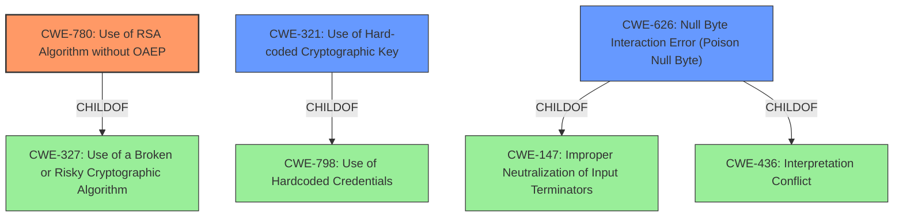

# Analysis Report for CVE-2022-25218

# Vulnerability Analysis Report: CVE-2022-25218

## Description


## Analysis (with Relationship Data)

# Summary
| CWE ID | CWE Name | Confidence | CWE Abstraction Level | CWE Vulnerability Mapping Label | CWE-Vulnerability Mapping Notes |
|---|---|---|---|---|---|
| CWE-780 | Use of RSA Algorithm without OAEP | 0.9 | Variant | Allowed | Primary CWE. The vulnerability description explicitly mentions the **use of the RSA algorithm without OAEP**. |
| CWE-321 | Use of Hard-coded Cryptographic Key | 0.7 | Variant | Allowed | Secondary CWE. The "CVE Reference Links Content Summary" mentions the server decrypts an encrypted message using a **hardcoded public RSA key**. |
| CWE-626 | Null Byte Interaction Error (Poison Null Byte) | 0.6 | Variant | Allowed | Secondary CWE. The vulnerability description mentions that a successful attack requires the exploitation of a **null-byte interaction error** (CVE-2022-25219) in some versions. |

## Evidence and Confidence

*   **Confidence Score:** 0.8
*   **Evidence Strength:** HIGH

## Relationship Analysis
The primary relationship impacting the decision is the hierarchical one.
  - `CWE-780` is a variant of `CWE-327` (Use of a Broken or Risky Cryptographic Algorithm), making it more specific.
  - `CWE-321` is a variant of `CWE-798` (Use of Hardcoded Credentials).
  - `CWE-626` is a child of both `CWE-147` (Improper Neutralization of Input Terminators) and `CWE-436` (Interpretation Conflict).



## Vulnerability Chain
The vulnerability chain involves the following:
  1. **Root Cause:** **Use of RSA algorithm without padding scheme** (`CWE-780`) and **use of a hardcoded public RSA key** (`CWE-321`).
  2. **Secondary Condition:** In some versions, exploitation requires a **null-byte interaction error** (`CWE-626`).
  3. **Impact:** Allows an attacker to gain a significant degree of control over the plaintext, manipulate the telnetd startup state machine, and ultimately obtain a root shell.

## Summary of Analysis
The initial assessment focused on identifying the root cause of the vulnerability based on the provided description and key phrases. The description explicitly states the **use of the RSA algorithm without OAEP** as a key factor, which aligns directly with `CWE-780`.

The "CVE Reference Links Content Summary" provided additional evidence, mentioning the **use of a hardcoded public RSA key**, leading to the inclusion of `CWE-321`. The summary also mentions that a successful attack requires the exploitation of a **null-byte interaction error** in some versions, which aligns with `CWE-626`.

The retriever results and complete CWE specifications were used to confirm the appropriateness of these CWEs and to ensure that they were the most specific and relevant options available.

The final selection of CWEs is based on the evidence provided in the vulnerability description and the supporting information from the CVE reference. The selected CWEs are at the optimal level of specificity, representing the specific weaknesses that contribute to the vulnerability.

Relevant CWE Information:
- The vulnerability description explicitly mentions the **use of the RSA algorithm without OAEP, or any other padding scheme**. This directly corresponds to `CWE-780`.
- The CVE reference summary mentions the **hardcoded public RSA key**, corresponding to `CWE-321`.
- The CVE reference summary and vulnerability description mentions the **null-byte interaction error**, corresponding to `CWE-626`.

CWEs Considered But Not Used:

*   `CWE-327` (Use of a Broken or Risky Cryptographic Algorithm): While the **use of RSA without OAEP** could be considered a risky cryptographic practice, `CWE-780` is a more specific variant that directly addresses the lack of OAEP padding. Therefore, `CWE-780` is preferred.
*   `CWE-203` (Observable Discrepancy) and `CWE-208` (Observable Timing Discrepancy): These CWEs relate to information leakage through observable differences. While timing attacks might be possible in some scenarios, they are not the primary weakness described. Therefore, these CWEs were not selected.
*   `CWE-287` (Improper Authentication): While the vulnerability leads to unauthorized access, the root cause is the cryptographic weakness, not a general authentication failure. Therefore, `CWE-287` is not the most appropriate choice.
*   `CWE-20` (Improper Input Validation) and `CWE-1284` (Improper Validation of Specified Quantity in Input): These CWEs are too general. The specific weakness is the lack of proper cryptographic practices.
*   `CWE-1240` (Use of a Cryptographic Primitive with a Risky Implementation): This CWE is similar to `CWE-327`, but `CWE-780` is a more specific variant that directly addresses the lack of OAEP padding.
*   `CWE-916` (Use of Password Hash With Insufficient Computational Effort): This is not related to password hashing.
*   `CWE-73` (External Control of File Name or Path), `CWE-41` (Improper Resolution of Path Equivalence), `CWE-22` (Improper Limitation of a Pathname to a Restricted Directory ('Path Traversal')), `CWE-770` (Allocation of Resources Without Limits or Throttling), `CWE-789` (Memory Allocation with Excessive Size Value), `CWE-170` (Improper Null Termination): These CWEs are not relevant to the vulnerability.


## CWE Relationship Analysis

Current CWEs represent these abstraction levels: .


### Vulnerability Chain Analysis

**Chain starting from CWE-208:**
- 208 (Observable Timing Discrepancy) - ROOT


**Chain starting from CWE-436:**
- 436 (Interpretation Conflict) - ROOT


### CWE Relationship Diagram

```mermaid
graph TD
    classDef primary fill:#f96,stroke:#333,stroke-width:2px
    classDef secondary fill:#69f,stroke:#333
    classDef tertiary fill:#9e9,stroke:#333
```


*Report generated on 2025-03-31 05:05:40*
