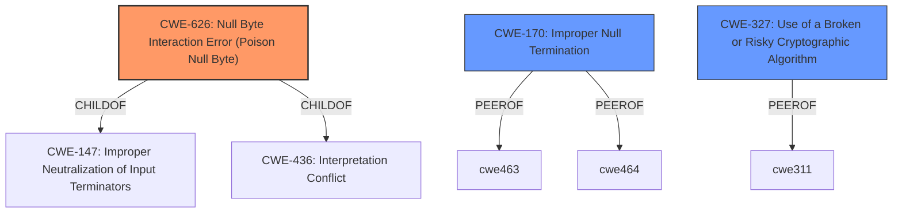

# Analysis Report for CVE-2022-25219

# Vulnerability Analysis Report: CVE-2022-25219

## Description


## Analysis (with Relationship Data)

# Summary
| CWE ID | CWE Name | Confidence | CWE Abstraction Level | CWE Vulnerability Mapping Label | CWE-Vulnerability Mapping Notes |
|---|---|---|---|---|---|
| **CWE-626** | **Null Byte Interaction Error (Poison Null Byte)** | 1.0 | Variant | Primary | Allowed |
| CWE-170 | Improper Null Termination | 0.7 | Base | Secondary | Allowed |
| CWE-327 | Use of a Broken or Risky Cryptographic Algorithm | 0.6 | Class | Secondary | Allowed-with-Review |

## Evidence and Confidence

*   **Confidence Score:** 0.9
*   **Evidence Strength:** HIGH

## Relationship Analysis
The primary CWE is CWE-626, a Variant of CWE-147 (Improper Neutralization of Input Terminators) and CWE-436 (Interpretation Conflict). The vulnerability involves a **null byte interaction error**, where the improper handling of null bytes leads to predictable passwords. The other possible CWEs are:
*   CWE-170: Improper Null Termination, which is a Base CWE.
*   CWE-327: Use of a Broken or Risky Cryptographic Algorithm, which is a Class CWE.
The relationships are:
*   CWE-626 is a child of CWE-147 and CWE-436.
*   CWE-170 is a peer of CWE-463 and CWE-464.
*   CWE-327 is a peer of CWE-311.



## Vulnerability Chain
The vulnerability chain involves the following:
1.  **Root Cause:** **Null byte interaction error** due to insufficient validation and the use of `sprintf` with `%s`.
2.  **Weakness:** Allows injection of a null byte at the start of a buffer.
3.  **Impact:** Makes ephemeral passwords predictable, leading to potential root shell access.

## Summary of Analysis
The primary CWE is CWE-626 due to the explicit mention and mechanism of the **null byte interaction error**. The vulnerability description states that "By means of a crafted exchange of UDP packets, an unauthenticated attacker on the local network can leverage this **null byte interaction error** in such a way as to make those ephemeral passwords predictable". The CVE reference summary highlights "attackers can inject a null byte at the start of a buffer used to construct the ephemeral password for telnet access. The use of sprintf with %s causes it to interpret this buffer as an empty string, resulting in predictable passwords." This clearly aligns with the description of CWE-626.

CWE-170 was considered as a secondary CWE since the root cause involves improper handling of null termination.
CWE-327 was considered because the vulnerability depends on the use of an unpadded RSA cipher (CVE-2022-25218) which can be seen as a risky cryptographic algorithm usage.

The selection of CWE-626 is at the optimal level of specificity as it directly addresses the **null byte interaction error**, while CWE-170 and CWE-327 offer additional context but are not as directly relevant.

Relevant CWE Information:

# Enhanced Context (25 CWEs)
The following CWEs were identified as potentially relevant to this vulnerability:

## CWE-191: Integer Underflow (Wrap or Wraparound)
**Abstraction Level**: Base
**Similarity Score**: 0.78
**Source**: dense

**Description**:
The product subtracts one value from another, such that the result is less than the minimum allowable integer value, which produces a value that is not equal to the correct result.

**Mapping Guidance**:
- Usage: Allowed
- Rationale: This CWE entry is at the Base level of abstraction, which is a preferred level of abstraction for mapping to the root causes of vulnerabilities.

## CWE-131: Incorrect Calculation of Buffer Size
**Abstraction Level**: Base
**Similarity Score**: 0.77
**Source**: dense

**Description**:
The product does not correctly calculate the size to be used when allocating a buffer, which could lead to a buffer overflow.

**Mapping Guidance**:
- Usage: Allowed
- Rationale: This CWE entry is at the Base level of abstraction, which is a preferred level of abstraction for mapping to the root causes of vulnerabilities.

## CWE-125: Out-of-bounds Read
**Abstraction Level**: Base
**Similarity Score**: 0.77
**Source**: dense

**Description**:
The product reads data past the end, or before the beginning, of the intended buffer.

**Mapping Guidance**:
- Usage: Allowed
- Rationale: This CWE entry is at the Base level of abstraction, which is a preferred level of abstraction for mapping to the root causes of vulnerabilities.

## CWE-197: Numeric Truncation Error
**Abstraction Level**: Base
**Similarity Score**: 0.76
**Source**: dense

**Description**:
Truncation errors occur when a primitive is cast to a primitive of a smaller size and data is lost in the conversion.

**Mapping Guidance**:
- Usage: Allowed
- Rationale: This CWE entry is at the Base level of abstraction, which is a preferred level of abstraction for mapping to the root causes of vulnerabilities.

## CWE-130: Improper Handling of Length Parameter Inconsistency
**Abstraction Level**: Base
**Similarity Score**: 0.76
**Source**: dense

**Description**:
The product parses a formatted message or structure, but it does not handle or incorrectly handles a length field that is inconsistent with the actual length of the associated data.

**Mapping Guidance**:
- Usage: Allowed
- Rationale: This CWE entry is at the Base level of abstraction, which is a preferred level of abstraction for mapping to the root causes of vulnerabilities.

## CWE-805: Buffer Access with Incorrect Length Value
**Abstraction Level**: Base
**Similarity Score**: 0.76
**Source**: dense

**Description**:
The product uses a sequential operation to read or write a buffer, but it uses an incorrect length value that causes it to access memory that is outside of the bounds of the buffer.

**Mapping Guidance**:
- Usage: Allowed
- Rationale: This CWE entry is at the Base level of abstraction, which is a preferred level of abstraction for mapping to the root causes of vulnerabilities.

## CWE-126: Buffer Over-read
**Abstraction Level**: Variant
**Similarity Score**: 0.76
**Source**: dense

**Description**:
The product reads from a buffer using buffer access mechanisms such as indexes or pointers that reference memory locations after the targeted buffer.

**Mapping Guidance**:
- Usage: Allowed
- Rationale: This CWE entry is at the Variant level of abstraction, which is a preferred level of abstraction for mapping to the root causes of vulnerabilities.

## CWE-193: Off-by-one Error
**Abstraction Level**: Base
**Similarity Score**: 0.76
**Source**: dense

**Description**:
A product calculates or uses an incorrect maximum or minimum value that is 1 more, or 1 less, than the correct value.

**Mapping Guidance**:
- Usage: Allowed
- Rationale: This CWE entry is at the Base level of abstraction, which is a preferred level of abstraction for mapping to the root causes of vulnerabilities.

## CWE-667: Improper Locking
**Abstraction Level**: Class
**Similarity Score**: 0.76
**Source**: dense

**Description**:
The product does not properly acquire or release a lock on a resource, leading to unexpected resource state changes and behaviors.

**Mapping Guidance**:
- Usage: Allowed-with-Review
- Rationale: This CWE entry is a Class and might have Base-level children that would be more appropriate

## CWE-476: NULL Pointer Dereference
**Abstraction Level**: Base
**Similarity Score**: 0.75
**Source**: dense

**Description**:
The product dereferences a pointer that it expects to be valid but is NULL.

**Mapping Guidance**:
- Usage: Allowed
- Rationale: This


## CWE Relationship Analysis

Current CWEs represent these abstraction levels: .


### Vulnerability Chain Analysis

**Chain starting from CWE-131:**
- 131 (Incorrect Calculation of Buffer Size) - ROOT


**Chain starting from CWE-147:**
- 147 (Improper Neutralization of Input Terminators) - ROOT


### CWE Relationship Diagram

```mermaid
graph TD
    classDef primary fill:#f96,stroke:#333,stroke-width:2px
    classDef secondary fill:#69f,stroke:#333
    classDef tertiary fill:#9e9,stroke:#333
```


*Report generated on 2025-03-31 10:28:35*
