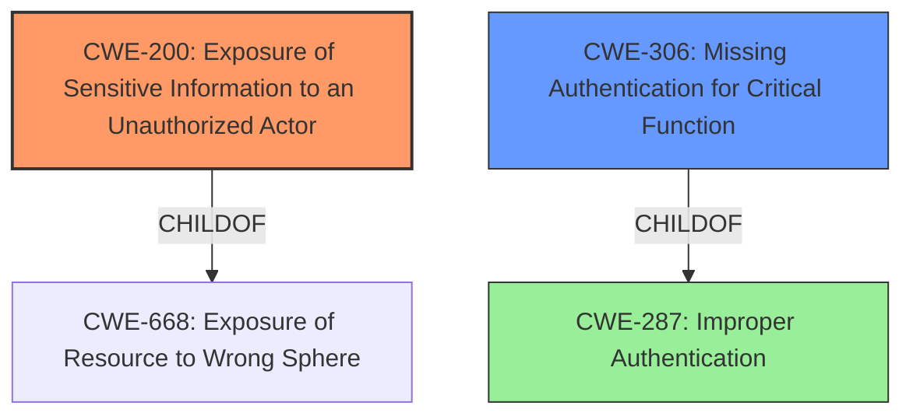

# Enhanced Analysis for CVE-2022-25248

# Summary
| CWE ID | CWE Name | Confidence | CWE Abstraction Level | CWE Vulnerability Mapping Label | CWE-Vulnerability Mapping Notes |
|---|---|---|---|---|---|
| CWE-200 | Exposure of Sensitive Information to an Unauthorized Actor | 0.9 | Class | Discouraged | The **root cause** of the vulnerability is the **exposure of the event log without authorization** when connecting to a specific port, which aligns with CWE-200's description. |
| CWE-306 | Missing Authentication for Critical Function | 0.7 | Base | Allowed | Connecting to a specific port to retrieve the event log lacks authentication, fitting CWE-306's description. |

## Evidence and Confidence

*   **Confidence Score:** 0.8
*   **Evidence Strength:** HIGH

## Relationship Analysis
The primary CWE selected is CWE-200 **Exposure of Sensitive Information to an Unauthorized Actor** because the description indicates that the system is providing sensitive information without proper authorization.

CWE-306 **Missing Authentication for Critical Function** is included as a secondary issue because the system should have required authentication before providing the event log. It is a child of CWE-287 **Improper Authentication**.



## Vulnerability Chain
The vulnerability chain starts with the **lack of authentication** (CWE-306), leading to the **exposure of sensitive information** (CWE-200) to unauthorized actors.

## Summary of Analysis
The initial analysis and criticism led to the conclusion that CWE-200 **Exposure of Sensitive Information to an Unauthorized Actor** is the primary weakness because the main issue is the **disclosure of sensitive information**. However, the **missing authentication** component is also significant, leading to the inclusion of CWE-306 **Missing Authentication for Critical Function** as a secondary weakness.

Evidence:
- "allows unauthorized access to sensitive information" (CVE Reference Links Content Summary)
- "Exposure of Sensitive Information to an Unauthorized Actor (CWE-200)" (CVE Reference Links Content Summary)
- "No authentication is required to exploit this vulnerability." (CVE Reference Links Content Summary)

The graph relationships influenced the selection by highlighting the connection between **missing authentication** and **information exposure**. CWE-200 is at the Class level, and while it is generally discouraged to use Class-level CWEs, in this case, it accurately represents the nature of the vulnerability. CWE-306 is at the Base level, providing a more specific description of the authentication failure.

Relevant CWE Information:
- **CWE-200:** Captures the **exposure of sensitive information** when connecting to a specific port.
- **CWE-306:** Highlights the **absence of authentication** for retrieving the event log.

I considered CWE-287 **Improper Authentication**, but CWE-306 **Missing Authentication for Critical Function** is more specific because it directly states the **lack of authentication for a critical function**.

I considered CWE-778 **Insufficient Logging**, but that is not the primary issue.

I considered CWE-269 **Improper Privilege Management**, however, the issue is not about managing privileges but rather the **absence of authentication** to access the event logs.


## CWE Relationship Analysis

Current CWEs represent these abstraction levels: .


### Vulnerability Chain Analysis

**Chain starting from CWE-200:**
- 200 (Exposure of Sensitive Information to an Unauthorized Actor) - ROOT


**Chain starting from CWE-668:**
- 668 (Exposure of Resource to Wrong Sphere) - ROOT


### CWE Relationship Diagram

```mermaid
graph TD
    classDef primary fill:#f96,stroke:#333,stroke-width:2px
    classDef secondary fill:#69f,stroke:#333
    classDef tertiary fill:#9e9,stroke:#333
```