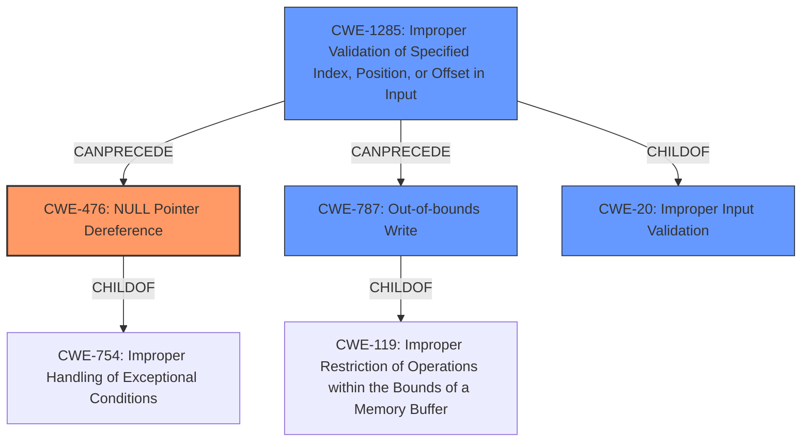

# Analysis Report for CVE-2022-25258

# Vulnerability Analysis Report: CVE-2022-25258

## Description


## Analysis (with Relationship Data)

# Summary
| CWE ID | CWE Name | Confidence | CWE Abstraction Level | CWE Vulnerability Mapping Label | CWE-Vulnerability Mapping Notes |
|---|---|---|---|---|---|
| CWE-476 | NULL Pointer Dereference | 0.9 | Base | Primary | Allowed |
| CWE-1285 | Improper Validation of Specified Index, Position, or Offset in Input | 0.7 | Base | Secondary | Allowed |
| CWE-787 | Out-of-bounds Write | 0.6 | Base | Secondary | Allowed |

## Evidence and Confidence

*   **Confidence Score:** 0.7
*   **Evidence Strength:** HIGH

## Relationship Analysis
The primary weakness identified is CWE-476 (**CWE-476: NULL Pointer Dereference**), which stems from the **lack of validation** of the `usb_function` pointer. This is further compounded by CWE-1285 (**CWE-1285: Improper Validation of Specified Index, Position, or Offset in Input**), where the `interface` index into the `usb_configuration->interface` array is not properly validated, leading to potential out-of-bounds access and subsequent NULL pointer dereference. CWE-787 (**CWE-787: Out-of-bounds Write**) is a potential outcome if a crafted request with a large `wLength` is sent.



## Vulnerability Chain
The vulnerability chain starts with the **lack of validation** of the `interface` variable (CWE-1285). This leads to accessing the `usb_configuration->interface` array out-of-bounds. The subsequent **lack of validation** of the retrieved `usb_function` pointer results in a NULL pointer dereference (CWE-476). A potential out-of-bounds write (CWE-787) could occur depending on the size of a crafted request.

## Summary of Analysis
The primary weakness is CWE-476 (**CWE-476: NULL Pointer Dereference**), supported by the evidence stating that the functions called by `composite_setup()` **do not check if the retrieved `usb_function` pointer is valid before dereferencing**, leading to a NULL pointer dereference. The vulnerability description key phrases also highlight the **lack of certain validation of interface OS descriptor requests**.

The secondary weakness is CWE-1285 (**CWE-1285: Improper Validation of Specified Index, Position, or Offset in Input**), as the `interface` variable is not checked against the valid range of indices for the `c->interface` array. This is explicitly mentioned in the CVE Reference Links Content Summary: "The `composite_setup()` function **lacks proper validation of the `interface` variable**... This variable is used as an index into the `usb_configuration->interface` array."

CWE-787 (**CWE-787: Out-of-bounds Write**) is a potential outcome if a crafted request with a large `wLength` is sent, as mentioned in the CVE Reference Links Content Summary: "While less likely, the **lack of length validation** combined with a specific memory layout could lead to a buffer overflow via `fill_ext_prop` and `usb_ext_prop_put_binary` if a crafted request with `wLength` greater than 0x0A is sent."

CWE-119 (**CWE-119: Improper Restriction of Operations within the Bounds of a Memory Buffer**) was considered as a potential candidate due to the possibility of memory corruption, but it is a Class-level CWE and is discouraged when more specific CWEs are available. Since CWE-787 (**CWE-787: Out-of-bounds Write**) is a child of CWE-119 and captures the specific out-of-bounds write scenario, it is a more appropriate choice.

CWE-20 (**CWE-20: Improper Input Validation**) was also considered, but it's a high-level class. The vulnerability involves a specific type of improper validation: the index used to access an array. Therefore, CWE-1285 is a better fit.

CWE-1284 (**CWE-1284: Improper Validation of Specified Quantity in Input**) was considered, as the wLength field in the crafted request is related to the size. However, the more direct cause is the missing validation of the interface index.

My assessment is based on the evidence provided, specifically the "Vulnerability Description Key Phrases" and the "CVE Reference Links Content Summary". The graph relationships helped to solidify the chain of events, from improper input validation to NULL pointer dereference and potential out-of-bounds write. The selected CWEs are at the optimal level of specificity, accurately representing the root cause and potential impact of the vulnerability.

Relevant CWE Information:
# Enhanced Context (25 CWEs)
The following CWEs were identified as potentially relevant to this vulnerability:

## CWE-131: Incorrect Calculation of Buffer Size
**Abstraction Level**: Base
**Similarity Score**: 0.78
**Source**: dense
**CWE-131 Rejected**: This CWE is not relevant as there is no buffer size calculation performed.

## CWE-822: Untrusted Pointer Dereference
**Abstraction Level**: Base
**Similarity Score**: 0.78
**Source**: dense
**CWE-822 Rejected**: Although there is a pointer dereference, the pointer itself does not originate from an untrusted source.

## CWE-805: Buffer Access with Incorrect Length Value
**Abstraction Level**: Base
**Similarity Score**: 0.78
**Source**: dense
**CWE-805 Rejected**: Incorrect length is not the main issue, it's the index that is not properly validated.

## CWE-125: Out-of-bounds Read
**Abstraction Level**: Base
**Similarity Score**: 0.78
**Source**: dense
**CWE-125 Rejected**: Out-of-bounds read is not explicitly mentioned.

## CWE-191: Integer Underflow (Wrap or Wraparound)
**Abstraction Level**: Base
**Similarity Score**: 0.78
**Source**: dense
**CWE-191 Rejected**: Integer underflow is not relevant.

## CWE-126: Buffer Over-read
**Abstraction Level**: Variant
**Similarity Score**: 0.78
**Source**: dense
**CWE-126 Rejected**: Out-of-bounds read is not explicitly mentioned.

## CWE-476: NULL Pointer Dereference
**Abstraction Level**: Base
**Similarity Score**: 0.77
**Source**: dense
**CWE-476 Accepted**: The **lack of validation** of the `usb_function` pointer before dereferencing directly leads to this weakness.

## CWE-667: Improper Locking
**Abstraction Level**: Class
**Similarity Score**: 0.77
**Source**: dense
**CWE-667 Rejected**: Locking is not the issue here.

## CWE-1289: Improper Validation of Unsafe Equivalence in Input
**Abstraction Level**: Base
**Similarity Score**: 0.77
**Source**: dense
**CWE-1289 Rejected**: Equivalence is not relevant here.

## CWE-119: Improper Restriction of Operations within the Bounds of a Memory Buffer
**Abstraction Level**: Class
**Similarity Score**: 0.77
**Source**: dense
**CWE-119 Rejected**: Too general; a more specific child CWE is more appropriate.

## CWE-1284: Improper Validation of Specified Quantity in Input
**Abstraction Level**: Base
**Similarity Score**: 8067.35
**Source**: sparse
**CWE-1284 Rejected**: While related to the size (wLength) in a crafted request, the index itself is the main issue.

## CWE-476: NULL Pointer Dereference
**Abstraction Level**: Base
**


## CWE Relationship Analysis

Current CWEs represent these abstraction levels: .


### Vulnerability Chain Analysis

**Chain starting from CWE-131:**
- 131 (Incorrect Calculation of Buffer Size) - ROOT


**Chain starting from CWE-476:**
- 476 (NULL Pointer Dereference) - ROOT


### CWE Relationship Diagram

```mermaid
graph TD
    classDef primary fill:#f96,stroke:#333,stroke-width:2px
    classDef secondary fill:#69f,stroke:#333
    classDef tertiary fill:#9e9,stroke:#333
```


*Report generated on 2025-03-31 08:15:07*
