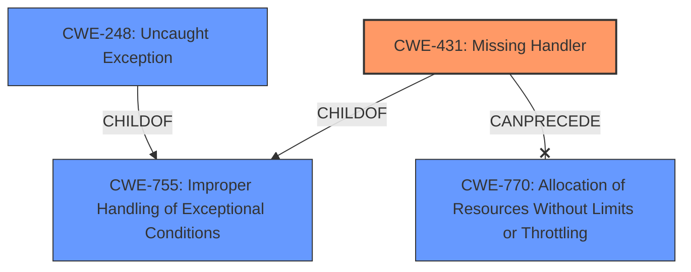

# Analysis Report for CVE-2022-25302

# Vulnerability Analysis Report: CVE-2022-25302

## Description


## Analysis (with Relationship Data)

# Summary
| CWE ID  | CWE Name  | Confidence | CWE Abstraction Level | CWE Vulnerability Mapping Label | CWE-Vulnerability Mapping Notes |
|---|---|---|---|---|---|
| CWE-431 | Missing Handler | 1.0 | Base | Allowed | Primary CWE. The vulnerability is due to a **missing handler for failed casting**. |
| CWE-755 | Improper Handling of Exceptional Conditions | 0.7 | Class | Discouraged | Secondary candidate. The **missing handler** is a specific case of not properly handling an exceptional condition. |
| CWE-248 | Uncaught Exception | 0.6 | Base | Allowed | Secondary candidate. The **missing handler for a failed casting** can result in an uncaught exception. |
| CWE-770 | Allocation of Resources Without Limits or Throttling | 0.5 | Base | Allowed | Secondary candidate. The **missing handler** could lead to uncontrolled resource allocation under specific circumstances. |

## Evidence and Confidence

*   **Confidence Score:** 0.9
*   **Evidence Strength:** HIGH

## Relationship Analysis
The primary CWE is CWE-431, **Missing Handler**, which is a Base level CWE. It is related to CWE-691, **Insufficient Control Flow Management**, as it is a child of it. It can precede CWE-433, **Unparsed Raw Web Content Delivery**, which is not relevant here.

CWE-755, **Improper Handling of Exceptional Conditions**, is a Class level CWE and a parent of CWE-431, thus less specific.

CWE-248, **Uncaught Exception**, is a Base level CWE and a child of CWE-755.

CWE-770, **Allocation of Resources Without Limits or Throttling**, is a Base level CWE.



## Vulnerability Chain
The vulnerability chain starts with a **missing handler for failed casting** (CWE-431), which leads to a Denial of Service (DoS).

## Summary of Analysis
The vulnerability is due to a **missing handler for failed casting**. This is the root cause. The impact is a Denial of Service (DoS).
The primary CWE is CWE-431 **Missing Handler** because the vulnerability description explicitly mentions a **missing handler**. The evidence is from the "Vulnerability Description Key Phrases" which states "**rootcause:** **missing handler for failed casting**". The "CVE Reference Links Content Summary" also supports this: "**Root cause of vulnerability:** Missing handler for failed casting when unvalidated data is forwarded to `boost::get` function in `OpcUaNodeIdBase.h`."
CWE-755 **Improper Handling of Exceptional Conditions** was considered because a missing handler is a specific type of improper handling of exceptional conditions, however it is less specific.
CWE-248 **Uncaught Exception** was considered because a missing handler can lead to an uncaught exception, however it is focused on the result of the missing handler and less on the root cause.
CWE-770 **Allocation of Resources Without Limits or Throttling** was considered because the missing handler *could* cause resource exhaustion, but there's no explicit evidence of that in the description.

The final decision favors CWE-431 due to the clear and direct evidence of a **missing handler**, making it the most specific and accurate representation of the vulnerability's root cause.


## CWE Relationship Analysis

Current CWEs represent these abstraction levels: .


### Vulnerability Chain Analysis

**Chain starting from CWE-433:**
- 433 (Unparsed Raw Web Content Delivery) - ROOT


**Chain starting from CWE-755:**
- 755 (Improper Handling of Exceptional Conditions) - ROOT


### CWE Relationship Diagram

```mermaid
graph TD
    classDef primary fill:#f96,stroke:#333,stroke-width:2px
    classDef secondary fill:#69f,stroke:#333
    classDef tertiary fill:#9e9,stroke:#333
```


*Report generated on 2025-03-30 14:22:40*
