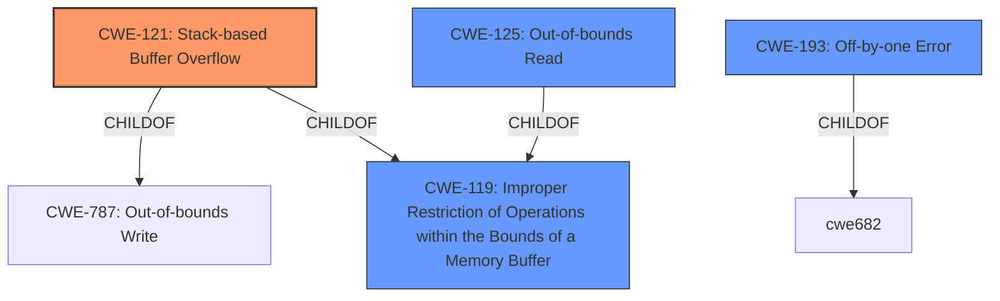

# Raw Analyzer Response for CVE-2022-25308

# Summary
| CWE ID  | CWE Name  | Confidence | CWE Abstraction Level | CWE Vulnerability Mapping Label | CWE-Vulnerability Mapping Notes |
|---------------------|------------------------------------------------------------------------|------------|-------------------------|-----------------------------------|-----------------------------------------------------------------------------------------------------------------------------------------------------------------------------------------------|
| CWE-121 | Stack-based Buffer Overflow | 1.0  | Variant  |  Primary  | Allowed |
| CWE-119 | Improper Restriction of Operations within the Bounds of a Memory Buffer | 0.7 | Class | Secondary | Discouraged |
| CWE-125 | Out-of-bounds Read | 0.6 | Base | Secondary | Allowed |
| CWE-193 | Off-by-one Error | 0.5 | Base | Secondary | Allowed |

## Evidence and Confidence

*   **Confidence Score:** 0.9
*   **Evidence Strength:** HIGH

## Relationship Analysis
The primary CWE selected is CWE-121, a **Variant** of CWE-787 (Out-of-bounds Write) and CWE-119 (Improper Restriction of Operations within the Bounds of a Memory Buffer). CWE-119 is a **Class** that is often too generic, and thus discouraged. However, it serves as a parent, illustrating the broader category of memory safety issues. CWE-125 (Out-of-bounds Read) and CWE-193 (Off-by-one Error) are included as possibilities because the vulnerability description mentions a stack-based buffer overflow due to a **missing** conditional check, potentially leading to a read or write before the buffer's beginning. These are all **Base** level CWEs.

## Vulnerability Chain
The vulnerability chain starts with **missing** input validation, leading to a stack-based buffer overflow when a specially crafted file is processed. This can then result in a memory leak or denial of service.
  - **Root Cause:** **Missing** input validation (implied)
  - **Weakness:** CWE-121 Stack-based Buffer Overflow
  - **Impact:** Memory Leak, Denial of Service

## Summary of Analysis
The initial analysis focused on the provided vulnerability description: "A **stack-based buffer overflow** flaw was found in the Fribidi package. This flaw allows an attacker to pass a specially crafted file to the Fribidi application, which leads to a possible memory leak or a denial of service."

The key phrase "stack-based buffer overflow" immediately suggests CWE-121. The CVE Reference Links Content Summary provides more details: "The vulnerability is caused by a **missing** conditional check for the length of a string before accessing a pointer. Specifically, the code attempts to access `S_[len - 1]` without verifying that `len` is greater than 0. If `strlen()` returns 0, `len - 1` results in a negative index, leading to a stack buffer underflow."

This confirms the **stack-based buffer overflow** and points to a **missing** input validation.  The code's attempt to access `S_[len - 1]` without checking if `len > 0` suggests a potential for out-of-bounds access.

CWE-121 is the most specific and appropriate choice, given the explicit mention of a "stack-based buffer overflow". CWE-119 is a broader category, and while applicable, is less precise. CWE-125 (Out-of-bounds Read) is considered because accessing `S_[len - 1]` when len is 0 would result in reading before the beginning of the buffer which is out-of-bounds.  CWE-193 (Off-by-one Error) is considered as a possibility because the vulnerability involves accessing an element one position before the start of the array.

The final selection prioritizes CWE-121 for its direct match to the vulnerability description, supplemented by CWE-119, CWE-125, and CWE-193 as potential contributing factors. The decision is based on evidence from the provided text and informed by the relationships between CWEs.

Relevant CWE Information:

# Enhanced Context (25 CWEs)
The following CWEs were identified as potentially relevant to this vulnerability:

## CWE-1325: Improperly Controlled Sequential Memory Allocation
**Abstraction Level**: Base
**Similarity Score**: 0.78
**Source**: dense

**Description**:
The product manages a group of objects or resources and performs a separate memory allocation for each object, but it does not properly limit the total amount of memory that is consumed by all of the combined objects.

**Mapping Guidance**:
- Usage: Allowed
- Rationale: This CWE entry is at the Base level of abstraction, which is a preferred level of abstraction for mapping to the root causes of vulnerabilities.

## CWE-789: Memory Allocation with Excessive Size Value
**Abstraction Level**: Variant
**Similarity Score**: 0.76
**Source**: dense

**Description**:
The product allocates memory based on an untrusted, large size value, but it does not ensure that the size is within expected limits, allowing arbitrary amounts of memory to be allocated.

**Mapping Guidance**:
- Usage: Allowed
- Rationale: This CWE entry is at the Variant level of abstraction, which is a preferred level of abstraction for mapping to the root causes of vulnerabilities.

## CWE-680: Integer Overflow to Buffer Overflow
**Abstraction Level**: Compound
**Similarity Score**: 0.76
**Source**: dense

**Description**:
The product performs a calculation to determine how much memory to allocate, but an integer overflow can occur that causes less memory to be allocated than expected, leading to a buffer overflow.

**Mapping Guidance**:
- Usage: Discouraged
- Rationale: This CWE entry is a named chain, which combines multiple weaknesses.

## CWE-124: Buffer Underwrite ('Buffer Underflow')
**Abstraction Level**: Base
**Similarity Score**: 0.76
**Source**: dense

**Description**:
The product writes to a buffer using an index or pointer that references a memory location prior to the beginning of the buffer.

**Mapping Guidance**:
- Usage: Allowed
- Rationale: This CWE entry is at the Base level of abstraction, which is a preferred level of abstraction for mapping to the root causes of vulnerabilities.

## CWE-805: Buffer Access with Incorrect Length Value
**Abstraction Level**: Base
**Similarity Score**: 0.76
**Source**: dense

**Description**:
The product uses a sequential operation to read or write a buffer, but it uses an incorrect length value that causes it to access memory that is outside of the bounds of the buffer.

**Mapping Guidance**:
- Usage: Allowed
- Rationale: This CWE entry is at the Base level of abstraction, which is a preferred level of abstraction for mapping to the root causes of vulnerabilities.

## CWE-191: Integer Underflow (Wrap or Wraparound)
**Abstraction Level**: Base
**Similarity Score**: 0.76
**Source**: dense

**Description**:
The product subtracts one value from another, such that the result is less than the minimum allowable integer value, which produces a value that is not equal to the correct result.

**Mapping Guidance**:
- Usage: Allowed
- Rationale: This CWE entry is at the Base level of abstraction, which is a preferred level of abstraction for mapping to the root causes of vulnerabilities.

## CWE-131: Incorrect Calculation of Buffer Size
**Abstraction Level**: Base
**Similarity Score**: 0.76
**Source**: dense

**Description**:
The product does not correctly calculate the size to be used when allocating a buffer, which could lead to a buffer overflow.

**Mapping Guidance**:
- Usage: Allowed
- Rationale: This CWE entry is at the Base level of abstraction, which is a preferred level of abstraction for mapping to the root causes of vulnerabilities.

## CWE-190: Integer Overflow or Wraparound
**Abstraction Level**: Base
**Similarity Score**: 0.75
**Source**: dense

**Description**:
The product performs a calculation that can
         produce an integer overflow or wraparound when the logic
         assumes that the resulting value will always be larger than
         the original value.