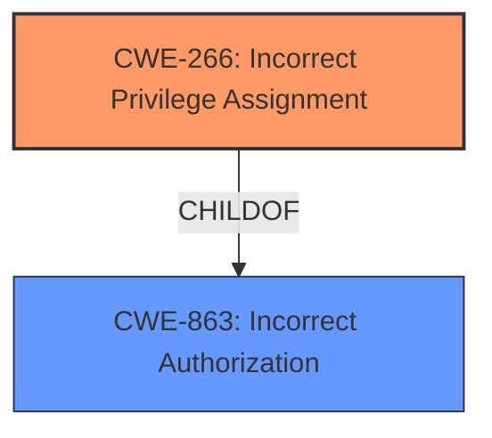

# Enhanced Analysis for CVE-2022-25318

# Summary
| CWE ID | CWE Name | Confidence | CWE Abstraction Level | CWE Vulnerability Mapping Label | CWE-Vulnerability Mapping Notes |
|---|---|---|---|---|---|
| CWE-266 | Incorrect Privilege Assignment | 0.9 | Base | Primary | Allowed |
| CWE-863 | Incorrect Authorization | 0.7 | Class | Secondary | Allowed-with-Review |

## Evidence and Confidence

*   **Confidence Score:** 0.8
*   **Evidence Strength:** HIGH

## Relationship Analysis
The primary CWE is CWE-266, which is a Base level CWE. CWE-863 is a Class level CWE and a parent of CWE-266. While CWE-863 is also relevant, CWE-266 is more specific and better captures the root cause of the vulnerability, so it is selected as the primary CWE. There are no chain relationships identified that are relevant to this vulnerability.



## Vulnerability Chain
The chain of events for this vulnerability is:
1.  **Root Cause:** **Incorrect sharing group ACL** (CWE-266 Incorrect Privilege Assignment)
2.  **Impact:** Unprivileged user can edit and modify sharing groups.

## Summary of Analysis
The initial assessment identified CWE-266 as the primary weakness due to the **incorrect sharing group ACL**, which directly aligns with the concept of assigning incorrect privileges. The evidence provided states, "An **incorrect sharing group ACL** allowed an unprivileged user to edit and modify sharing groups." The vulnerability allows unprivileged users to modify sharing groups, indicating that the ACLs are not properly configured to restrict access based on user privileges. This fits the description of CWE-266, "A product incorrectly assigns a privilege to a particular actor, creating an unintended sphere of control for that actor." CWE-863 (Incorrect Authorization) was considered as a secondary weakness because the authorization check is performed, but it's not correctly implemented, leading to the privilege assignment issue.

The relationship graph shows that CWE-266 is a child of CWE-863. Given that there is a misconfiguration in the product, CWE-266 is a better fit, as it is more specific.

Relevant CWE Information:

# Enhanced Context (25 CWEs)
The following CWEs were identified as potentially relevant to this vulnerability:

## CWE-266: Incorrect Privilege Assignment
**Abstraction Level**: Base
**Similarity Score**: 0.76
**Source**: dense

**Description**:
A product incorrectly assigns a privilege to a particular actor, creating an unintended sphere of control for that actor.

**Mapping Guidance**:
- Usage: Allowed
- Rationale: This CWE entry is at the Base level of abstraction, which is a preferred level of abstraction for mapping to the root causes of vulnerabilities.

## CWE-863: Incorrect Authorization
**Abstraction Level**: Class
**Similarity Score**: 5151.49
**Source**: sparse

**Description**:
The product performs an authorization check when an actor attempts to access a resource or perform an action, but it does not correctly perform the check.

**Mapping Guidance**:
- Usage: Allowed-with-Review
- Rationale: This CWE entry is a Class and might have Base-level children that would be more appropriate

### Other CWEs Considered But Not Used:

*   **CWE-276: Incorrect Default Permissions**: This CWE relates to incorrect permissions set during installation. It doesn't fit because the vulnerability is about an incorrect ACL, not default permissions.
*   **CWE-274: Improper Handling of Insufficient Privileges**: This CWE is about the product not handling insufficient privileges, but the problem here is that the user *shouldn't* have the privilege in the first place.
*   **CWE-280: Improper Handling of Insufficient Permissions or Privileges**: Similar to CWE-274, this is about handling insufficient privileges. It doesn't apply because the vulnerability is about the incorrect assignment of privileges.
*   **CWE-281: Improper Preservation of Permissions**: This CWE is about not preserving permissions when copying or restoring objects. It's not applicable because the issue is with the initial assignment of permissions, not their preservation.
*   **CWE-267: Privilege Defined With Unsafe Actions**: While possibly related, the core issue is not that the privilege *itself* is unsafe, but that the privilege is assigned incorrectly.
*   **CWE-653: Improper Isolation or Compartmentalization**: This CWE is about not isolating functionality based on privilege levels. It's not a direct fit because the core issue is with the privilege assignment itself, rather than a lack of isolation.
*   **CWE-664: Improper Control of a Resource Through its Lifetime**: This is a high-level CWE. The issue is about incorrect privilege assignment.
*   **CWE-842: Placement of User into Incorrect Group**: This is about placing a user into an incorrect group. It's not directly applicable because the vulnerability is not about placing the user in the wrong group, but about the privileges assigned to the user/group.
*   **CWE-668: Exposure of Resource to Wrong Sphere**: This is a high-level CWE. The issue is about incorrect privilege assignment.
*   **CWE-1220: Insufficient Granularity of Access Control**: This is about access controls lacking granularity. The specific issue is incorrect ACL.
*   **CWE-285: Improper Authorization**: This is a Class level CWE that could be too general. A more specific CWE is better suited.
*   **CWE-732: Incorrect Permission Assignment for Critical Resource**: Similar to CWE-266, but it relates specifically to *critical* resources. The context does not specify that the resource is critical.
*   **CWE-639: Authorization Bypass Through User-Controlled Key**: This is about bypassing authorization by modifying a key value. It's not relevant because the vulnerability is about incorrect ACLs.
*   **CWE-178: Improper Handling of Case Sensitivity**: This is about case sensitivity, and the vulnerability is about ACLs.
*   **CWE-1289: Improper Validation of Unsafe Equivalence in Input**: This is about input validation, and the vulnerability is about ACLs.
*   **CWE-289: Authentication Bypass by Alternate Name**: This is about authentication bypass, and the vulnerability is about ACLs.
*   **CWE-322: Key Exchange without Entity Authentication**: This is about key exchange, and the vulnerability is about ACLs.
*   **CWE-942: Permissive Cross-domain Policy with Untrusted Domains**: This is about cross-domain policies, and the vulnerability is about ACLs.
*   **CWE-350: Reliance on Reverse DNS Resolution for a Security-Critical Action**: This is about reverse DNS resolution, and the vulnerability is about ACLs.
*   **CWE-456: Missing Initialization of a Variable**: This is about missing initialization, and the vulnerability is about ACLs.
*   **CWE-274: Improper Handling of Insufficient Privileges**: This is about handling of privileges and permissions. The ACL issue is a privilege assignment problem.
*   **CWE-280: Improper Handling of Insufficient Permissions or Privileges**: This is about handling of privileges and permissions. The ACL issue is a privilege assignment problem.
*   **CWE-284: Improper Access Control**: This is too general.


## CWE Relationship Analysis

Current CWEs represent these abstraction levels: .


### Vulnerability Chain Analysis

**Chain starting from CWE-942:**
- 942 (Permissive Cross-domain Policy with Untrusted Domains) - ROOT


**Chain starting from CWE-668:**
- 668 (Exposure of Resource to Wrong Sphere) - ROOT


### CWE Relationship Diagram

```mermaid
graph TD
    classDef primary fill:#f96,stroke:#333,stroke-width:2px
    classDef secondary fill:#69f,stroke:#333
    classDef tertiary fill:#9e9,stroke:#333
```