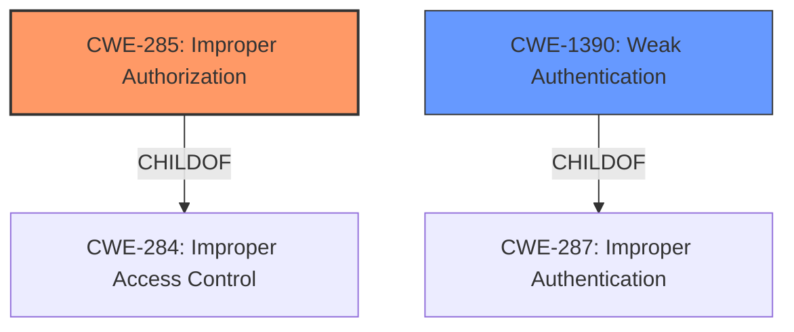

# Enhanced Analysis for CVE-2022-2533

# Summary
| CWE ID | CWE Name | Confidence | CWE Abstraction Level | CWE Vulnerability Mapping Label | CWE-Vulnerability Mapping Notes |
|---|---|---|---|---|---|
| CWE-285 | Improper Authorization | 0.8 | Class | Primary | Allowed-with-Review |
| CWE-1390 | Weak Authentication | 0.7 | Class | Secondary | Allowed-with-Review |

## Evidence and Confidence

*   **Confidence Score:** 0.8
*   **Evidence Strength:** MEDIUM

## Relationship Analysis
The primary CWE is CWE-285, Improper Authorization, which is a Class-level CWE. CWE-1390, Weak Authentication, is considered as a secondary CWE. Both CWE-285 and CWE-1390 are children of higher-level CWEs related to security issues, but they best represent the **incorrect authentication** and misuse of the Deploy Token described in the vulnerability.



## Vulnerability Chain
The vulnerability chain starts with **incorrect authentication**, leading to the ability to misuse a Deploy Token from any location. This bypasses intended IP address restrictions, ultimately resulting in unauthorized access and potential data compromise.
  - **Root Cause:** Incorrect Authentication
  - **Weakness:** Improper Authorization
  - **Impact:** Misuse Deploy Token from any location

## Summary of Analysis
The primary classification is CWE-285, Improper Authorization, because the vulnerability involves GitLab not performing correct authentication, which allows an attacker to misuse a Deploy Token from any location when IP address restrictions are configured. This directly relates to an authorization failure where the system incorrectly grants access based on the token's presence, disregarding the IP restrictions.

The vulnerability description states: "GitLab was not performing correct authentication with some Package Registries when IP address restrictions were configured, allowing an attacker already in possession of a valid Deploy Token to misuse it from any location." This indicates that even with IP restrictions in place, the authentication process was flawed, leading to improper authorization.

CWE-1390, Weak Authentication, is considered a secondary CWE because the **incorrect authentication** mechanism allowed an attacker with a valid Deploy Token to bypass IP address restrictions.

Both CWEs are at the Class level, which is appropriate because more specific Base or Variant level CWEs do not fully capture the essence of the vulnerability. CWE-285 directly addresses the authorization flaw, while CWE-1390 highlights the weakness in the authentication process that enables the bypass.

Relevant CWE Information:

# Enhanced Context (25 CWEs)

## CWE-664: Improper Control of a Resource Through its Lifetime
**Abstraction Level**: Pillar
**Similarity Score**: 0.76
**Source**: dense

**Description**:
The product does not maintain or incorrectly maintains control over a resource throughout its lifetime of creation, use, and release.
**Rationale for not selecting:** While resource control is involved, the core issue is **incorrect authentication** and authorization, making CWE-285 and CWE-1390 more relevant.

## CWE-404: Improper Resource Shutdown or Release
**Abstraction Level**: Class
**Similarity Score**: 0.76
**Source**: dense

**Description**:
The product does not release or incorrectly releases a resource before it is made available for re-use.
**Rationale for not selecting:** This CWE is not directly applicable as the issue is not about releasing resources but about **incorrect authentication** and authorization.

## CWE-668: Exposure of Resource to Wrong Sphere
**Abstraction Level**: Class
**Similarity Score**: 0.75
**Source**: dense

**Description**:
The product exposes a resource to the wrong control sphere, providing unintended actors with inappropriate access to the resource.
**Rationale for not selecting:** While the Deploy Token is exposed, the core issue is **incorrect authentication** and authorization, making CWE-285 and CWE-1390 more accurate.

## CWE-226: Sensitive Information in Resource Not Removed Before Reuse
**Abstraction Level**: Base
**Similarity Score**: 0.75
**Source**: dense

**Description**:
The product releases a resource such as memory or a file so that it can be made available for reuse, but it does not clear or "zeroize" the information contained in the resource before the product performs a critical state transition or makes the resource available for reuse by other entities.
**Rationale for not selecting:** This CWE is not relevant because the vulnerability is not about sensitive information not being removed before reuse.

## CWE-667: Improper Locking
**Abstraction Level**: Class
**Similarity Score**: 0.75
**Source**: dense

**Description**:
The product does not properly acquire or release a lock on a resource, leading to unexpected resource state changes and behaviors.
**Rationale for not selecting:** Locking is not the primary issue; the problem lies in **incorrect authentication** and subsequent authorization bypass.

## CWE-280: Improper Handling of Insufficient Permissions or Privileges
**Abstraction Level**: Base
**Similarity Score**: 0.75
**Source**: dense

**Description**:
The product does not handle or incorrectly handles when it has insufficient privileges to access resources or functionality as specified by their permissions. This may cause it to follow unexpected code paths that may leave the product in an invalid state.
**Rationale for not selecting:** The core issue is not about handling insufficient privileges but about **incorrect authentication** and authorization.

## CWE-696: Incorrect Behavior Order
**Abstraction Level**: Class
**Similarity Score**: 0.75
**Source**: dense

**Description**:
The product performs multiple related behaviors, but the behaviors are performed in the wrong order in ways which may produce resultant weaknesses.
**Rationale for not selecting:** While the order of operations might be a factor, the primary issue is **incorrect authentication** and authorization.

## CWE-639: Authorization Bypass Through User-Controlled Key
**Abstraction Level**: Base
**Similarity Score**: 0.75
**Source**: dense

**Description**:
The system's authorization functionality does not prevent one user from gaining access to another user's data or record by modifying the key value identifying the data.
**Rationale for not selecting:** This is closely related, but the user isn't modifying any key, they are simply re-using the key from a different location. The root cause is the **incorrect authentication**.

## CWE-274: Improper Handling of Insufficient Privileges
**Abstraction Level**: Base
**Similarity Score**: 0.75
**Source**: dense

**Description**:
The product does not handle or incorrectly handles when it has insufficient privileges to perform an operation, leading to resultant weaknesses.
**Rationale for not selecting:** This CWE is not directly applicable as the issue is not about handling insufficient privileges.

## CWE-799: Improper Control of Interaction Frequency
**Abstraction Level**: Class
**Similarity Score**: 0.75
**Source**: dense

**Description**:
The product does not properly limit the number or frequency of interactions that it has with an actor, such as the number of incoming requests.
**Rationale for not selecting:** Interaction frequency is not the core issue; the problem lies in **incorrect authentication** and subsequent authorization bypass.

## CWE-770: Allocation of Resources Without Limits or Throttling
**Abstraction Level**: Base
**Similarity Score**: 5225.48
**Source**: sparse

**Description**:
The product allocates a reusable resource or group of resources on behalf of an actor without imposing any restrictions on the size or number of resources that can be allocated, in violation of the intended security policy for that actor.
**Rationale for not selecting:** Resource allocation is not the primary issue; the problem lies in **incorrect authentication** and subsequent authorization bypass.

## CWE-22: Improper Limitation of a Pathname to a Restricted Directory ('Path Traversal')
**Abstraction Level**: base
**Similarity Score**: 4.33
**Source**: graph

**Description**:
CWE-22: Improper Limitation of a Pathname to a Restricted Directory ('Path Traversal')
**Rationale for not selecting:** Path traversal is not relevant to this vulnerability.

## CWE-410: Insufficient Resource Pool
**Abstraction Level**: base
**Similarity Score**: 4.33
**Source**: graph

**Description**:
CWE-410: Insufficient Resource Pool
**Rationale for not selecting:** Resource pools are not relevant to this vulnerability.

## CWE-1284: Improper Validation of Specified Quantity in Input
**Abstraction Level**: base
**Similarity Score**: 4.33
**Source**: graph

**Description**:
CWE-1284: Improper Validation of Specified Quantity in Input
**Rationale for not selecting:**


## CWE Relationship Analysis

Current CWEs represent these abstraction levels: .


### Vulnerability Chain Analysis

**Chain starting from CWE-280:**
- 280 (Improper Handling of Insufficient Permissions or Privileges ) - ROOT


**Chain starting from CWE-696:**
- 696 (Incorrect Behavior Order) - ROOT


### CWE Relationship Diagram

```mermaid
graph TD
    classDef primary fill:#f96,stroke:#333,stroke-width:2px
    classDef secondary fill:#69f,stroke:#333
    classDef tertiary fill:#9e9,stroke:#333
```