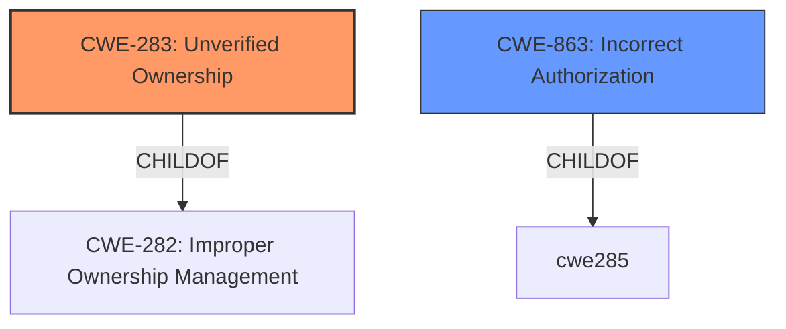

# Raw Analyzer Response for CVE-2022-25335

# Summary

| CWE ID | CWE Name | Confidence | CWE Abstraction Level | CWE Vulnerability Mapping Label | CWE-Vulnerability Mapping Notes |
|---|---|---|---|---|---|
| CWE-283 | Unverified Ownership | 0.8 | Base | Allowed | Primary CWE |
| CWE-863 | Incorrect Authorization | 0.6 | Class | Allowed-with-Review | Secondary Candidate |

## Evidence and Confidence

*   **Confidence Score:** 0.7
*   **Evidence Strength:** MEDIUM

## Relationship Analysis
The analysis is focused on identifying the root cause of the vulnerability, which is the **missing onlyOwner modifier**. This leads to the selection of CWE-283 (Unverified Ownership) as the primary CWE. CWE-863 (Incorrect Authorization) is considered as a secondary candidate due to its broader scope. The hierarchical relationships and abstraction levels were considered to select the most appropriate CWEs. CWE-283 is at the Base level and a child of CWE-282, making it a more specific and accurate representation of the vulnerability compared to the Class-level CWE-863.

## Vulnerability Chain
The chain of events for this vulnerability is:
1.  **Root Cause:** **Missing onlyOwner modifier** in the `setMultipleAllowances` function. (CWE-283)
2.  **Impact:** Enables token manipulation.

## Summary of Analysis
The initial analysis focused on the **missing onlyOwner modifier**, which is the **root cause** of the vulnerability. The Retriever Results suggested CWE-306 (Missing Authentication for Critical Function) and CWE-863 (Incorrect Authorization) as potential matches. However, CWE-283 (Unverified Ownership) was ultimately chosen as the primary CWE due to its more specific fit to the vulnerability description.

The evidence from the vulnerability description key phrases clearly states that the **root cause** is the **missing onlyOwner modifier**, and the impact is token manipulation. The "CVE Reference Links Content Summary" did not provide any additional information related to the vulnerability.

The graph relationships influenced the final selection by highlighting the hierarchical structure of the CWEs. CWE-283 is a child of CWE-282 (Improper Ownership Management), making it a more specific and accurate representation of the vulnerability compared to the Class-level CWE-863.

The selected CWEs are at the optimal level of specificity because they accurately represent the weakness described in the vulnerability description. CWE-283 directly addresses the **missing ownership verification**, while CWE-863 is a broader classification that encompasses various authorization issues.

CWE-306 (Missing Authentication for Critical Function) was considered but not used because the vulnerability is related to ownership verification rather than missing authentication. The function itself is not missing authentication, but rather missing the correct access control mechanism (the `onlyOwner` modifier).

CWE-863 (Incorrect Authorization) was considered as a secondary CWE because the **missing onlyOwner modifier** leads to **incorrect authorization**. However, since the root cause is the **lack of ownership verification**, CWE-283 is the primary CWE.

Relevant CWE Information:

# Enhanced Context (25 CWEs)
The following CWEs were identified as potentially relevant to this vulnerability:

## CWE-226: Sensitive Information in Resource Not Removed Before Reuse
**Abstraction Level**: Base
**Similarity Score**: 0.80
**Source**: dense

**Description**:
The product releases a resource such as memory or a file so that it can be made available for reuse, but it does not clear or "zeroize" the information contained in the resource before the product performs a critical state transition or makes the resource available for reuse by other entities.

**Mapping Guidance**:
- Usage: Allowed
- Rationale: This CWE entry is at the Base level of abstraction, which is a preferred level of abstraction for mapping to the root causes of vulnerabilities.

## CWE-131: Incorrect Calculation of Buffer Size
**Abstraction Level**: Base
**Similarity Score**: 0.78
**Source**: dense

**Description**:
The product does not correctly calculate the size to be used when allocating a buffer, which could lead to a buffer overflow.

**Mapping Guidance**:
- Usage: Allowed
- Rationale: This CWE entry is at the Base level of abstraction, which is a preferred level of abstraction for mapping to the root causes of vulnerabilities.

## CWE-404: Improper Resource Shutdown or Release
**Abstraction Level**: Class
**Similarity Score**: 0.78
**Source**: dense

**Description**:
The product does not release or incorrectly releases a resource before it is made available for re-use.

**Mapping Guidance**:
- Usage: Allowed-with-Review
- Rationale: This CWE entry is a Class and might have Base-level children that would be more appropriate

## CWE-667: Improper Locking
**Abstraction Level**: Class
**Similarity Score**: 0.78
**Source**: dense

**Description**:
The product does not properly acquire or release a lock on a resource, leading to unexpected resource state changes and behaviors.

**Mapping Guidance**:
- Usage: Allowed-with-Review
- Rationale: This CWE entry is a Class and might have Base-level children that would be more appropriate

## CWE-119: Improper Restriction of Operations within the Bounds of a Memory Buffer
**Abstraction Level**: Class
**Similarity Score**: 0.78
**Source**: dense

**Description**:
The product performs operations on a memory buffer, but it reads from or writes to a memory location outside the buffer's intended boundary. This may result in read or write operations on unexpected memory locations that could be linked to other variables, data structures, or internal program data.

**Mapping Guidance**:
- Usage: Discouraged
- Rationale: CWE-119 is commonly misused in low-information vulnerability reports when lower-level CWEs could be used instead, or when more details about the vulnerability are available.

## CWE-126: Buffer Over-read
**Abstraction Level**: Variant
**Similarity Score**: 0.77
**Source**: dense

**Description**:
The product reads from a buffer using buffer access mechanisms such as indexes or pointers that reference memory locations after the targeted buffer.

**Mapping Guidance**:
- Usage: Allowed
- Rationale: This CWE entry is at the Variant level of abstraction, which is a preferred level of abstraction for mapping to the root causes of vulnerabilities.

## CWE-805: Buffer Access with Incorrect Length Value
**Abstraction Level**: Base
**Similarity Score**: 0.77
**Source**: dense

**Description**:
The product uses a sequential operation to read or write a buffer, but it uses an incorrect length value that causes it to access memory that is outside of the bounds of the buffer.

**Mapping Guidance**:
- Usage: Allowed
- Rationale: This CWE entry is at the Base level of abstraction, which is a preferred level of abstraction for mapping to the root causes of vulnerabilities.

## CWE-125: Out-of-bounds Read
**Abstraction Level**: Base
**Similarity Score**: 0.77
**Source**: dense

**Description**:
The product reads data past the end, or before the beginning, of the intended buffer.

**Mapping Guidance**:
- Usage: Allowed
- Rationale: This CWE entry is at the Base level of abstraction, which is a preferred level of abstraction for mapping to the root causes of vulnerabilities.

## CWE-754: Improper Check for Unusual or Exceptional Conditions
**Abstraction Level**: Class
**Similarity Score**: 0.77
**Source**: dense

**Description**:
The product does not check or incorrectly checks for unusual or exceptional conditions that are not expected to occur frequently during day to day operation of the product.

**Mapping Guidance**:
- Usage: Allowed-with-Review
- Rationale: This CWE entry is a Class and might have Base-level children that would be more appropriate

## CWE-789: Memory Allocation with Excessive Size Value
**Abstraction Level**: Variant
**Similarity Score**: 0.77
**Source**: dense

**Description**:
The product allocates memory based on an untrusted, large size value, but it does not ensure that the size is within expected limits, allowing arbitrary amounts of memory to be allocated.

**Mapping Guidance**:
- Usage: Allowed
- Rationale: This CWE entry is at the Variant level of abstraction, which is a preferred level of abstraction for mapping to the root causes of vulnerabilities.

## CWE-226: Sensitive Information in Resource Not Removed Before Reuse
**Abstraction Level**: Base
**Similarity Score**: 5542.15
**Source**: sparse

**Description**:
The product releases a resource such as memory or a file so that it can be made available