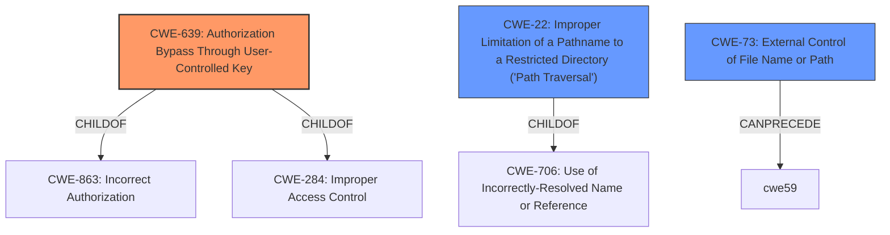

# Analysis for CVE-2022-25336

# Summary
| CWE ID | CWE Name | Confidence | CWE Abstraction Level | CWE Vulnerability Mapping Label | CWE-Vulnerability Mapping Notes |
|---|---|---|---|---|---|
| CWE-639 | Authorization Bypass Through User-Controlled Key | 0.9 | Base | Allowed | Primary CWE |
| CWE-22 | Improper Limitation of a Pathname to a Restricted Directory ('Path Traversal') | 0.6 | Base | Allowed | Secondary Candidate |
| CWE-73 | External Control of File Name or Path | 0.6 | Base | Allowed | Secondary Candidate |

## Evidence and Confidence

*   **Confidence Score:** 0.8
*   **Evidence Strength:** MEDIUM

## Relationship Analysis
The primary CWE, CWE-639, is a base-level weakness that is a child of CWE-863 (Incorrect Authorization) and CWE-284 (Improper Access Control). This indicates that the vulnerability stems from a failure in the authorization process, specifically related to user-controlled keys. CWE-22 and CWE-73, while related to path manipulation and external control of file names, are considered secondary because the root cause is more directly tied to the authorization bypass.

## Vulnerability Chain
The vulnerability chain starts with the **Insecure Direct Object Reference** (**IDOR**) due to **insufficient sanitization** of image filenames and **lack of access control**. This allows an attacker to guess or discover the image path and filename, ultimately leading to unauthorized access to image files.

## Summary of Analysis
The initial assessment identified CWE-639 as the primary candidate due to the **Insecure Direct Object Reference** (**IDOR**) described in the vulnerability. The CVE Reference Links Content Summary further supports this by highlighting the **lack of access control** for direct image access and the ability for attackers to potentially access images by guessing or discovering the image path and filename.

The relationship graph shows how the selected CWEs relate to broader categories of authorization and access control issues. CWE-639 is a child of CWE-863 and CWE-284, highlighting its specific focus on authorization bypass via user-controlled keys.

The selection of CWE-639 is at the optimal level of specificity because it directly addresses the root cause of the vulnerability: the ability for an attacker to bypass authorization by manipulating the key used to access image files. While CWE-22 and CWE-73 are related to path manipulation and external control of file names, they are secondary because the core issue is the **lack of proper authorization checks**.

The assessment is primarily based on the provided evidence, specifically:

*   Vulnerability Description: "Ibexa DXP ezsystems/ezpublish-kernel 7.5.x before 7.5.26 and 1.3.x before 1.3.12 allows **Insecure Direct Object Reference** (IDOR) attacks against image files because the image path and filename can be correctly deduced."
*   CVE Reference Links Content Summary: "The vulnerability stems from two issues: **insufficient sanitization** of uploaded image filenames and the **lack of access control** for direct access to images."

Relevant CWE Information:

# Enhanced Context (25 CWEs)
The following CWEs were identified as potentially relevant to this vulnerability:

## CWE-639: Authorization Bypass Through User-Controlled Key
**Abstraction Level**: Base
**Similarity Score**: 7370.31
**Source**: sparse

**Description**:
The system's authorization functionality does not prevent one user from gaining access to another user's data or record by modifying the key value identifying the data.

**Mapping Guidance**:
- Usage: Allowed
- Rationale: This CWE entry is at the Base level of abstraction, which is a preferred level of abstraction for mapping to the root causes of vulnerabilities.

## CWE-22: Improper Limitation of a Pathname to a Restricted Directory ('Path Traversal')
**Abstraction Level**: Base
**Similarity Score**: 7218.62
**Source**: sparse

**Description**:
The product uses external input to construct a pathname that is intended to identify a file or directory that is located underneath a restricted parent directory, but the product does not properly neutralize special elements within the pathname that can cause the pathname to resolve to a location that is outside of the restricted directory.

**Mapping Guidance**:
- Usage: Allowed
- Rationale: This CWE entry is at the Base level of abstraction, which is a preferred level of abstraction for mapping to the root causes of vulnerabilities.

## CWE-73: External Control of File Name or Path
**Abstraction Level**: Base
**Similarity Score**: 3.33
**Source**: graph

**Description**:
The product allows user input to control or influence paths or file names that are used in filesystem operations.

**Mapping Guidance**:
- Usage: Allowed
- Rationale: This CWE entry is at the Base level of abstraction, which is a preferred level of abstraction for mapping to the root causes of vulnerabilities.

### Technical Explanation for CWE-639
CWE-639 (Authorization Bypass Through User-Controlled Key): This vulnerability occurs because the application does not properly validate whether the user is authorized to access the requested image file. An attacker can potentially modify the image path or filename (the "key") to access images belonging to other users or images that should not be publicly accessible.

*   **Match:** The vulnerability description explicitly states that the image path and filename can be correctly deduced, indicating that an attacker can manipulate the key to access unauthorized resources.
*   **Security Implications:** Unauthorized access to sensitive image files.
*   **Relationship:** ChildOf CWE-863 (Incorrect Authorization) and CWE-284 (Improper Access Control).
*   **Mapping Guidance:** Allowed; the base level of abstraction accurately reflects the root cause.
*   **Primary Weakness:** This is the primary weakness.

### Technical Explanation for CWE-22
CWE-22 (Improper Limitation of a Pathname to a Restricted Directory ('Path Traversal')): While not the primary cause, path traversal could be a contributing factor if the application does not properly restrict the pathnames used to access image files.

*   **Match:** If the "image path and filename can be correctly deduced" this could involve traversal.
*   **Security Implications:** Allows attackers to access files outside of the intended directory.
*   **Relationship:** ChildOf CWE-706
*   **Mapping Guidance:** Allowed; the base level of abstraction accurately reflects the potential traversal issue.
*   **Secondary Weakness:** This is a secondary weakness.

### Technical Explanation for CWE-73
CWE-73 (External Control of File Name or Path): This vulnerability occurs because the application allows user input (directly or indirectly) to control or influence the file names or paths that are used in file system operations.

*   **Match:** The vulnerability description describes that an attacker can deduce file names and paths.
*   **Security Implications:** Attackers may manipulate file access.
*   **Relationship:** ParentOf CWE-114, CanPrecede CWE-59
*   **Mapping Guidance:** Allowed; the base level of abstraction accurately reflects the vulnerability.
*   **Secondary Weakness:** This is a secondary weakness.

### CWEs Considered but Not Used
*   CWE-99 (Improper Control of Resource Identifiers ('Resource Injection')): This CWE is similar to CWE-639 but is broader. Since the vulnerability specifically involves authorization bypass through a user-controlled key, CWE-639 is a more precise match.

*   CWE-74 (Improper Neutralization of Special Elements in Output Used by a Downstream Component ('Injection')): This CWE is too general and doesn't accurately reflect the specific vulnerability of authorization bypass.

*   CWE-327 (Use of a Broken or Risky Cryptographic Algorithm): This CWE is not relevant as the vulnerability does not involve any cryptographic issues.

*   CWE-59 (Improper Link Resolution Before File Access ('Link Following')): This CWE is related to symbolic link vulnerabilities and is not directly relevant to the described vulnerability.