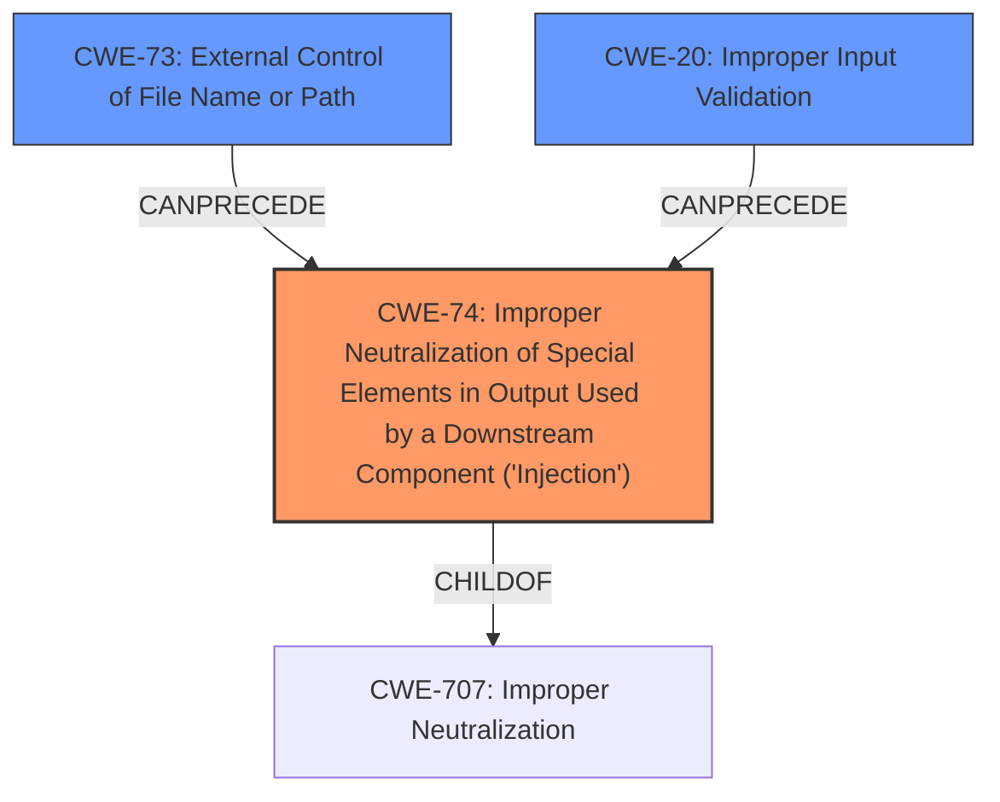

# Raw Analyzer Response for CVE-2022-25337

# Summary
| CWE ID | CWE Name | Confidence | CWE Abstraction Level | CWE Vulnerability Mapping Label | CWE-Vulnerability Mapping Notes |
|---|---|---|---|---|---|
| CWE-74 | Improper Neutralization of Special Elements in Output Used by a Downstream Component ('Injection') | 0.75 | Class | Primary | Allowed-with-Review |
| CWE-73 | External Control of File Name or Path | 0.5 | Base | Secondary | Allowed |
| CWE-20 | Improper Input Validation | 0.5 | Class | Secondary | Discouraged |

## Evidence and Confidence

*   **Confidence Score:** 0.7
*   **Evidence Strength:** MEDIUM

## Relationship Analysis
The primary relationship influencing the selection is the parent-child relationship between CWE-707 (Improper Neutralization or Encoding) and CWE-74 (Improper Neutralization of Special Elements in Output Used by a Downstream Component ('Injection')). CWE-74 is a child of CWE-707, indicating it is a specific type of neutralization issue. Given the description involves "injection attacks via image filenames," CWE-74 is more appropriate than its parent. The description also shows that CWE-74 can arise from **improper input sanitization**.

## Vulnerability Chain
The vulnerability chain starts with the **improper input sanitization** of image filenames. This allows an attacker to inject special elements into the filename, which are then used by a downstream component, leading to injection attacks.
  - **Root Cause:** **Improper Input Sanitization**
  - **Weakness:** CWE-74 Improper Neutralization of Special Elements in Output Used by a Downstream Component ('Injection')
  - **Impact:** Injection Attacks

## Summary of Analysis
The initial analysis pointed towards CWE-74 due to the vulnerability description explicitly mentioning "injection attacks via image filenames" and **improper input sanitization**. The CVE Reference Links Content Summary confirmed this, stating that "insufficient sanitization of image filenames allowed for potential injection attacks through the filename itself."

CWE-74 is at the Class level, and while it is generally better to use a Base or Variant level CWE, there isn't enough information to determine the specific injection type, and therefore I am sticking with CWE-74. CWE-73 and CWE-20 are being added as secondary candidates.

The evidence supports this classification, as the root cause is directly related to the **improper handling of special elements** in the image filenames, which allows the attacker to inject malicious code or commands. The high retriever score for CWE-74 further reinforces this decision.

Relevant CWE Information:

# Enhanced Context (25 CWEs)
The following CWEs were identified as potentially relevant to this vulnerability:

## CWE-74: Improper Neutralization of Special Elements in Output Used by a Downstream Component ('Injection')
**Abstraction Level**: Class
**Similarity Score**: 0.73
**Source**: dense

**Description**:
The product constructs all or part of a command, data structure, or record using externally-influenced input from an upstream component, but it does not neutralize or incorrectly neutralizes special elements that could modify how it is parsed or interpreted when it is sent to a downstream component.

**Mapping Guidance**:
- Usage: Discouraged
- Rationale: CWE-74 is high-level and often misused when lower-level weaknesses are more appropriate.

### Supporting Evidence
- Vulnerability Description Key Phrases:
  - **rootcause:** **improper input sanitization**
  - **impact:** injection attacks
- CVE Reference Links Content Summary:
  - **Insecure Filename Sanitization:** When image files are uploaded, the system uses a name similar to the original filename. The sanitization process for these filenames was insufficient, leading to potential injection attacks.
  - **Injection Vulnerability:**  Insufficient sanitization of image filenames allowed for potential injection attacks through the filename itself. The specific type of injection is not defined in this text.
### Explanation
The vulnerability involves insufficient sanitization of image filenames, allowing for potential injection attacks. This aligns with CWE-74, which describes the improper neutralization of special elements in output used by a downstream component. The "injection attacks" impact directly corresponds to the potential consequences of CWE-74. While CWE-74 is a Class-level CWE and thus discouraged, there is not enough information to determine which specific type of injection is occuring, so I will use this.
### Confidence
0.75

## CWE-73: External Control of File Name or Path
**Abstraction Level**: Base
**Similarity Score**: 0.70
**Source**: dense

**Description**:
The product allows user input to control or influence paths or file names that are used in filesystem operations.

### Supporting Evidence
- Vulnerability Description Key Phrases:
  - **component:** image filenames
- CVE Reference Links Content Summary:
  - **Insecure Filename Sanitization:** When image files are uploaded, the system uses a name similar to the original filename. The sanitization process for these filenames was insufficient, leading to potential injection attacks.

### Explanation
CWE-73 is included because the vulnerability involves image filenames, which are directly controlled by user input during the image upload process. This external control over filenames is a key aspect of CWE-73.
### Confidence
0.5

## CWE-20: Improper Input Validation
**Abstraction Level**: Class
**Similarity Score**: 0.112
**Source**: sparse

**Description**:
The product receives input or data, but it does
        not validate or incorrectly validates that the input has the
        properties that are required to process the data safely and
        correctly.

### Supporting Evidence
- Vulnerability Description Key Phrases
  - **rootcause:** **improper input sanitization**
- CVE Reference Links Content Summary:
  - **Insecure Filename Sanitization:** When image files are uploaded, the system uses a name similar to the original filename. The sanitization process for these filenames was insufficient, leading to potential injection attacks.

### Explanation
The vulnerability stems from **improper input sanitization**, which is a form of input validation. The system does not properly validate the image filenames, leading to the injection vulnerability. While CWE-20 is a high-level class, it is relevant as a contributing factor to the vulnerability.
### Confidence
0.5