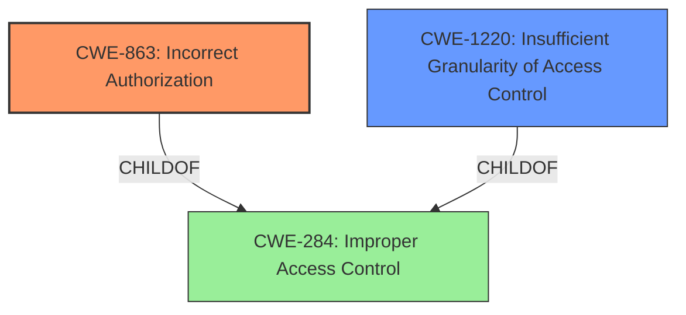

# Raw Analyzer Response for CVE-2022-25339

# Summary
| CWE ID | CWE Name | Confidence | CWE Abstraction Level | CWE Vulnerability Mapping Label | CWE-Vulnerability Mapping Notes |
|---|---|---|---|---|---|
| CWE-863 | Incorrect Authorization | 0.9 | Class | Primary | Allowed-with-Review |
| CWE-1220 | Insufficient Granularity of Access Control | 0.7 | Base | Secondary | Allowed |

## Evidence and Confidence

*   **Confidence Score:** 0.8
*   **Evidence Strength:** HIGH

## Relationship Analysis
The primary CWE, CWE-863 (Incorrect Authorization), is a child of CWE-284 (Improper Access Control). CWE-1220 (Insufficient Granularity of Access Control) is also a child of CWE-284. The vulnerability description indicates an **incorrect access control** issue, suggesting a problem with authorization. CWE-863 is a class-level CWE, and the retriever results suggest examining its children for a better fit. However, given the available information and the nature of the **incorrect authorization**, CWE-863 seems to be the most appropriate primary classification. CWE-1220 suggests that the access control is not granular enough.

## Vulnerability Chain
The chain of events can be described as follows:
1.  **Root Cause:** **Incorrect Access Control** (Implicitly CWE-284).
2.  **Weakness:** Incorrect Authorization (CWE-863) leading to local attackers gaining unauthorized access.
3.  **Impact:** Local attackers can access the application's internal files.

## Summary of Analysis
The initial assessment identified **incorrect access control** as the root cause. The provided evidence from the "CVE Reference Links Content Summary" clearly indicates this: "Improper access control in the ownCloud Android application." The "Vulnerability Description Key Phrases" also highlight "**incorrect access control**". This aligns well with CWE-863 (Incorrect Authorization), which specifies that the product performs an authorization check, but it does not correctly perform the check. The summary also notes that "The application does not properly restrict access to its internal files". This lack of proper restriction is also related to CWE-1220.

The relationships between CWEs, particularly the child-of relationship with CWE-284 (Improper Access Control), support the selection of CWE-863 as the primary issue.

The retriever results also list CWE-1220 (Insufficient Granularity of Access Control). This CWE suggests that the access control mechanisms are not fine-grained enough, allowing unauthorized access. This could be a contributing factor and is added as a secondary CWE.

CWE-284 is too high-level, as stated in the Mapping Guidance: "CWE-284 is extremely high-level, a Pillar. Its name, "Improper Access Control," is often misused in low-information vulnerability reports." The description recommends considering descendants of CWE-284 for a more specific classification.

Therefore, CWE-863 (Incorrect Authorization) is the most appropriate primary CWE, with CWE-1220 (Insufficient Granularity of Access Control) as a secondary weakness. Both selections are supported by the provided evidence and relationship analysis, providing a detailed and well-justified classification.